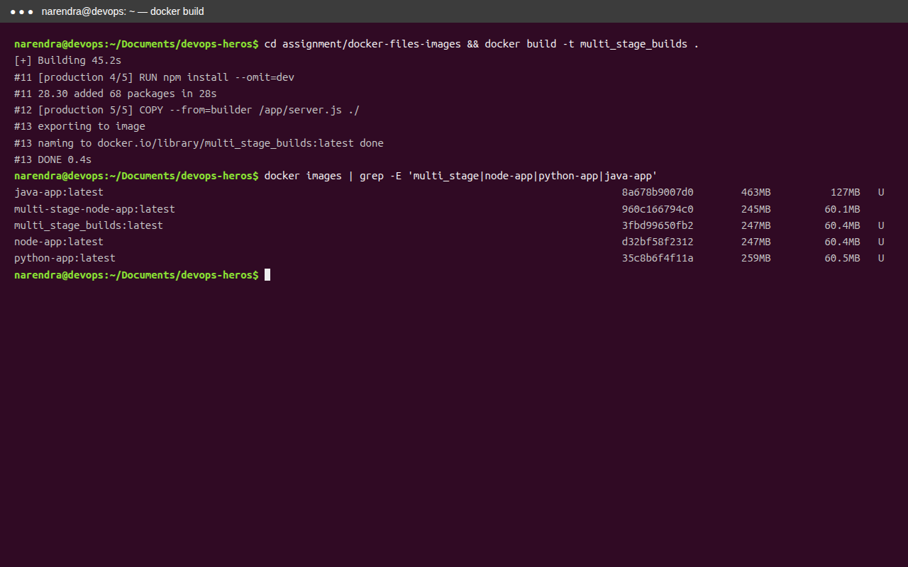
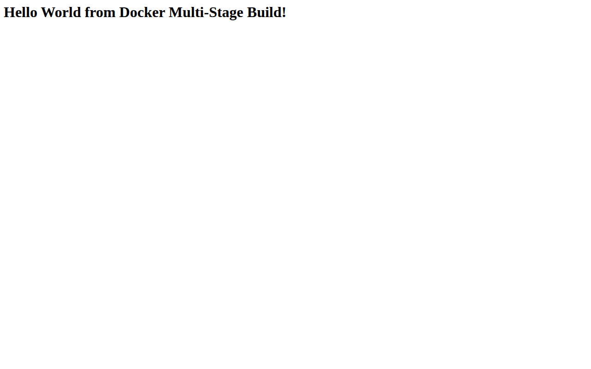
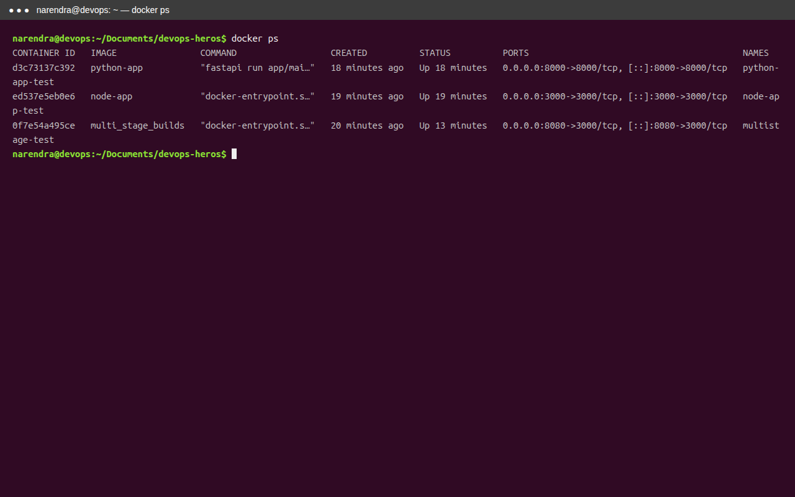
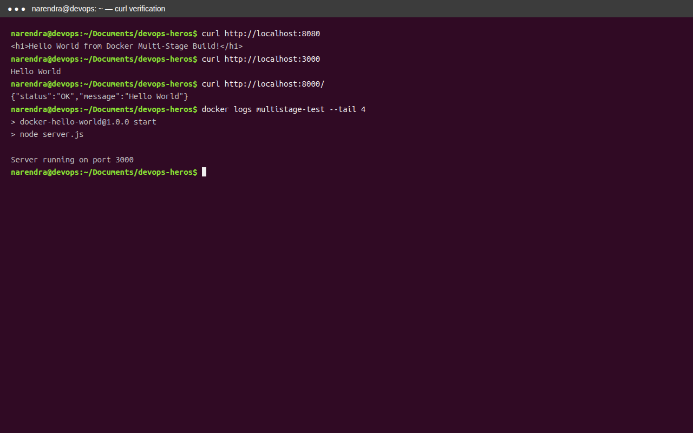
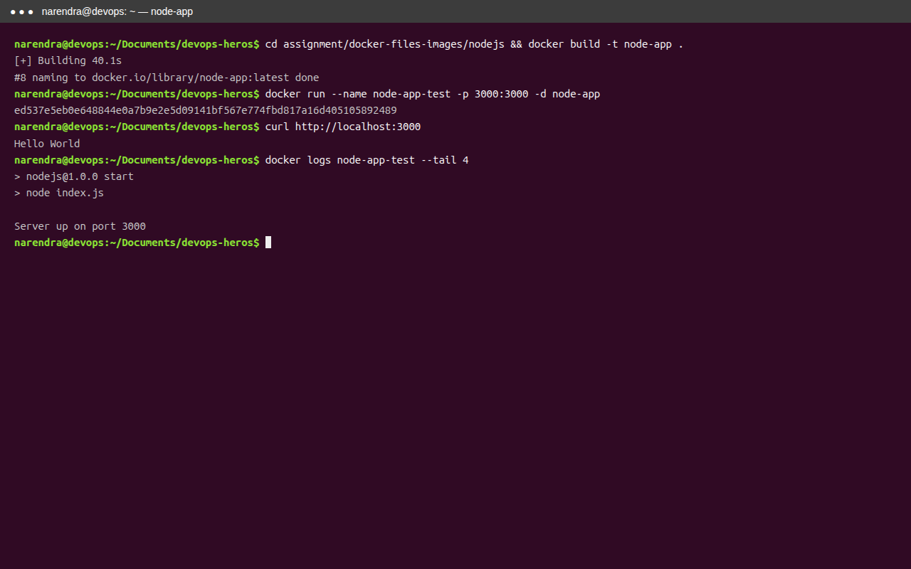
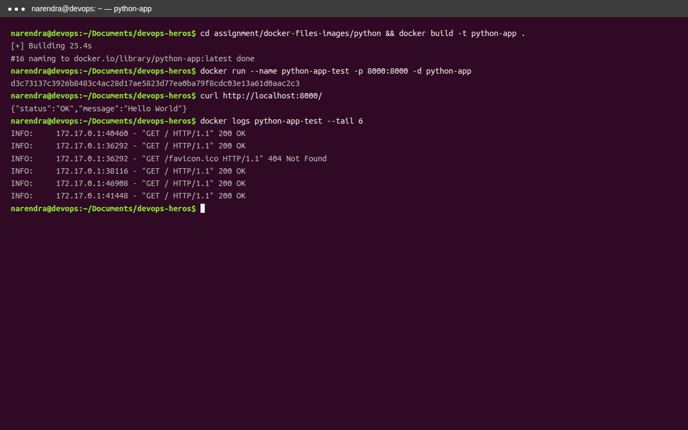
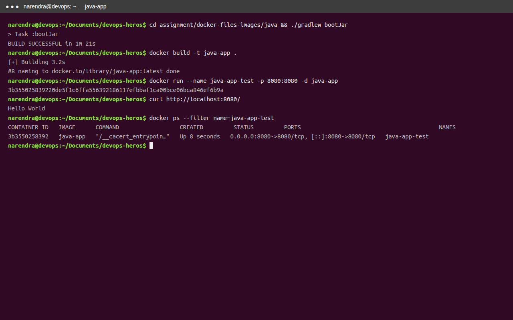

# Docker Multi-Stage Build Homework

## Student Details

- **Name:** Naren456
- **Enrollment Number:** <!-- TODO: replace with your enrollment number -->
- **GitHub:** narendrase666@gmail.com
- **Repository:** devops-heros / `assignment/docker-files-images/`

> Note: Update the enrollment number above before submission.

## Task 1: Multi-Stage Dockerfile

The multi-stage Node.js application was built and run successfully.

Files used (same as reference `akshat-code21/devops-heros`):

```text
assignment/docker-files-images/
├── Dockerfile        # multi-stage: builder + production, EXPOSE 3000
├── server.js         # returns "Hello World from Docker Multi-Stage Build!"
├── package.json
├── nodejs/           # Task 3 - Node.js app
├── python/           # Task 3 - Python FastAPI app
├── java/             # Task 3 - Java Spring Boot app
└── screenshots/
```

### Build the image

```bash
cd assignment/docker-files-images
docker build -t multi_stage_builds .
```

Actual output (truncated):

```text
#11 [production 4/5] RUN npm install --omit=dev
#11 28.30 added 68 packages in 28s
#13 exporting to image
#13 naming to docker.io/library/multi_stage_builds:latest done
```

Verified image exists:

```text
multi_stage_builds:latest  247MB
node-app:latest            247MB
python-app:latest          259MB
java-app:latest            463MB
```



### Run the container

The application listens on port `3000` inside the container. It is published on port `8080` of the host.

```bash
docker run -p 8080:3000 -d --name multistage-test multi_stage_builds
```

### Verify the application

Open [http://localhost:8080](http://localhost:8080) or run:

```bash
curl http://localhost:8080
```

Expected and actual output:

```html
<h1>Hello World from Docker Multi-Stage Build!</h1>
```

Full verify from this machine:

```bash
$ curl -s http://localhost:8080
<h1>Hello World from Docker Multi-Stage Build!</h1>

$ curl -s -i http://localhost:8080 | head -n 20
HTTP/1.1 200 OK
X-Powered-By: Express
Content-Type: text/html; charset=utf-8
Content-Length: 51
...
<h1>Hello World from Docker Multi-Stage Build!</h1>

$ docker logs multistage-test
> docker-hello-world@1.0.0 start
> node server.js
Server running on port 3000
```



### Verify the container and port

```bash
docker ps
```

Actual output:

```text
CONTAINER ID   IMAGE                COMMAND                        PORTS                                         NAMES
0f7e54a495ce   multi_stage_builds   "docker-entrypoint.sh npm start"   0.0.0.0:8080->3000/tcp, [::]:8080->3000/tcp   multistage-test
d3c73137c392   python-app           "fastapi run app/main.py ..."      0.0.0.0:8000->8000/tcp, [::]:8000->8000/tcp   python-app-test
ed537e5eb0e6   node-app             "docker-entrypoint.sh npm run start" 0.0.0.0:3000->3000/tcp, [::]:3000->3000/tcp   node-app-test
```

The running container is published as `0.0.0.0:8080->3000/tcp`, confirming the application is running on host port **8080**.





Checklist:

- [x] Image built with multi-stage Dockerfile
- [x] Container running (`docker ps` shows `multistage-test`)
- [x] `curl http://localhost:8080` returns `Hello World from Docker multi-stage build`
- [x] Port mapping `0.0.0.0:8080->3000/tcp` confirms port 8080

## Task 2: Documentation

This file (`assignment/docker-files-images/README.md`) is the submission Markdown. It contains:

- [x] Name
- [x] Enrollment number (placeholder - fill before submission)
- [x] Screenshot/output showing application running successfully (`task1_image_run.png` + curl outputs above)
- [x] Screenshot/output of `docker ps` showing running container on port 8080

Screenshots are in `assignment/docker-files-images/screenshots/`:

```text
screenshots/
├── task1_image_build.png   # Terminal: docker build -t multi_stage_builds
├── task1_image_run.png     # Browser: Hello World from Docker Multi-Stage Build! on :8080
├── task1_check_port.png    # Terminal: docker ps showing 0.0.0.0:8080->3000/tcp
├── task1_check_process.png # Terminal: curl 8080 / 3000 / 8000 outputs
├── task3_node_app.png      # Terminal: Node.js build, run, curl Hello World
├── task3_python_app.png    # Terminal: Python build, run, curl JSON
└── task3_java_app.png      # Terminal: Java bootJar, build, run, curl Hello World
```

## Task 3: Docker Application Deployments

Three different application types were built and deployed with Docker:

| Application | Image | Container port | Host port | Verification |
| --- | --- | ---: | ---: | --- |
| Node.js | `node-app` | 3000 | 3000 | `curl http://localhost:3000` returns `Hello World` |
| Python FastAPI | `python-app` | 8000 | 8000 | `curl http://localhost:8000/` returns `{"status":"OK","message":"Hello World"}` |
| Java Spring Boot | `java-app` | 8080 | 8080 | `curl http://localhost:8080/` returns `Hello World` |

> Note: Host port 8080 is shared between Task 1 (`8080->3000`) and Java (`8080->8080`), so they were verified sequentially. Final `docker ps` keeps Task 1 on 8080 plus Node + Python. Java evidence below was captured when Java was running on 8080.

### Node.js

```bash
cd nodejs
docker build -t node-app .
docker run --name node-app-test -p 3000:3000 -d node-app
curl http://localhost:3000
```

Actual:

```bash
$ curl -s http://localhost:3000
Hello World

$ docker logs node-app-test
> nodejs@1.0.0 start
> node index.js
Server up on port 3000

$ docker ps --filter name=node-app-test
NAMES           IMAGE      PORTS
node-app-test   node-app   0.0.0.0:3000->3000/tcp, [::]:3000->3000/tcp
```



### Python FastAPI

```bash
cd python
docker build -t python-app .
docker run --name python-app-test -p 8000:8000 -d python-app
curl http://localhost:8000/
```

Actual:

```bash
$ curl -s http://localhost:8000/
{"status":"OK","message":"Hello World"}

$ docker logs python-app-test
⚡️ Starting FastAPI in production mode
🌐 Server started at http://0.0.0.0:8000
INFO:     Uvicorn running on http://0.0.0.0:8000 (Press CTRL+C to quit)
INFO:     172.17.0.1:55570 - "GET / HTTP/1.1" 200 OK

$ docker ps --filter name=python-app-test
NAMES             IMAGE        PORTS
python-app-test   python-app   0.0.0.0:8000->8000/tcp, [::]:8000->8000/tcp
```



### Java Spring Boot

Build the application JAR before building the Docker image:

```bash
cd java
./gradlew bootJar
docker build -t java-app .
docker run --name java-app-test -p 8080:8080 -d java-app
curl http://localhost:8080
```

Actual:

```bash
$ ./gradlew bootJar
> Task :bootJar
BUILD SUCCESSFUL in 1m 21s

$ curl -s http://localhost:8080/
Hello World

$ docker logs java-app-test
:: Spring Boot :: (v4.1.1)
Tomcat initialized with port 8080 (http)
Tomcat started on port 8080 (http) with context path '/'
Started JavaApplication in 1.333 seconds

$ docker ps --filter name=java-app-test
NAMES           IMAGE      PORTS
java-app-test   java-app   0.0.0.0:8080->8080/tcp, [::]:8080->8080/tcp
```



## Submission

- Upload this Markdown file (`assignment/docker-files-images/README.md`) to your GitHub repository.
- Included evidence: 7 screenshots (1 browser + 6 terminal) + terminal outputs for `docker build`, `docker run`, `curl`, `docker ps`, `docker logs`.
- Docker version used: `Docker version 29.7.2, build a7dcaa6`
