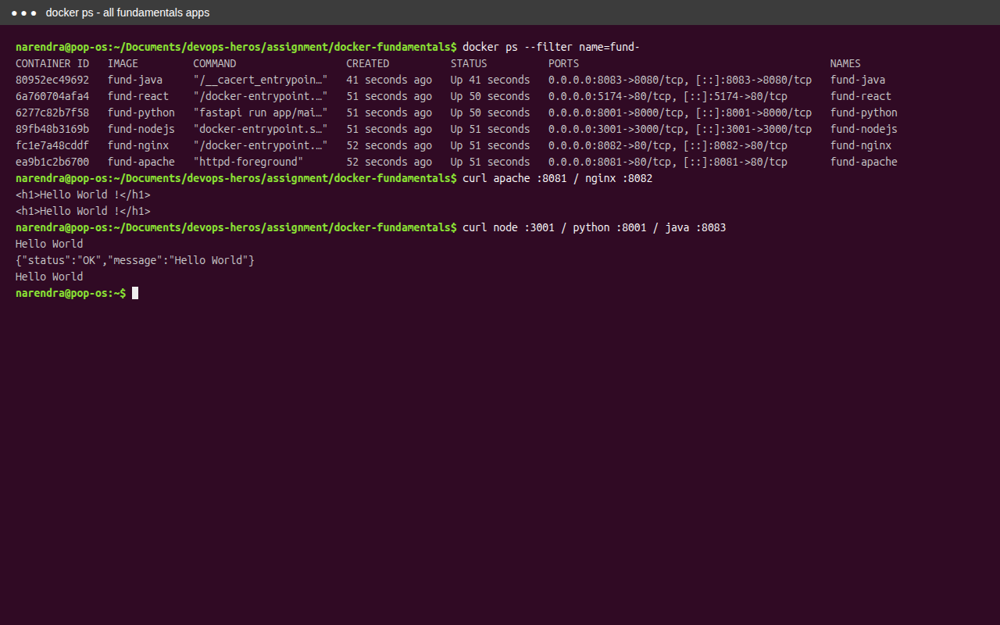
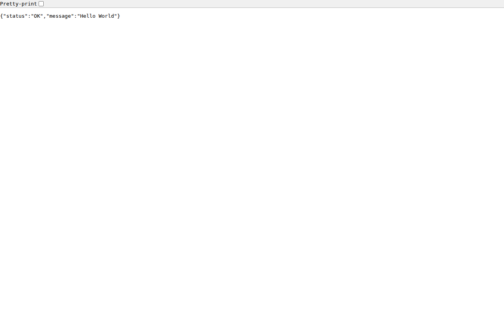
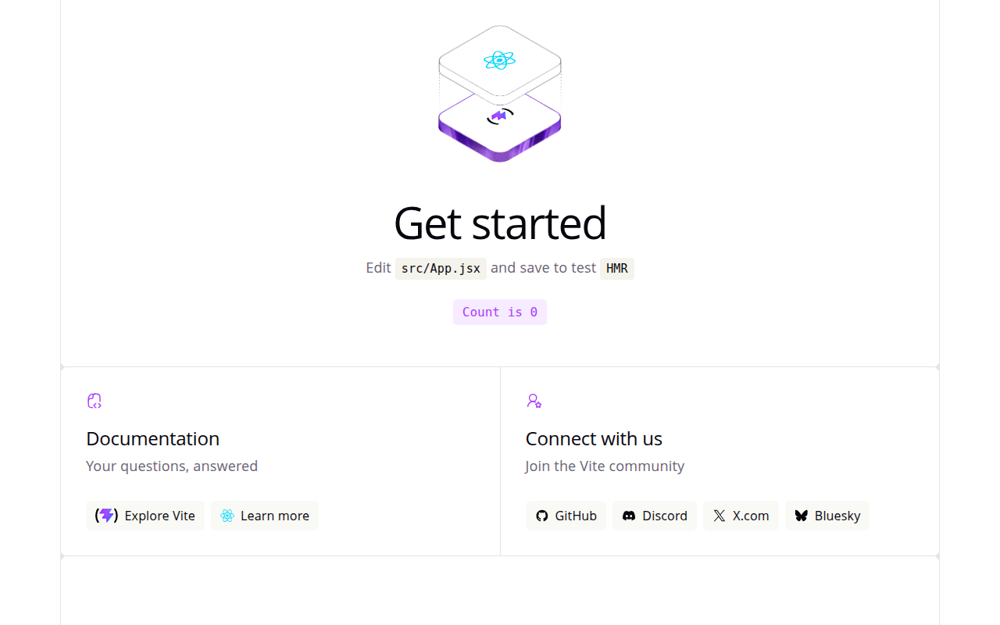

# Docker Fundamentals: Hello World Applications

## Student Details

- **Name:** Naren456
- **Enrollment Number:** 24bcs10225

The implementation folders of this assignment are:

```text
docker-fundamentals/
├── apache/     # httpd, port 80 -> host 8081
├── nginx/      # nginx, port 80 -> host 8082
├── nodejs/     # Node.js + Express, port 3000 -> host 3001
├── python/     # Python FastAPI, port 8000 -> host 8001
├── java/       # Java Spring Boot, port 8080 -> host 8083
├── react/      # React Vite (React-app/) served by nginx, port 80 -> host 5174
└── screenshots/
```

> Host ports 8081/8082/3001/8001/8083/5174 are used to avoid clashing with the
> `docker-files-images` homework containers (8080/3000/8000). Container ports
> match the reference (`apache 80`, `nginx 80`, `nodejs 3000`, `python 8000`,
> `java 8080`, `react 80`).

All six containers running together:



```text
$ docker ps --filter name=fund-
NAMES         IMAGE         PORTS
fund-apache   fund-apache   0.0.0.0:8081->80/tcp
fund-nginx    fund-nginx    0.0.0.0:8082->80/tcp
fund-nodejs   fund-nodejs   0.0.0.0:3001->3000/tcp
fund-python   fund-python   0.0.0.0:8001->8000/tcp
fund-java     fund-java     0.0.0.0:8083->8080/tcp
fund-react    fund-react    0.0.0.0:5174->80/tcp
```

## Applications

| Application | Folder | Container port | Host port | Verification |
| --- | --- | ---: | ---: | --- |
| Apache | `apache/` | 80 | 8081 | `curl http://localhost:8081` → `Hello World !` |
| Nginx | `nginx/` | 80 | 8082 | `curl http://localhost:8082` → `Hello World !` |
| Node.js | `nodejs/` | 3000 | 3001 | `curl http://localhost:3001` → `Hello World` |
| Python | `python/` | 8000 | 8001 | `curl http://localhost:8001` → `{"status":"OK","message":"Hello World"}` |
| Java | `java/` | 8080 | 8083 | `curl http://localhost:8083` → `Hello World` |
| React | `react/React-app/` | 80 | 5174 | browser `http://localhost:5174` → Vite app |

## Build and Run

### Apache

```bash
cd apache
docker build -t fund-apache .
docker run --name fund-apache -p 8081:80 -d fund-apache
curl http://localhost:8081
cd ..
```

Expected page heading: `Hello World !`


### Nginx

```bash
cd nginx
docker build -t fund-nginx .
docker run --name fund-nginx -p 8082:80 -d fund-nginx
curl http://localhost:8082
cd ..
```

Expected page heading: `Hello World !`


### Node.js

```bash
cd nodejs
docker build -t fund-nodejs .
docker run --name fund-nodejs -p 3001:3000 -d fund-nodejs
curl http://localhost:3001
cd ..
```

Expected response: `Hello World`

```text
$ curl -s http://localhost:3001/
Hello World
$ docker logs fund-nodejs
> nodejs@1.0.0 start
> node index.js
Server up on port 3000
```


### Python

```bash
cd python
docker build -t fund-python .
docker run --name fund-python -p 8001:8000 -d fund-python
curl http://localhost:8001
cd ..
```

Expected response: `{"status":"OK","message":"Hello World"}`

```text
$ curl -s http://localhost:8001/
{"status":"OK","message":"Hello World"}
```



### Java

Build the application JAR before building the Docker image:

```bash
cd java
./gradlew bootJar
docker build -t fund-java .
docker run --name fund-java -p 8083:8080 -d fund-java
curl http://localhost:8083
cd ..
```

Expected response: `Hello World`

```text
$ ./gradlew bootJar
BUILD SUCCESSFUL
$ curl -s http://localhost:8083/
Hello World
$ docker logs fund-java
Tomcat started on port 8080 (http) with context path '/'
Started DemoApplication in 1.497 seconds
```


### React

```bash
cd react/React-app
docker build -t fund-react .
docker run --name fund-react -p 5174:80 -d fund-react
open http://localhost:5174
cd ../..
```

The bundled app is the default Vite + React template (Get started page).



## Verification Screenshots

```text
screenshots/
├── apache_app.png         # Browser: Hello World ! (Apache on :8081)
├── nginx_app.png          # Browser: Hello World ! (Nginx on :8082)
├── node_app.png           # Browser: Hello World (Node.js on :3001)
├── python_app.png         # Browser: JSON Hello World (Python on :8001)
├── java_app.png           # Browser: Hello World (Java on :8083)
├── react_app_running.png  # Browser: Vite React app (React on :5174)
└── containers_running.png # Terminal: docker ps + curl for all six apps
```
