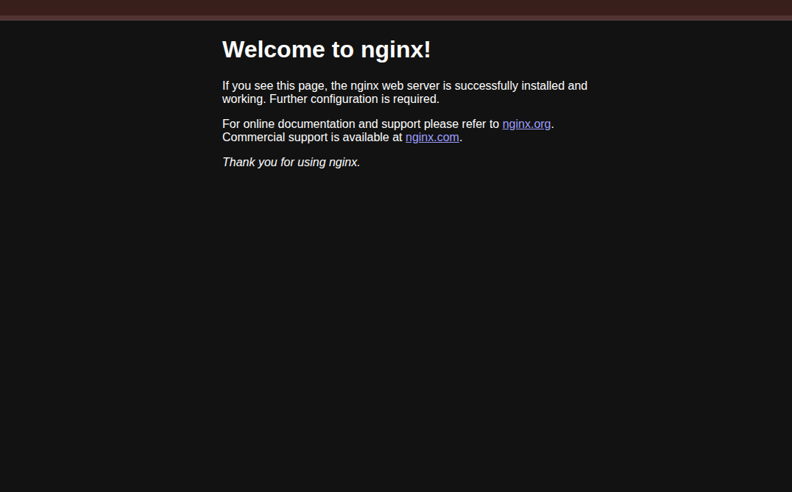

# ClusterIP Service — Internal Communication in Kubernetes

> **Session-11 Reference:** `session-11-kubernetes-services/01-clusterip` + `service.md` & `fqdn.md`  
> **Type:** `ClusterIP` (Default) — Internal Only

---

## 1. What is ClusterIP?

`ClusterIP` is the **default Service type** in Kubernetes. When you create it, Kubernetes allocates a stable **virtual IP (VIP)** from the service CIDR (e.g. `10.96.0.0/12`). This IP is **virtual** — it does not belong to any Node NIC — and is reachable **only inside the cluster**.

Any Pod inside the cluster can reach the service via:
- `http://<service-name>:<port>` (short name, same namespace)
- `http://<service-name>.<namespace>.svc.cluster.local:<port>` (FQDN, cross-namespace)

Outside traffic (internet / laptop without `port-forward`) **cannot** reach it directly.




---

## 2. Why Do We Need It? (Problem → Solution)

### Problem: Ephemeral Pod IPs
Pods are disposable. Every restart / reschedule / scale event gives a new IP:
```
Old Pod IP: 10.244.1.25  (Terminated)
New Pod IP: 10.244.2.80  (Started)
```
If frontend hardcodes `10.244.1.25`, it instantly breaks.

### Solution: Stable VIP + DNS + Load Balancing
ClusterIP gives a **permanent IP + DNS name** that never changes. `kube-proxy` (iptables/IPVS) watches `Endpoints`/`EndpointSlices` and load-balances traffic to **healthy Ready pods only**.

```
Frontend Pod ──► http://web-service-clusterip:8080 ──► ClusterIP VIP 10.96.150.45 ──► [Pod1 | Pod2 | Pod3]
```

**Analogy:** Office PBX extension `*200` for Billing. Agents rotate desks, but you always dial `*200` and the switchboard connects you to whoever is logged in.

---

## 3. When to Use ClusterIP in Production?

| Use Case | Example |
|---|---|
| **Microservice → Microservice** | `frontend → backend-api`, `payment → order-service` |
| **App → Database/Cache** | App → PostgreSQL / Redis / MongoDB (never expose DB externally) |
| **Internal APIs** | Metrics collector, logging aggregator, admin APIs |
| **Behind Ingress** | Ingress Controller routes external traffic to internal ClusterIPs |

> **Rule of thumb:** If it should NOT be on the internet, use ClusterIP.

---

## 4. YAML Manifests (Session-11 Lab)

### Deployment (`app-deployment.yaml`)
```yaml
apiVersion: apps/v1
kind: Deployment
metadata:
  name: web-app-clusterip
  labels:
    app: web-clusterip
spec:
  replicas: 3
  selector:
    matchLabels:
      app: web-clusterip
  template:
    metadata:
      labels:
        app: web-clusterip
    spec:
      containers:
        - name: nginx-web
          image: nginx:1.25-alpine
          ports:
            - containerPort: 80   # informational, must match targetPort
          resources:
            requests: { cpu: "50m", memory: "64Mi" }
            limits:   { cpu: "100m", memory: "128Mi" }
```

### Service (`service.yaml`)
```yaml
apiVersion: v1
kind: Service
metadata:
  name: web-service-clusterip
  labels:
    app: web-clusterip
spec:
  type: ClusterIP          # default if omitted
  selector:
    app: web-clusterip     # must match Pod labels
  ports:
    - name: http
      port: 8080           # Service port (other pods connect here)
      targetPort: 80       # Container port
      protocol: TCP
```

### Field Breakdown

| Field | Meaning |
|---|---|
| `type: ClusterIP` | Internal virtual IP only |
| `selector` | Selects pods with matching label `app: web-clusterip` |
| `port: 8080` | Front door — what clients dial |
| `targetPort: 80` | Back door — what nginx listens on |
| `containerPort: 80` | Doc field in Deployment, must align with `targetPort` |

> **The 4 Ports (Interview Must-Know):** `nodePort (Node host 30000-32767) → port (Service VIP) → targetPort (Pod) → containerPort (spec docs)`

---

## 5. How to Deploy & Verify (Hands-On)

### Step 1 — Deploy App
```bash
kubectl apply -f app-deployment.yaml
kubectl get pods -l app=web-clusterip -o wide
# NAME  READY  IP           NODE
# web-app-clusterip-xxx  1/1  10.244.0.12  minikube
```

### Step 2 — Create Service
```bash
kubectl apply -f service.yaml
kubectl get svc web-service-clusterip
# NAME                    TYPE        CLUSTER-IP     PORT(S)    AGE
# web-service-clusterip   ClusterIP   10.96.150.45   8080/TCP   10s

kubectl get endpoints web-service-clusterip
# ENDPOINTS: 10.244.0.12:80,10.244.0.13:80,10.244.0.14:80
```

### Step 3 — Test Inside Cluster (2 Methods)

**Method A: Internal curl pod (production-style)**
```bash
kubectl apply -f client-pod.yaml          # session-11/01-clusterip/client-pod.yaml
kubectl exec -it curl-client -- curl -s http://web-service-clusterip:8080
kubectl exec -it curl-client -- curl -s http://web-service-clusterip.default.svc.cluster.local:8080
kubectl exec -it curl-client -- nslookup web-service-clusterip
cat /etc/resolv.conf   # inside curl-client → nameserver 10.96.0.10 (CoreDNS)
```

**Method B: Port-Forward (local debug)**
```bash
kubectl port-forward svc/web-service-clusterip 8080:8080
# Open http://localhost:8080 → NGINX Welcome Page
```

---

## 6. How It Works Under the Hood

1. **Endpoint Controller** watches `selector`, builds `Endpoints` object with Ready pod IPs.
2. **kube-proxy** (DaemonSet on every node) watches Services + Endpoints, programs `iptables`/`IPVS` DNAT rules.
3. **CoreDNS** (`kube-system`, IP `10.96.0.10`) creates DNS `A` record: `web-service-clusterip.default.svc.cluster.local → 10.96.150.45`

> FQDN Format: `<service>.<namespace>.svc.cluster.local` — see `session-11/fqdn.md`

---

## 7. Troubleshooting

| Symptom | Cause | Fix |
|---|---|---|
| `Endpoints: <none>` | Selector mismatch | `service.selector` must equal `pod.labels` |
| `Connection refused` | `targetPort` wrong | Match container's actual listening port |
| `nslookup` fails | CoreDNS down | `kubectl get pods -n kube-system -l k8s-app=kube-dns` |
| Pod not receiving traffic | Failed `readinessProbe` | Service removes NotReady pods automatically |

---

## 8. Cleanup

```bash
kubectl delete -f client-pod.yaml
kubectl delete -f service.yaml
kubectl delete -f app-deployment.yaml
```

---

## 9. Key Takeaway & Interview Cheat

- **Default type, internal only, single VIP, kube-proxy LB, CoreDNS A record.**
- `ClusterIP` → `NodePort` → `LoadBalancer` are nesting dolls (each builds on previous).
- Use for **backend → frontend, backend → database** — exactly as noted in assignment image — never expose directly to internet.

**Reference:** `session-11-kubernetes-services/service.md` (Section Type 1) + `01-clusterip/README.md`
