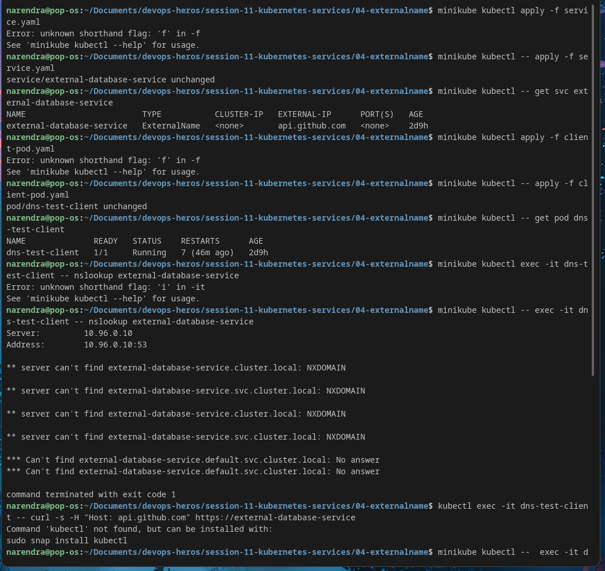

# ExternalName Service — Internal DNS Alias for External Systems

> **Session-11 Reference:** `session-11-kubernetes-services/04-externalname` + `service.md` (Type 4) + `fqdn.md`  
> **Type:** `ExternalName` — **No Selector, No ClusterIP, No Endpoints** — CoreDNS `CNAME` redirect only

---

## 1. What is ExternalName?

`ExternalName` is the **odd one out** among service types. It has:

- **No pods**
- **No ClusterIP** (`CLUSTER-IP: <none>`)
- **No kube-proxy / iptables rules**
- **No Endpoints object**

It is purely a **CoreDNS CNAME record**: when a pod queries `external-database-service.default.svc.cluster.local`, CoreDNS replies `CNAME → api.github.com` (or your RDS/hostname), and the pod then connects **directly** to the external system.



```
App Pod ──► nslookup external-database-service
              │
              ▼
          CoreDNS (10.96.0.10) ──► CNAME: api.github.com → 140.82.121.6
              │
              ▼
          App Pod ──► Direct TCP to api.github.com (bypasses kube-proxy)
```

---

## 2. Why Do We Need It?

### Problem: Hardcoded External URLs
```text
Dev:       dev-db.local
Staging:   staging-postgres.company.internal
Prod:      prod-aurora.c484930.us-east-1.rds.amazonaws.com
```
Hardcoding these across 20 microservices → painful migration, image rebuilds, config drift.

### Solution: Stable Internal Alias
Apps always use:
```
DB_HOST=external-database-service
# or FQDN: external-database-service.default.svc.cluster.local
```
Switch environment by updating **one YAML**:
- Dev → `ClusterIP` pointing to local Postgres Pod
- Prod → `ExternalName` pointing to RDS

**Analogy:** Phone speed-dial "Best Friend". Friend changes number (Airtel → Jio) — you update the contact once, not every chat thread.

---

## 3. Where is ExternalName Used?

| Use Case | Example |
|---|---|
| **Managed DBs outside cluster** | AWS RDS, GCP CloudSQL, MongoDB Atlas, Azure Cosmos |
| **Third-party SaaS APIs** | `api.stripe.com`, `api.twilio.com`, `api.github.com` |
| **Legacy VM / On-Prem DB** | Gradual migration — pods talk to legacy VM via internal name |
| **Environment portability** | Same app config (`DB_HOST=db-service`) across dev/stage/prod |

---

## 4. YAML Manifest (Session-11 Lab)

### Service (`service.yaml`)
```yaml
apiVersion: v1
kind: Service
metadata:
  name: external-database-service
spec:
  type: ExternalName
  externalName: api.github.com   # must be a DNS hostname, NOT an IP
```

### Key Field Explanations
| Field | Meaning |
|---|---|
| `type: ExternalName` | DNS CNAME mode |
| `externalName: api.github.com` | Target FQDN returned by CoreDNS |
| **Absent:** `selector`, `ports`, `clusterIP` | Not used — DNS layer only |

> **No IP allowed:** `externalName: 192.168.1.50` is invalid. For raw IPs, use a `ClusterIP` without selector + manual `Endpoints` object (see `service.md` §6).

### Optional Test Pod (`client-pod.yaml` from session-11)
```yaml
apiVersion: v1
kind: Pod
metadata:
  name: dns-test-client
spec:
  containers:
    - name: dnsutils
      image: tutum/dnsutils:latest
      command: ["sleep", "3600"]
  restartPolicy: Always
```

---

## 5. How to Deploy & Verify

### Step 1 — Apply Service
```bash
kubectl apply -f service.yaml
kubectl get svc external-database-service
# NAME                        TYPE           CLUSTER-IP   EXTERNAL-IP      PORT(S)  AGE
# external-database-service   ExternalName   <none>       api.github.com   <none>   12s
```

### Step 2 — Deploy Test Pod
```bash
kubectl apply -f client-pod.yaml
kubectl get pod dns-test-client
```

### Step 3 — Verify CNAME
```bash
kubectl exec -it dns-test-client -- nslookup external-database-service

# Expected:
# Server:    10.96.0.10
# Address:   10.96.0.10#53
# external-database-service.default.svc.cluster.local  canonical name = api.github.com.
# Name:      api.github.com
# Address:   140.82.121.6
```

### Step 4 — HTTP Test
```bash
kubectl exec -it dns-test-client -- curl -s https://external-database-service | head -20
# If HTTPS: set Host header for SNI
kubectl exec -it dns-test-client -- curl -s -H "Host: api.github.com" http://external-database-service
```

---

## 6. How It Works Under the Hood

1. Pod queries `external-database-service` → Linux checks `/etc/resolv.conf` (`nameserver 10.96.0.10`, `search default.svc.cluster.local svc.cluster.local cluster.local`, `ndots:5`).
2. Query sent to **CoreDNS** (`kube-system`, e.g., `coredns-xxx`).
3. CoreDNS returns `CNAME api.github.com`.
4. Pod's resolver does second lookup for `api.github.com` → real external IP.
5. Pod opens **direct connection** to external IP — **no NAT via kube-proxy**.

> Short vs Long name: Same namespace → `external-database-service` works. Cross-namespace → `external-database-service.<namespace>` or full FQDN required. See `fqdn.md` §6.

---

## 7. Caveats & Interview Gotchas

| Gotcha | Detail |
|---|---|
| **No port remapping** | DNS only — cannot map `80 → 8080` |
| **HTTPS / SNI mismatch** | Cert expects `api.github.com`, not `external-database-service`. App must set `Host` header or disable strict SNI check |
| **No IP in externalName** | Must be hostname; for IP use manual `Endpoints` without selector |
| **No selectors/endpoints** | `kubectl get endpoints external-database-service` → not found (by design) |

### ExternalName vs Service without Selector

|  | ExternalName | Service (no selector) + Manual Endpoints |
|---|---|---|
| Mechanism | DNS CNAME | kube-proxy iptables DNAT to IP |
| Target | FQDN (domain) | IP address (`192.168.1.50:3306`) |
| Layer | DNS (L7) | TCP/UDP (L4) |

---

## 8. Cleanup

```bash
kubectl delete -f client-pod.yaml
kubectl delete -f service.yaml
```

**Reference:** `session-11-kubernetes-services/service.md` (Type 4) + `04-externalname/README.md` + `fqdn.md`
