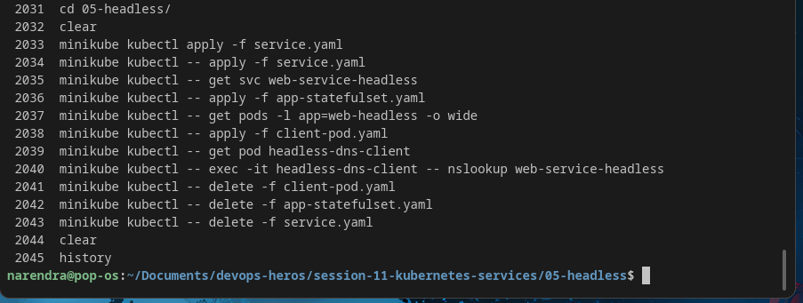

# Headless Service (`clusterIP: None`) — Direct Pod Discovery

> **Session-11 Reference:** `session-11-kubernetes-services/05-headless` + `service.md` (Type 5) + `fqdn.md` §7  
> **Type:** `Headless` — `clusterIP: None` — No VIP, No Load Balancing, DNS returns **Pod IPs directly**

---

## 1. What is a Headless Service?

A normal `ClusterIP` gives **one virtual IP** and `kube-proxy` load-balances randomly.

A **Headless Service** disables that:

```yaml
spec:
  clusterIP: None   # ← this single field makes it headless
```

Result:
- **No virtual IP** (`CLUSTER-IP: None`)
- **No kube-proxy rules**
- **CoreDNS returns ALL Pod IPs** as multiple `A` records instead of one VIP.
- With a `StatefulSet`, each pod also gets a **stable DNS**: `<pod-name>.<service>.<namespace>.svc.cluster.local`



```
Normal ClusterIP:    nslookup web-service → 10.96.140.50 (single VIP)
Headless Service:    nslookup web-service-headless → 10.244.0.30, 10.244.0.31, 10.244.0.32 (all pods)
                     nslookup web-stateful-0.web-service-headless → 10.244.0.30 (specific pod)
```

---

## 2. Why Do We Need It?

### Problem: Stateful Clusters Need Direct Peers
Databases like **Kafka, MongoDB ReplicaSet, Cassandra, ZooKeeper, Elasticsearch, Redis Cluster, PostgreSQL Master-Slave** have roles:

- `Pod-0 = Master / Leader` (writes)
- `Pod-1, Pod-2 = Followers / Replicas` (reads)

A normal `ClusterIP` would **randomly** send a WRITE to a read-only replica → failure! Brokers also need to gossip directly to elect leaders / form quorum.

### Solution: Client Chooses Pod
Headless gives the client the **full list of pod IPs** and **individual pod DNS**. App logic decides:

```
Write → web-stateful-0.web-service-headless:9042 (master only)
Read  → any of web-stateful-{0,1,2} or client-side LB
Kafka broker discovery → each broker dials peer brokers directly
```

**Analogy:** Standard service = calling 1-800 switchboard → random operator. Headless = phone directory with every engineer's direct extension → you dial Alice at ext 101 directly.

---

## 3. Where is Headless Used?

| System | Why Headless |
|---|---|
| **Kafka / ZooKeeper / etcd / RabbitMQ** | Quorum, leader election, peer replication |
| **MongoDB ReplicaSet / Cassandra / Elasticsearch** | Nodes discover peers, distinguish primary vs secondary |
| **PostgreSQL / MySQL master-slave** | Writes to master only |
| **gRPC / Envoy client-side LB** | Client implements its own balancing / connection pooling |
| **Redis Sentinel / Redis Cluster** | Sentinel needs direct pod addresses |

---

## 4. YAML Manifests (Session-11 Lab)

### Headless Service (`service.yaml`)
```yaml
apiVersion: v1
kind: Service
metadata:
  name: web-service-headless
  labels:
    app: web-headless
spec:
  clusterIP: None               # ← HEADLESS
  selector:
    app: web-headless
  ports:
    - name: web
      port: 80
      targetPort: 80
      protocol: TCP
```

### StatefulSet (`app-statefulset.yaml`)
```yaml
apiVersion: apps/v1
kind: StatefulSet
metadata:
  name: web-stateful
  labels:
    app: web-headless
spec:
  serviceName: web-service-headless   # must match Headless Service name
  replicas: 3
  selector:
    matchLabels:
      app: web-headless
  template:
    metadata:
      labels:
        app: web-headless
    spec:
      containers:
        - name: nginx-stateful
          image: nginx:1.25-alpine
          ports:
            - name: web
              containerPort: 80
          resources:
            requests: { cpu: "50m", memory: "64Mi" }
            limits:   { cpu: "100m", memory: "128Mi" }
```

### Field Breakdown

| Field | Meaning |
|---|---|
| `clusterIP: None` | Disables VIP → headless |
| `serviceName` (StatefulSet) | Links StatefulSet to Headless Service for per-pod DNS `web-stateful-0.web-service-headless...` |
| `selector: app: web-headless` | Selects pods (same as normal) |
| No `type` needed | Headless is a variant of ClusterIP, not a separate `type` |

---

## 5. How to Deploy & Verify

### Step 1 — Create Headless Service (must be first)
```bash
kubectl apply -f service.yaml
kubectl get svc web-service-headless
# NAME                   TYPE        CLUSTER-IP   EXTERNAL-IP   PORT(S)   AGE
# web-service-headless   ClusterIP   None         <none>        80/TCP    10s
```

### Step 2 — Create StatefulSet
```bash
kubectl apply -f app-statefulset.yaml
kubectl get pods -l app=web-headless -o wide -w
# NAME             READY   IP           NODE
# web-stateful-0   1/1     10.244.0.30  minikube
# web-stateful-1   1/1     10.244.0.31  minikube
# web-stateful-2   1/1     10.244.0.32  minikube
# Note: Pods start sequentially (0 → 1 → 2) — StatefulSet guarantee
```

### Step 3 — DNS Verification (via test pod)

Deploy client:
```bash
kubectl apply -f client-pod.yaml   # session-11/05-headless/client-pod.yaml
kubectl get pod headless-dns-client
```

**Test A — Service DNS returns ALL pod IPs:**
```bash
kubectl exec -it headless-dns-client -- nslookup web-service-headless
# Server:    10.96.0.10
# Name:      web-service-headless.default.svc.cluster.local
# Address:   10.244.0.30
# Address:   10.244.0.31
# Address:   10.244.0.32
```

**Test B — Specific Pod DNS:**
```bash
kubectl exec -it headless-dns-client -- nslookup web-stateful-0.web-service-headless.default.svc.cluster.local
# Name:      web-stateful-0.web-service-headless.default.svc.cluster.local
# Address:   10.244.0.30

kubectl exec -it headless-dns-client -- nslookup web-stateful-1.web-service-headless.default.svc.cluster.local
# Address:   10.244.0.31
```

**Test C — Curl specific pod directly:**
```bash
kubectl exec -it headless-dns-client -- curl -s http://web-stateful-0.web-service-headless:80 | head -20
kubectl exec -it headless-dns-client -- curl -s http://web-stateful-1.web-service-headless:80 | head -20
```

Compare to normal service:
```bash
kubectl exec -it headless-dns-client -- nslookup web-service-clusterip
# Returns single VIP 10.96.x.x
```

---

## 6. How It Works Under the Hood

|  | Normal Service | Headless Service |
|---|---|---|
| **VIP** | Allocated `10.96.x.x` | `None` |
| **LB** | kube-proxy iptables/IPVS | **Client** decides |
| **DNS returns** | 1× `A` → VIP | N× `A` → Pod IPs |
| **Per-pod DNS** | No | `pod.service.namespace.svc.cluster.local` |
| **Workload** | Deployment (stateless) | StatefulSet (stateful, ordinal) |

CoreDNS watches `Endpoints` — for headless it directly returns `Endpoint` IPs instead of `ClusterIP`.

---

## 7. Decision Guide (All 5 Types) — Session-11 Summary

```
Need external access?
├── NO ──► Need direct pod-to-pod / StatefulSet clustering?
│          ├── YES → HEADLESS (clusterIP: None)
│          └── NO  → CLUSTERIP (default)
└── YES ─► Is target outside cluster (RDS FQDN / SaaS)?
           ├── YES → EXTERNALNAME (CNAME)
           └── NO  ─► On Public Cloud?
                     ├── YES ─► HTTP/HTTPS? → 1× LOADBALANCER for Ingress + ClusterIP apps
                     │         └─ No (TCP/UDP) → direct LOADBALANCER
                     └── NO (On-Prem/Local) → NODEPORT
```

---

## 8. Troubleshooting

| Symptom | Fix |
|---|---|
| `nslookup` returns 1 IP not 3 | Service missing `clusterIP: None` → check `kubectl get svc -o yaml` |
| Per-pod DNS fails | `StatefulSet.serviceName` must exactly match Headless Service `metadata.name` |
| Pods not in DNS | Pods must be `Ready` (readinessProbe passes); headless only returns Ready pods by default |
| Want even NotReady pods | Set `publishNotReadyAddresses: true` in Service spec |

---

## 9. Cleanup

```bash
kubectl delete -f client-pod.yaml
kubectl delete -f app-statefulset.yaml
kubectl delete -f service.yaml
```

**Reference:** `session-11-kubernetes-services/service.md` (Type 5) + `05-headless/README.md` + `fqdn.md` §7 (Pod FQDN)
