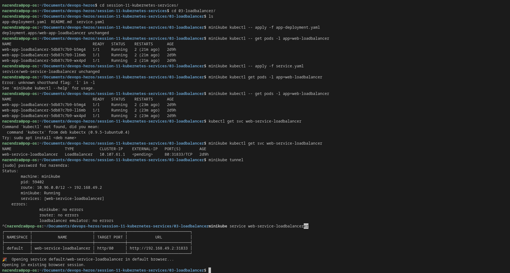

# LoadBalancer Service — Public Cloud Exposure

> **Session-11 Reference:** `session-11-kubernetes-services/03-loadbalancer` + `service.md` (Type 3)  
> **Type:** `LoadBalancer` — Provisions external Cloud Load Balancer (AWS ELB/NLB, GCP LB, Azure LB) for internet-facing apps

---

## 1. What is LoadBalancer?

`LoadBalancer` is the standard way to expose apps to the **public internet** on **standard ports `80`/`443`** in managed clouds (EKS, GKE, AKS).

When you apply `type: LoadBalancer`:

1. Kubernetes creates a **ClusterIP** (internal VIP).
2. Kubernetes creates a **NodePort** (host port on every node).
3. **Cloud Controller Manager** calls cloud API to provision an external LB (e.g., AWS NLB, GCP External LB) with a **public IP / DNS**.
4. External LB forwards `PublicIP:80 → NodeIP:NodePort → ClusterIP:80 → PodIP:80`.



---

## 2. Why Do We Need It?

### Problems with NodePort
- Users won't visit `http://shop.com:30080` — they expect `:80`/`:443`.
- Connecting directly to a Node IP is **single point of failure** if that node dies.
- No cross-AZ balancing / health checks.

### Solution: Cloud Managed LB
```
User Browser ──► http://my-shop.com:80
                   │
                   ▼
         Cloud LB (54.210.15.22:80, health-checked, multi-AZ, auto-scaling)
                   │
        ┌──────────┴──────────┐
        ▼                     ▼
   Node1:31250           Node2:31250
        \                     /
         ▼                   ▼
      ClusterIP 10.96.88.20:80
              │
       ┌──────┴──────┐
       ▼             ▼
    Pod1          Pod2
```

**Analogy:** International airport — all travelers enter the same glass terminal entrance (Cloud LB), then shuttles (Nodes) route them to specific boarding gates (Pods).

---

## 3. Where is LoadBalancer Used?

| Use Case | Example |
|---|---|
| **Public web apps** | E-commerce frontend, SaaS dashboard, marketing site |
| **Public APIs** | Mobile API gateway, webhooks (`api.company.com`) |
| **Non-HTTP (L4)** | gRPC, WebSocket, game servers, VoIP where Ingress (L7) is insufficient |
| **Ingress entrypoint (BEST PRACTICE)** | **1× LoadBalancer for NGINX Ingress Controller** → 100 microservices as `ClusterIP` via Ingress rules (saves $$$) |

> **Cost Warning (Interview Favorite):** Each `LoadBalancer` creates a real cloud resource costing **$15–$30/month** on AWS. 50 microservices × 50 LBs = **>$1000/month wasted**. Use **one LB + Ingress**.

---

## 4. YAML Manifests (Session-11 Lab)

### Deployment (`app-deployment.yaml`)
```yaml
apiVersion: apps/v1
kind: Deployment
metadata:
  name: web-app-loadbalancer
  labels:
    app: web-loadbalancer
spec:
  replicas: 3
  selector:
    matchLabels:
      app: web-loadbalancer
  template:
    metadata:
      labels:
        app: web-loadbalancer
    spec:
      containers:
        - name: web-server
          image: nginx:1.25-alpine
          ports:
            - containerPort: 80
          resources:
            requests: { cpu: "50m", memory: "64Mi" }
            limits:   { cpu: "100m", memory: "128Mi" }
```

### Service (`service.yaml`)
```yaml
apiVersion: v1
kind: Service
metadata:
  name: web-service-loadbalancer
  labels:
    app: web-loadbalancer
  # Optional cloud annotations (example: AWS NLB + SSL)
  # annotations:
  #   service.beta.kubernetes.io/aws-load-balancer-type: "nlb"
spec:
  type: LoadBalancer
  selector:
    app: web-loadbalancer
  ports:
    - name: http
      port: 80           # Public LB port
      targetPort: 80     # Container port
      protocol: TCP
```

### Field Breakdown
| Field | Meaning |
|---|---|
| `type: LoadBalancer` | Ask cloud provider to provision external LB |
| `port: 80` | Public port users hit |
| `targetPort: 80` | Pod container port |
| `selector` | Must match Pod labels |

> **Russian Doll:** `LoadBalancer` = `ClusterIP` + `NodePort` + `Cloud LB`

---

## 5. How to Deploy & Verify

### Step 1 — Deploy App
```bash
kubectl apply -f app-deployment.yaml
kubectl get pods -l app=web-loadbalancer
```

### Step 2 — Create Service
```bash
kubectl apply -f service.yaml
kubectl get svc web-service-loadbalancer -w
# Wait 1–2 min for EXTERNAL-IP to populate
```

### Step 3 — Access

**On AWS/GCP/Azure (real cloud):**
```bash
kubectl get svc web-service-loadbalancer
# NAME                       TYPE           CLUSTER-IP   EXTERNAL-IP                               PORT(S)
# web-service-loadbalancer   LoadBalancer   10.96.88.20  a1b2c3d4-123456.us-east-1.elb.amazonaws.com  80:31250/TCP

curl http://a1b2c3d4-123456.us-east-1.elb.amazonaws.com
```

**On Minikube / Docker Desktop (local):**
`EXTERNAL-IP` stays `<pending>` because no cloud exists. Two workarounds:

*Option A — Minikube Tunnel (new terminal):*
```bash
minikube tunnel
kubectl get svc web-service-loadbalancer   # now shows 127.0.0.1
curl http://localhost
```

*Option B — Direct service shortcut:*
```bash
minikube service web-service-loadbalancer
minikube service web-service-loadbalancer --url
```

Expected: NGINX welcome page.

---

## 6. Comparison

| Feature | NodePort | LoadBalancer |
|---|---|---|
| Public Port | 30000-32767 (ugly) | 80/443 (clean) |
| HA | ❌ Manual | ✅ Cloud LB health checks + AZ spread |
| Cost | Free | $15–30/mo per LB (use Ingress to minimize) |
| Cloud Required | No | Yes |
| L4 vs L7 | L4 | L4 (use Ingress for L7 path/host routing) |

---

## 7. Production Best Practices

1. **One LB per cluster:** Expose Ingress Controller via LoadBalancer; route all apps via `Ingress` objects (`/api`, `/web`, `app.domain.com`).
2. **Annotations for LB type:** Use cloud-specific annotations for NLB vs ALB, SSL cert, cross-zone LB.
3. **Health checks:** Ensure `readinessProbe` on pods — LB removes unhealthy nodes automatically.

---

## 8. Troubleshooting

| Symptom | Fix |
|---|---|
| `EXTERNAL-IP <pending> forever` | Expected locally — run `minikube tunnel` or check cloud IAM / quota / Cloud Controller Manager logs |
| `Connection timed out` | Security Group / Firewall not allowing `NodePort` from LB; check `targetPort` match |
| Cost surprise | Audit `kubectl get svc --all-namespaces \| grep LoadBalancer` and consolidate via Ingress |

---

## 9. Cleanup

```bash
kubectl delete -f service.yaml
kubectl delete -f app-deployment.yaml
# On cloud: verify LB deleted in AWS/GCP console to avoid charges
```

**Reference:** `session-11-kubernetes-services/service.md` (Type 3) + `03-loadbalancer/README.md` + `service/loadbalancer.yaml`
