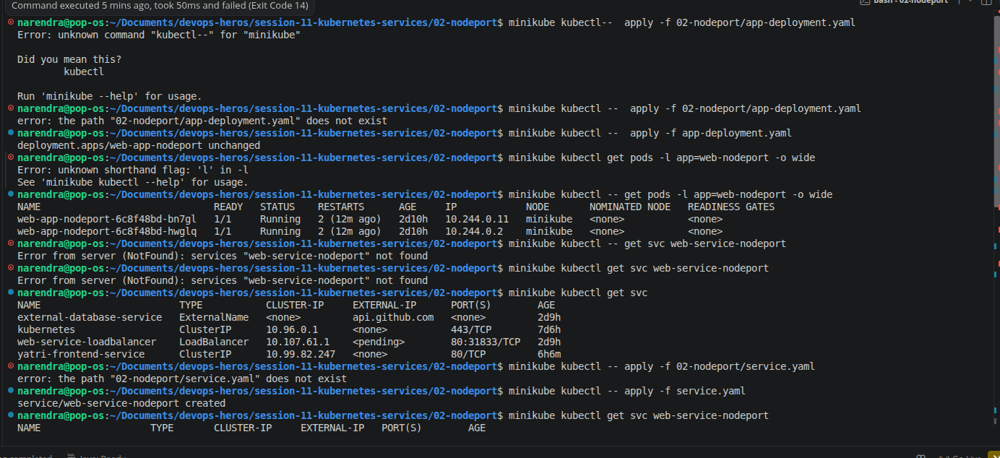

# NodePort Service — Host-Level External Access

> **Session-11 Reference:** `session-11-kubernetes-services/02-nodeport` + `service.md` (Type 2)  
> **Type:** `NodePort` — Exposes service on every Node's IP via static high port `30000-32767`

---

## 1. What is NodePort?

`NodePort` is the simplest **native** way to make a service reachable from **outside** the cluster without a cloud provider.

When you set `type: NodePort`, Kubernetes:
1. Allocates a port in range **`30000–32767`** (or uses your `nodePort` if specified).
2. Opens **that same port on EVERY worker node** via `kube-proxy`.
3. Creates a `ClusterIP` underneath for internal routing.

Any client that can reach a Node IP can hit `http://<Any-Node-IP>:<NodePort>` and reach your pods — even if the pod lives on a different node.




---

## 2. Why Do We Need It?

### Problem: ClusterIP is Private
`ClusterIP` uses `10.96.0.0/12` which is non-routable from internet / office LAN. Browser / curl from outside fails.

### Solution: Open a Host Port
NodePort punches a hole on the Node's network interface:

```
Browser / curl  ──► http://192.168.49.2:30080 ──► Node 192.168.49.2:30080 (kube-proxy)
                                               ──► ClusterIP 10.96.210.44:80
                                               ──► Pod 10.244.0.15:80 / Pod 10.244.0.16:80
```

**Analogy:** Apartment complex with 5 towers — every tower's Gate #30080 leads to the same laundry room. Enter from any tower, you reach the same backend pods.

---

## 3. Where is NodePort Used in Production?

| Scenario | Why |
|---|---|
| **Bare-metal / On-Prem** | No cloud LB API (AWS/GCP) available — use NodePort + external HAProxy/F5 |
| **Local Dev / Minikube / Kind** | Quick exposure without paid cloud resources |
| **Ingress Controller entrypoint** | NGINX/Traefik often exposed via NodePort `30080`/`30443` to hardware LB |
| **Non-HTTP / TCP+UDP** | Raw TCP services (databases, game servers) on known host ports |

> **Not for everyday public web:** Port `30080` is ugly for users and fails over poorly if a specific Node dies.

---

## 4. YAML Manifests (Session-11 Lab)

### Deployment (`app-deployment.yaml`)
```yaml
apiVersion: apps/v1
kind: Deployment
metadata:
  name: web-app-nodeport
  labels:
    app: web-nodeport
spec:
  replicas: 2
  selector:
    matchLabels:
      app: web-nodeport
  template:
    metadata:
      labels:
        app: web-nodeport
    spec:
      containers:
        - name: web-server
          image: nginx:1.25-alpine
          ports:
            - containerPort: 80
          resources:
            requests: { cpu: "50m", memory: "64Mi" }
            limits:   { cpu: "100m", memory: "128Mi" }
```

### Service (`service.yaml`)
```yaml
apiVersion: v1
kind: Service
metadata:
  name: web-service-nodeport
  labels:
    app: web-nodeport
spec:
  type: NodePort
  selector:
    app: web-nodeport
  ports:
    - name: http
      port: 80           # internal ClusterIP port
      targetPort: 80     # container port
      nodePort: 30080    # external Node port (optional — auto-assigned if omitted)
      protocol: TCP
```

### Field Breakdown

| Field | Meaning |
|---|---|
| `type: NodePort` | Expose on Node IPs |
| `port: 80` | Internal ClusterIP port (pod-to-pod) |
| `targetPort: 80` | Pod container port |
| `nodePort: 30080` | Host port on every node (`30000-32767`), omit → auto-assign |

---

## 5. How to Deploy & Verify

### Step 1 — Deploy App
```bash
kubectl apply -f app-deployment.yaml
kubectl get pods -l app=web-nodeport -o wide
```

### Step 2 — Create Service
```bash
kubectl apply -f service.yaml
kubectl get svc web-service-nodeport
# NAME                   TYPE       CLUSTER-IP     PORT(S)        AGE
# web-service-nodeport   NodePort   10.96.210.44   80:30080/TCP   10s
#                              └─ 80 = ClusterIP port, 30080 = NodePort
kubectl get endpoints web-service-nodeport
```

### Step 3 — Access

**Method A: Direct Node IP**
```bash
kubectl get nodes -o wide   # get Node IP
curl http://<NODE-IP>:30080
curl http://localhost:30080        # Docker Desktop / single-node
curl http://$(minikube ip):30080   # Minikube
```

**Method B: Minikube helper (macOS Docker driver)**
```bash
minikube service web-service-nodeport --url
minikube service web-service-nodeport   # opens browser
```

**Method C: Internal (still works)**
```bash
kubectl run curl-test --rm -it --image=curlimages/curl -- sh
curl http://web-service-nodeport:80
```

Expected: NGINX welcome HTML.

---

## 6. How It Works Under the Hood

```
Internet ──► NodeIP:30080 (kube-proxy iptables listen on ALL nodes)
           ──► ClusterIP:10.96.210.44:80
           ──► PodIP:10.244.x.x:80 (DNAT + load balancing)
```
- Cross-node routing: traffic hitting Node-A can be forwarded to a pod on Node-B.
- Still creates ClusterIP + Endpoints; `nodePort` is an extra front door.

---

## 7. Limitations & Gotchas

| Limitation | Detail |
|---|---|
| **Port range** | Only `30000-32767` by default; cannot use `80`/`443` without `--service-node-port-range` on `kube-apiserver` |
| **One port per service** | `30080` cannot be reused |
| **No HA by itself** | If client hits a dead Node IP, fails; needs external LB / DNS round-robin for HA |
| **Security** | Opens high port on ALL nodes — manage firewalls / SecurityGroups |

---

## 8. NodePort vs ClusterIP vs LoadBalancer

| Feature | ClusterIP | NodePort | LoadBalancer |
|---|---|---|---|
| External Access | ❌ No | ✅ Yes via NodeIP:NodePort | ✅ Yes via Cloud LB IP |
| Port Range | Any | 30000-32767 | 80/443 |
| Cloud Needed | No | No | Yes (costs $$) |
| Underlying | — | Creates ClusterIP | Creates ClusterIP + NodePort + Cloud LB |

---

## 9. Troubleshooting

| Symptom | Fix |
|---|---|
| `pending` / connection refused | Check `nodePort` in range, Node firewall allows `30080`, `targetPort` matches container |
| `Endpoints <none>` | Selector mismatch (`app: web-nodeport`) |
| Minikube `curl` fails on macOS | Use `minikube service ... --url` or `minikube tunnel` |

---

## 10. Cleanup

```bash
kubectl delete -f service.yaml
kubectl delete -f app-deployment.yaml
```

**Reference:** `session-11-kubernetes-services/service.md` (Type 2) + `02-nodeport/README.md`
