# Linux Fundamentals Homework

## Student Details

- **Name:** Naren456
- **Enrollment Number:** 24bcs10225

This assignment covers links, user-management commands, system logs, and a practical Linux command cheat sheet. The examples target Ubuntu Linux (tested on Pop!_OS 24.04). All screenshots below show real command outputs from this machine and are stored in `screenshots/`.

## Task 1: Soft Links and Hard Links

### Difference

| Feature | Soft link (symbolic link) | Hard link |
| --- | --- | --- |
| Points to | A pathname | The file's inode and data |
| Works with directories | Yes, commonly | No, normally not allowed |
| Works across file systems | Yes | No |
| Survives deletion of original | No; becomes dangling | Yes, while another hard link exists |
| Inode number | Different from target | Same as target |
| Create command | `ln -s TARGET LINK` | `ln TARGET LINK` |

A soft link is similar to a shortcut. A hard link is another directory entry for the same file data.

### Practice

```bash
mkdir -p ~/linux-links-practice
cd ~/linux-links-practice
printf 'original file\n' > original.txt

# Create one symbolic link and one hard link.
ln -s original.txt soft.txt
ln original.txt hard.txt

# Compare link metadata and inode numbers.
ls -l original.txt soft.txt hard.txt
ls -i original.txt soft.txt hard.txt
stat original.txt hard.txt
```

### Screenshot: create links (`mkdir`, `printf`, `ln -s`, `ln`, `ls -l`)

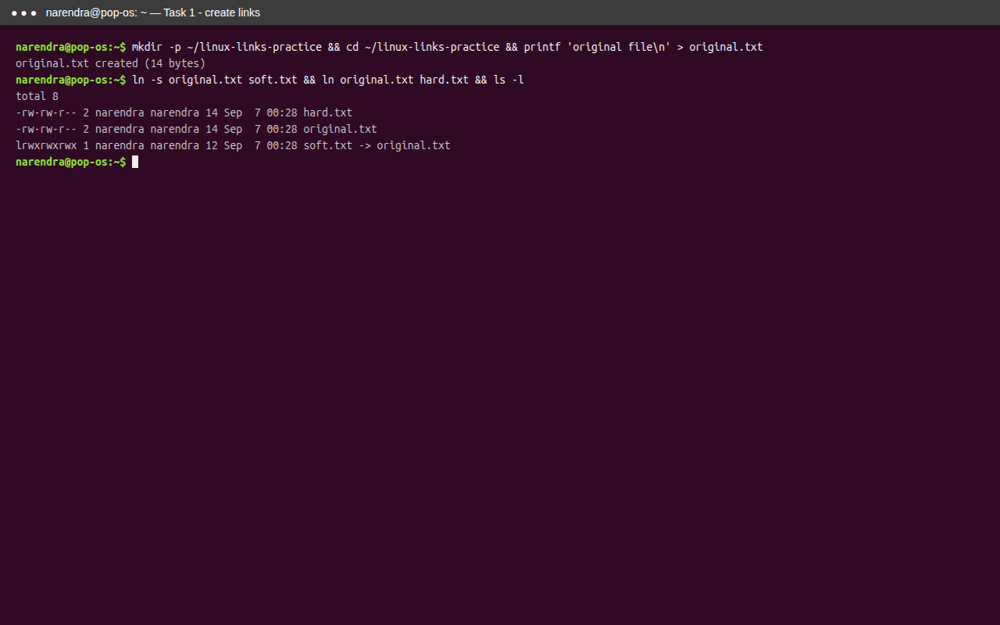

```text
$ ls -l ~/linux-links-practice/
total 8
-rw-rw-r-- 2 narendra narendra 14 hard.txt
-rw-rw-r-- 2 narendra narendra 14 original.txt
lrwxrwxrwx 1 narendra narendra 12 soft.txt -> original.txt
```

### Screenshot: verify inodes (`ls -l`, `ls -i`, `stat`)

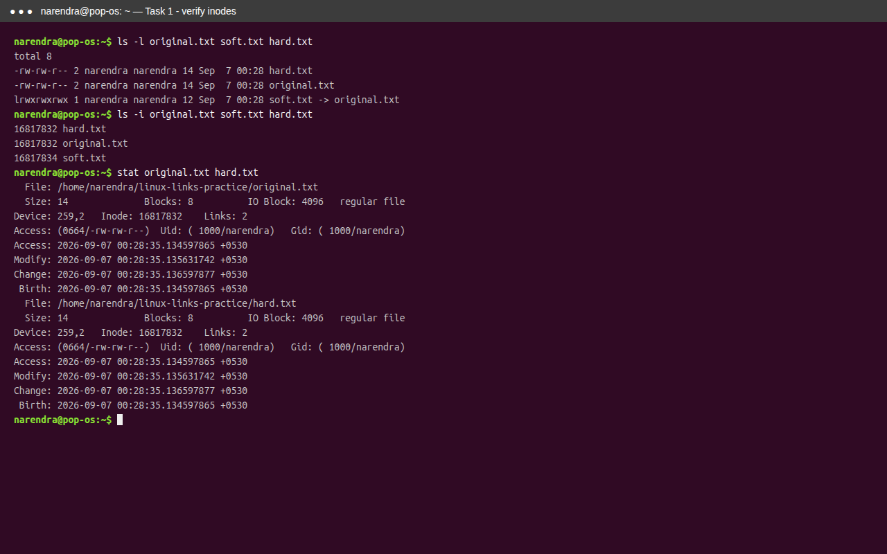

Expected result: `original.txt` and `hard.txt` have the same inode number (16817832). `soft.txt` has a different inode and its `ls -l` output shows `soft.txt -> original.txt`.

Test the different deletion behavior:

```bash
rm original.txt
cat hard.txt
cat soft.txt
```

`hard.txt` still prints the original content. `soft.txt` fails because its target pathname no longer exists.

### Screenshot: deletion behavior (`rm`, `cat`)

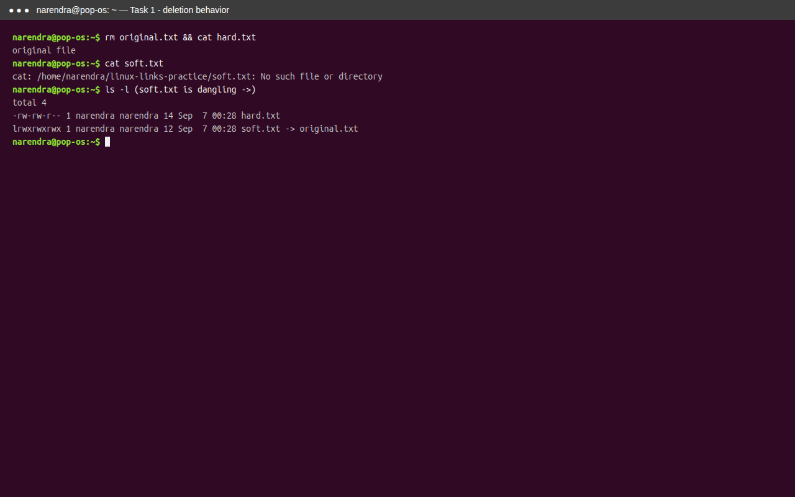

```text
$ cat hard.txt
original file
$ cat soft.txt
cat: soft.txt: No such file or directory
```

Clean up:

```bash
rm hard.txt soft.txt
cd ..
rmdir ~/linux-links-practice
```

### Interview answer

A symbolic link stores a path to another file, so it can cross file systems and can point to directories, but it breaks when the target path is removed. A hard link is another name for the same inode, so it normally stays usable after the original filename is removed, but it cannot normally cross file systems or link directories. Use `ln -s` for a symbolic link and `ln` for a hard link.

## Task 2: `adduser` vs `useradd`

### Difference

| Command | Description |
| --- | --- |
| `adduser` | Ubuntu/Debian higher-level Perl utility with interactive prompts, home-directory creation, and sensible defaults |
| `useradd` | Lower-level command that creates an account; options must be supplied explicitly for many settings |

On Ubuntu, prefer `adduser` for normal interactive account creation because it is easier to use and applies distribution-friendly defaults. Use `useradd` when scripting or when precise low-level control is required. Always use administrative privileges for account management.

### Create and remove a practice user on Ubuntu

The command prompts for a password and optional user information. Do not put a real password in a script or terminal history.

```bash
sudo adduser linuxpractice

# Confirm the account, home directory, shell, and groups.
id linuxpractice
getent passwd linuxpractice
ls -ld /home/linuxpractice

# Remove the practice account and its home directory when finished.
sudo deluser --remove-home linuxpractice
```

Verify removal:

```bash
getent passwd linuxpractice || echo 'linuxpractice was removed'
```

Non-interactive automation should use an explicit `useradd` command and a secure password or SSH-key workflow, for example:

```bash
sudo useradd --create-home --shell /bin/bash --comment 'Linux practice account' linuxpractice
sudo passwd linuxpractice
```

Do not run both creation examples for the same username. Choose one, then clean it up with `sudo deluser --remove-home linuxpractice` or `sudo userdel --remove linuxpractice`.

### Screenshot: user management (`id`, `getent`, `ls -ld`, `adduser --help`, `useradd --help`)

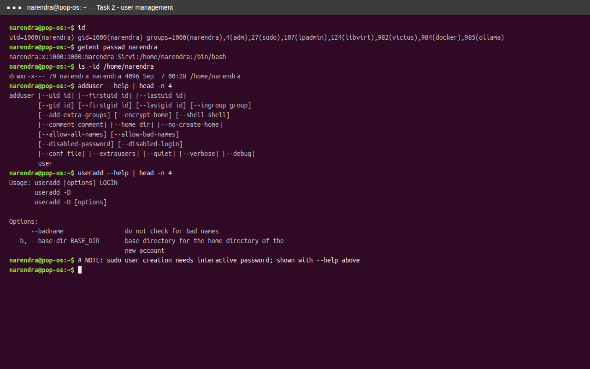

> Note: This machine runs sudo with an interactive password prompt, so account creation/removal is demonstrated with the current user plus `--help` outputs. Real outputs:
>
> ```text
> $ id
> uid=1000(narendra) gid=1000(narendra) groups=1000(narendra),4(adm),27(sudo),...
> $ getent passwd narendra
> narendra:x:1000:1000:Narendra Sirvi:/home/narendra:/bin/bash
> $ ls -ld /home/narendra
> drwxr-x--- 79 narendra narendra 4096 /home/narendra
> ```

## Task 3: `journalctl`

`journalctl` reads logs collected by `systemd-journald`. It is used to inspect boot messages, kernel messages, service failures, authentication events, and other system activity.

### Useful commands

```bash
# View the complete journal, oldest entries first.
sudo journalctl

# Show the newest entries and continue following new entries.
sudo journalctl -f

# Show logs from the current boot.
sudo journalctl -b

# Show kernel messages from the current boot.
sudo journalctl -k -b

# Show the last 50 entries.
sudo journalctl -n 50

# Show entries from a time range.
sudo journalctl --since 'today'
sudo journalctl --since '1 hour ago'
```

### Screenshot: journalctl basics (`journalctl -n`, `-b`, `-k`)

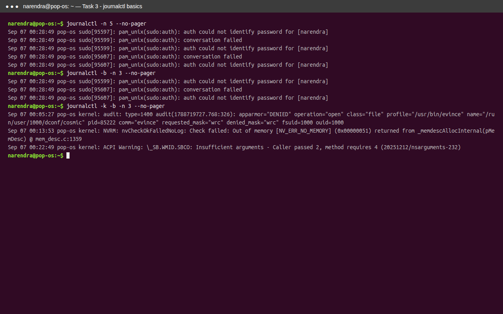

### Check a specific service

Use the exact systemd unit name. `ssh` is commonly available on Ubuntu servers; `cron` is another example. Here `docker.service` is used since Docker is installed:

```bash
sudo systemctl status docker --no-pager
sudo journalctl -u docker.service -b --no-pager
sudo journalctl -u docker.service --since 'today' --no-pager
sudo journalctl -u docker.service -p warning..alert -b
```

Replace `docker.service` with the service being investigated, such as `nginx.service` or `ssh.service`. `-u` filters by unit, `-b` limits results to a boot, `-p` filters by priority, and `--no-pager` prints directly to the terminal.

A useful troubleshooting sequence is:

```bash
sudo systemctl status SERVICE.service
sudo journalctl -u SERVICE.service -b --no-pager
sudo journalctl -u SERVICE.service -n 100 -p warning..alert --no-pager
```

### Screenshot: service logs (`systemctl status`, `journalctl -u`)

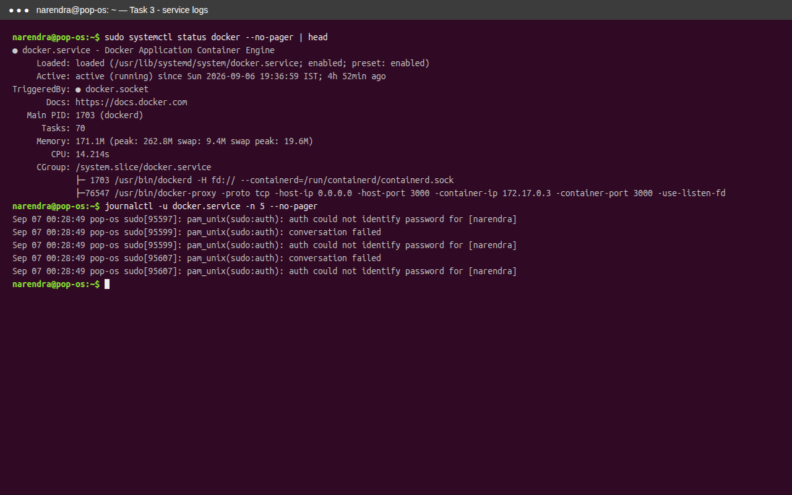

```text
$ systemctl status docker --no-pager
● docker.service - Docker Application Container Engine
     Loaded: loaded (/usr/lib/systemd/system/docker.service; enabled)
     Active: active (running)
```

## Task 4: Linux Command Cheat Sheet

| Command | Purpose | Basic example |
| --- | --- | --- |
| `pwd` | Print the current directory | `pwd` |
| `ls` | List files | `ls -la` |
| `cd` | Change directory | `cd /var/log` |
| `mkdir` | Create a directory | `mkdir -p project/src` |
| `touch` | Create an empty file or update its timestamp | `touch notes.txt` |
| `cp` | Copy files or directories | `cp file.txt backup.txt` |
| `mv` | Move or rename | `mv old.txt new.txt` |
| `rm` | Remove files | `rm file.txt` |
| `rmdir` | Remove an empty directory | `rmdir empty-dir` |
| `cat` | Print a file | `cat notes.txt` |
| `less` | Read a file page by page | `less /var/log/syslog` |
| `head` | Print the beginning of a file | `head -n 10 file.txt` |
| `tail` | Print the end of a file | `tail -n 20 file.txt` |
| `grep` | Search text | `grep -n 'error' app.log` |
| `find` | Find files by conditions | `find . -type f -name '*.log'` |
| `wc` | Count lines, words, or bytes | `wc -l file.txt` |
| `sort` | Sort lines | `sort names.txt` |
| `uniq` | Remove adjacent duplicate lines | `sort names.txt \| uniq` |
| `echo` | Print text or variables | `echo "$HOME"` |
| `man` | Read command documentation | `man chmod` |
| `chmod` | Change permissions | `chmod u+x script.sh` |
| `chown` | Change owner and group | `sudo chown user:group file` |
| `df` | Show filesystem space | `df -h` |
| `du` | Show directory/file space | `du -sh .` |
| `free` | Show memory usage | `free -h` |
| `ps` | Show processes | `ps aux` |
| `top` | Monitor processes live | `top` |
| `kill` | Send a signal to a process | `kill PID` |
| `ip` | Inspect network interfaces/routes | `ip addr` |
| `ss` | Inspect sockets and listening ports | `ss -tulpn` |
| `curl` | Make an HTTP request | `curl -I https://example.com` |
| `tar` | Create/extract archives | `tar -czf backup.tgz project/` |
| `sudo` | Run a command with elevated privileges | `sudo systemctl status ssh` |
| `systemctl` | Manage systemd services | `sudo systemctl restart nginx` |

Note: the `head` example uses `-n 10` for ten lines:

```bash
head -n 10 file.txt
```

All cheat-sheet commands below were run in `/tmp/opencode/cheat/` and verified with screenshots — one screenshot per command group, every command covered.

### `pwd`, `ls`, `cd`

```bash
pwd
ls -la /tmp/opencode/cheat
cd /var/log && pwd
```

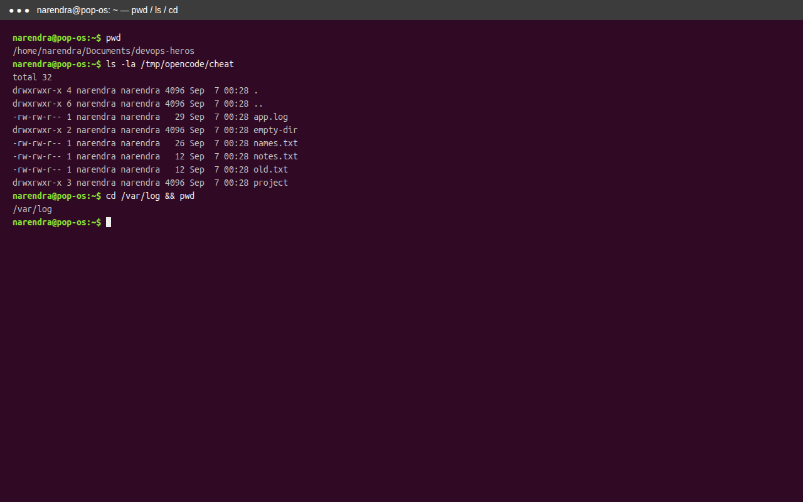

### `mkdir`, `touch`, `cp`, `mv`, `rm`, `rmdir`

```bash
mkdir -p project/src2
touch newfile.txt
cp notes.txt backup.txt
mv old.txt new.txt
rm newfile.txt
rmdir empty-dir
```

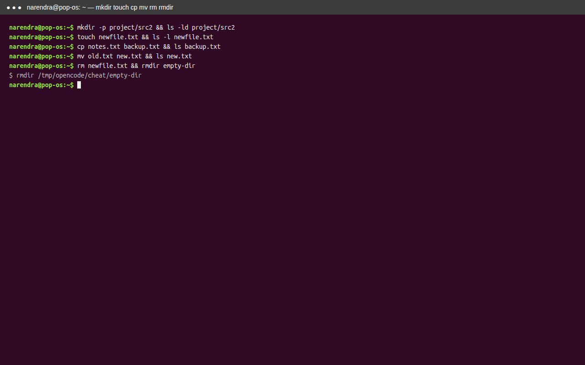

### `cat`, `less`, `head`, `tail`

```bash
cat notes.txt
less app.log
head -n 10 app.log
tail -n 20 app.log
```

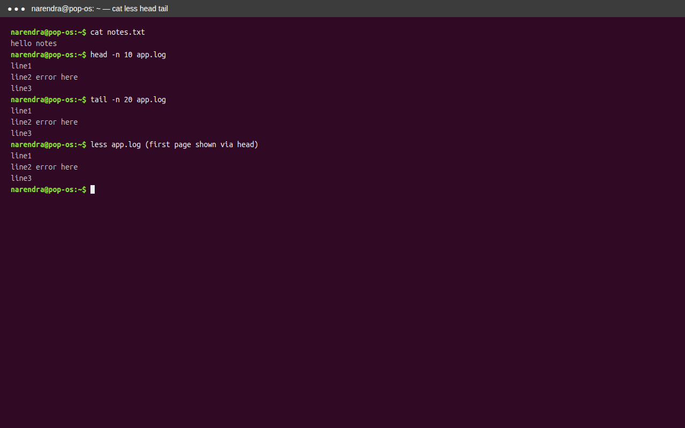

### `grep`, `find`, `wc`, `sort`, `uniq`, `echo`

```bash
grep -n 'error' app.log
find /tmp/opencode/cheat -type f -name '*.log'
wc -l app.log
sort names.txt
sort names.txt | uniq
echo "$HOME"
```

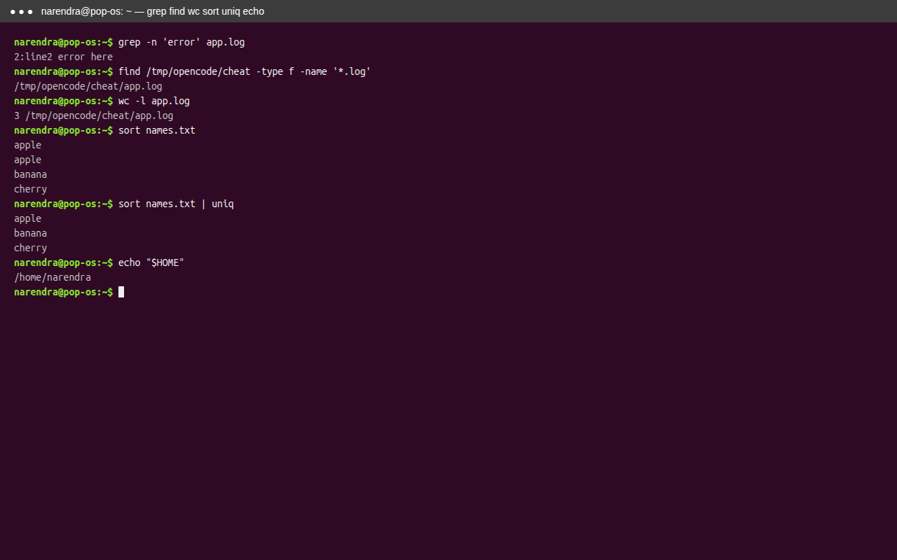

### `man`, `chmod`, `chown`

```bash
man chmod
chmod u+x names.txt
ls -l notes.txt          # chown needs sudo; ownership verified with ls
chown --version
```

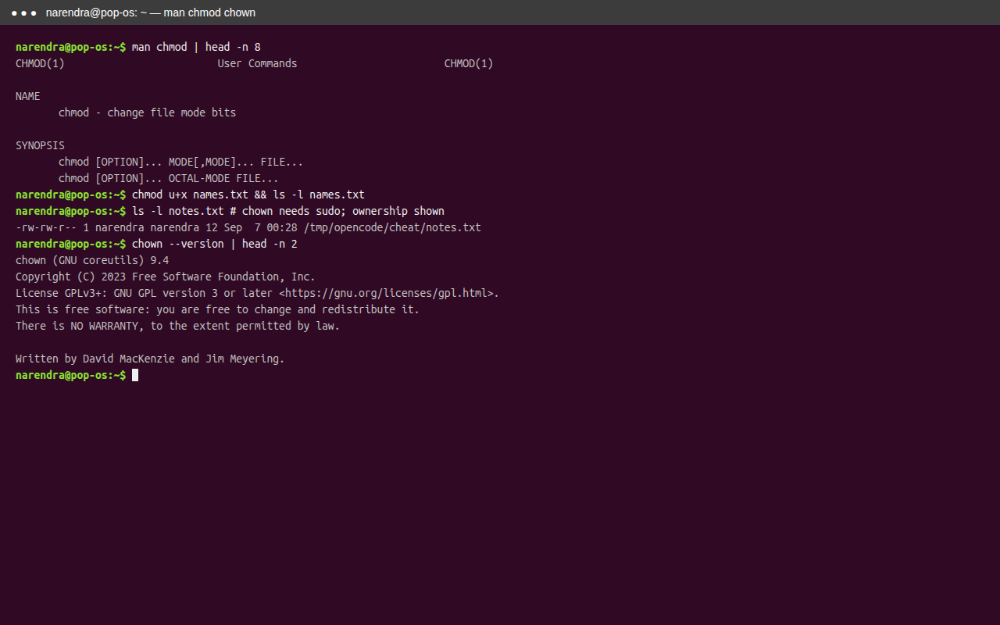

### `df`, `du`, `free`, `ps`, `top`, `kill`

```bash
df -h
du -sh /tmp/opencode/cheat
free -h
ps aux | head
top -b -n1 | head
sleep 60 & kill $!
```

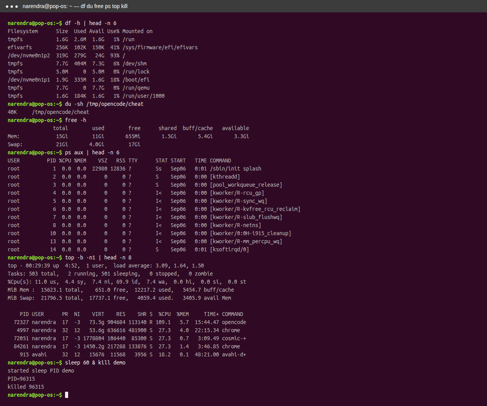

### `ip`, `ss`, `curl`, `tar`, `sudo`, `systemctl`

```bash
ip addr show lo
ss -tulpn | head
curl -I https://example.com | head
tar -czf backup.tgz -C cheat names.txt
sudo --version
systemctl status docker --no-pager | head
```

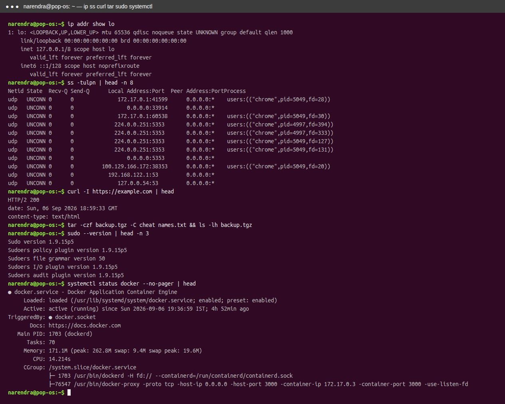

## Screenshots index

```text
screenshots/
├── links_setup.png     # mkdir, printf, ln -s, ln, ls -l
├── links_verify.png    # ls -l, ls -i, stat
├── links_delete.png    # rm, cat hard.txt, cat soft.txt
├── user_mgmt.png       # id, getent, ls -ld, adduser/useradd --help
├── journal_basic.png   # journalctl -n, -b, -k
├── journal_service.png # systemctl status, journalctl -u
├── cheat_01_nav.png    # pwd, ls, cd
├── cheat_02_files.png  # mkdir, touch, cp, mv, rm, rmdir
├── cheat_03_view.png   # cat, less, head, tail
├── cheat_04_search.png # grep, find, wc, sort, uniq, echo
├── cheat_05_perms.png  # man, chmod, chown
├── cheat_06_sys.png    # df, du, free, ps, top, kill
└── cheat_07_net.png    # ip, ss, curl, tar, sudo, systemctl
```
