# session-01&02 : linux_fundamentals

## Overview
This folder contains work completed for the **session-01&02 : linux_fundamentals** assignment.

## Learning Objectives
- Learn Linux fundamentals and command-line workflows.
- Practice file, system, networking, and permission tasks.
- Validate results through screenshots and command examples.

## Tasks Completed
- Setup and navigation exercises
- File and directory management
- Search, permissions, networking, and system troubleshooting
- Documentation and validation

## Screenshots

### Linux Fundamentals
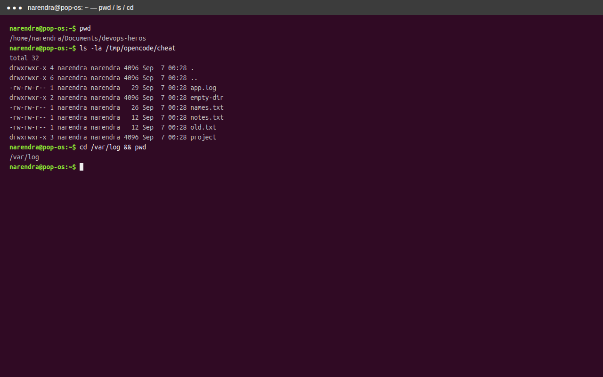
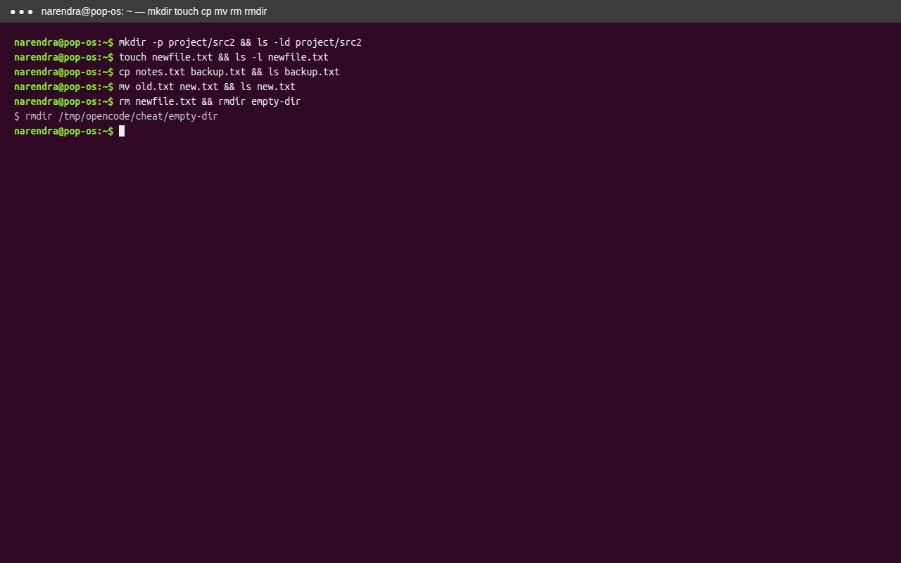
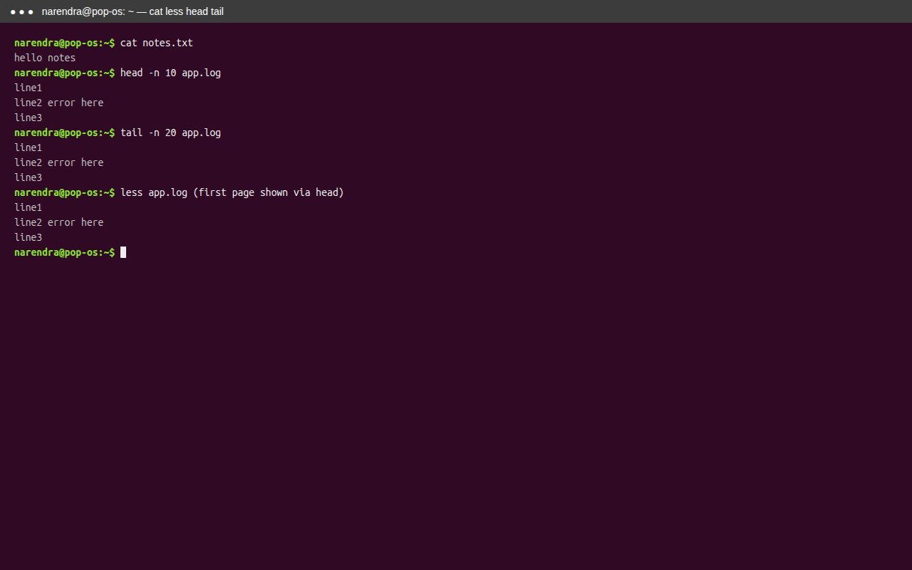
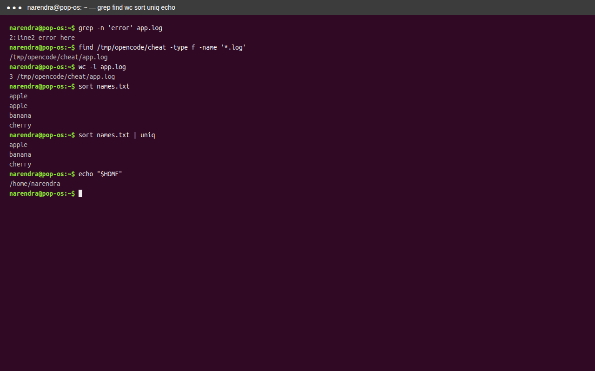
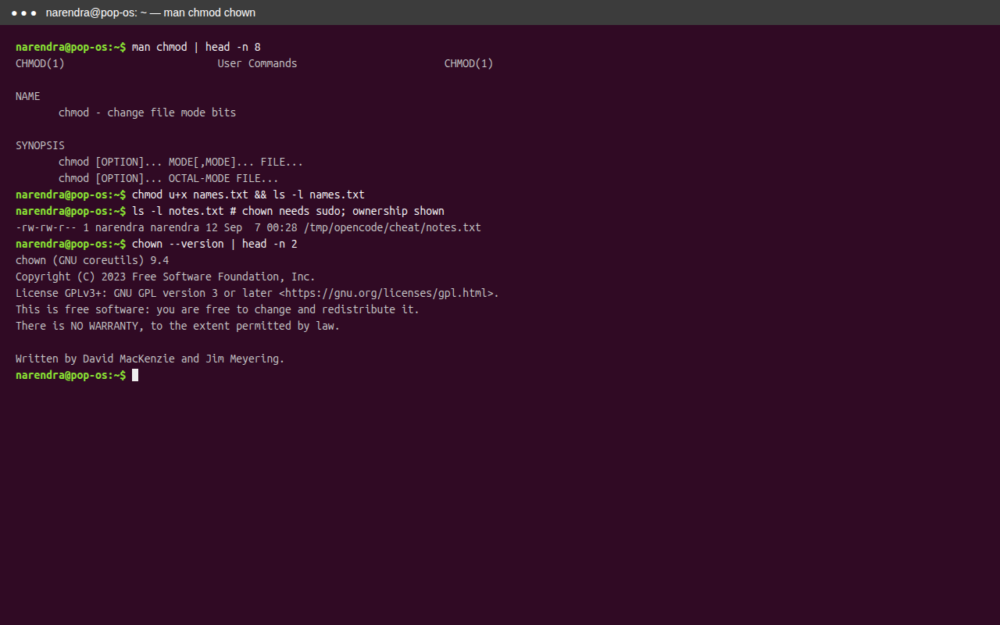
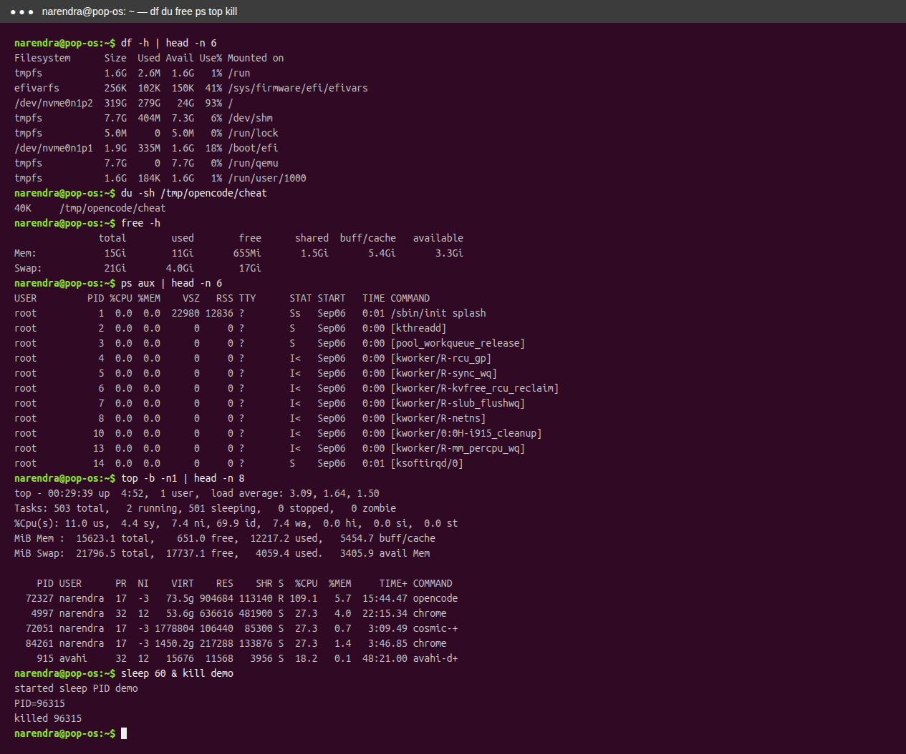
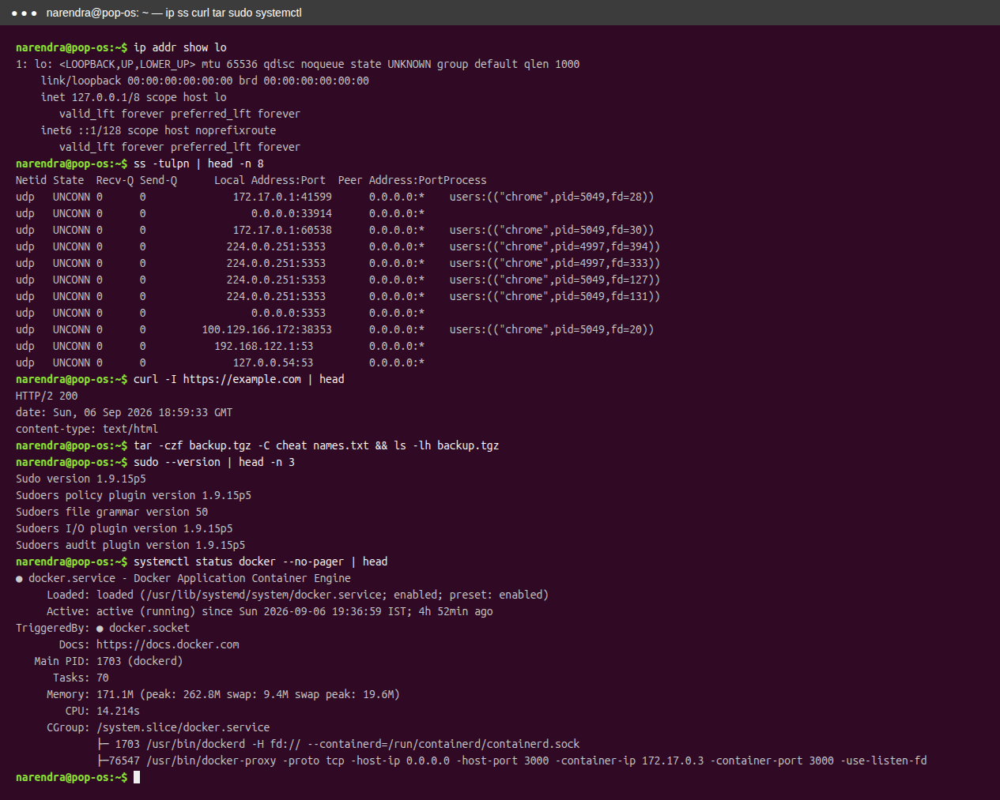
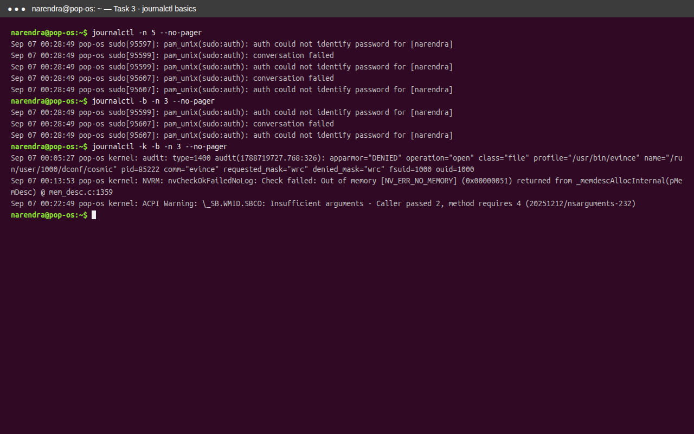
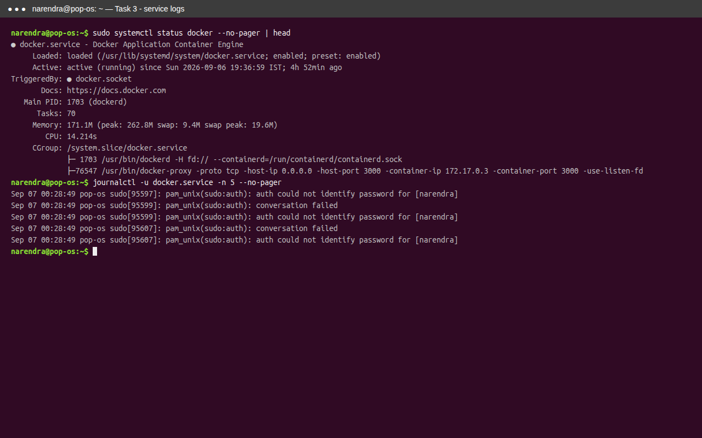
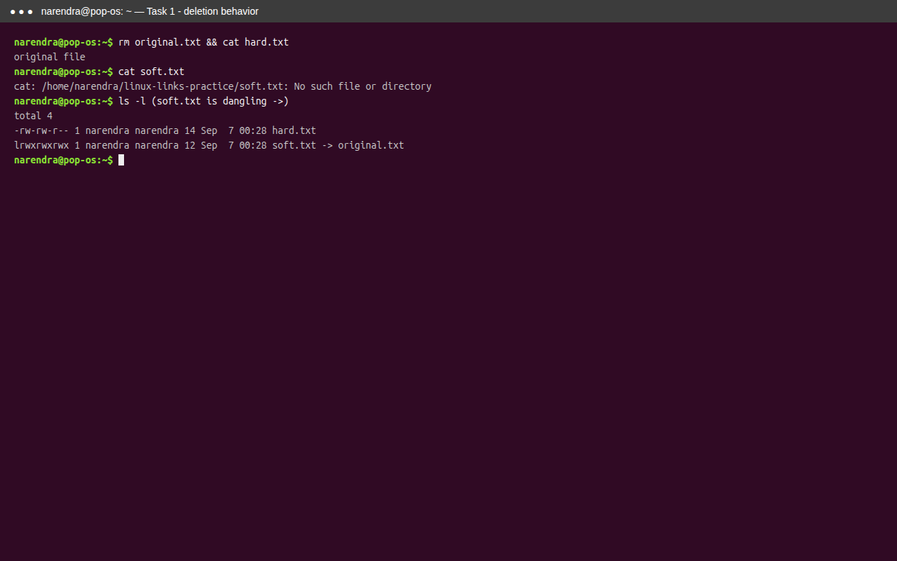
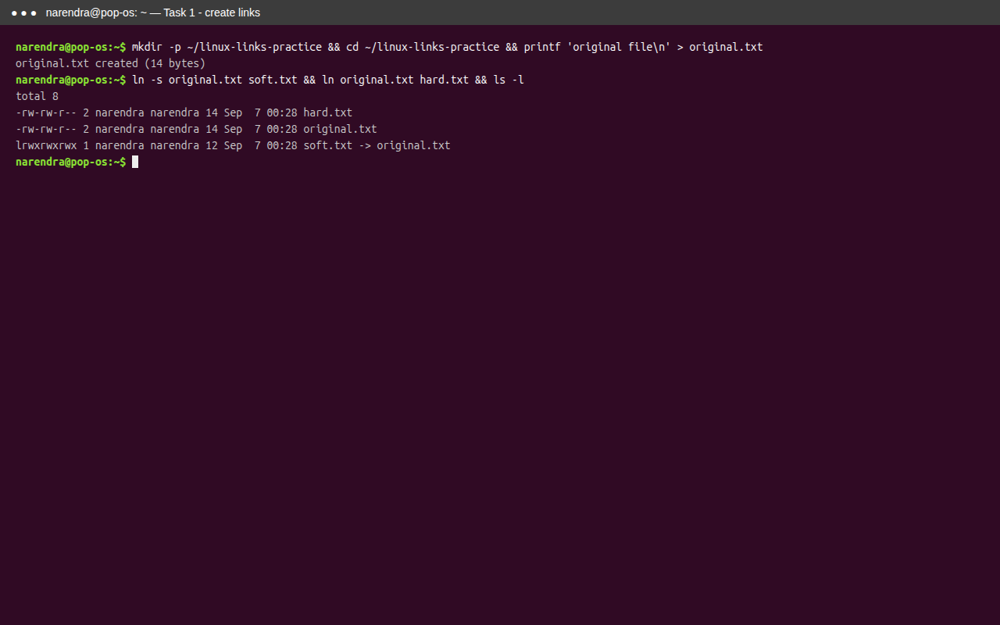
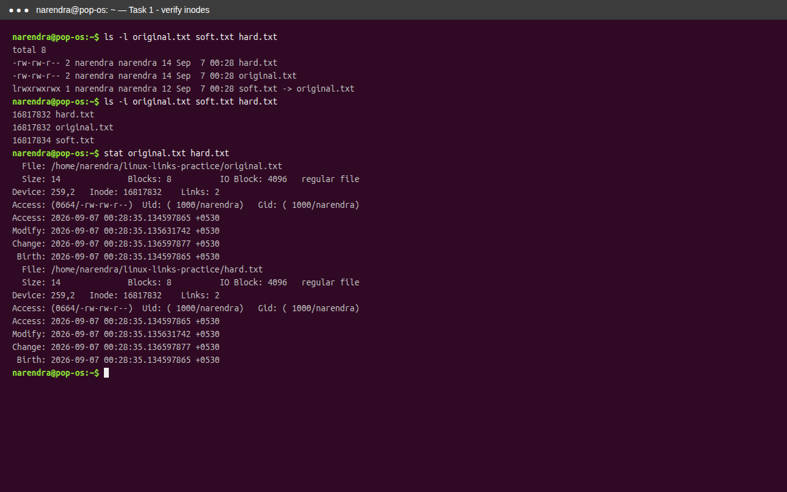
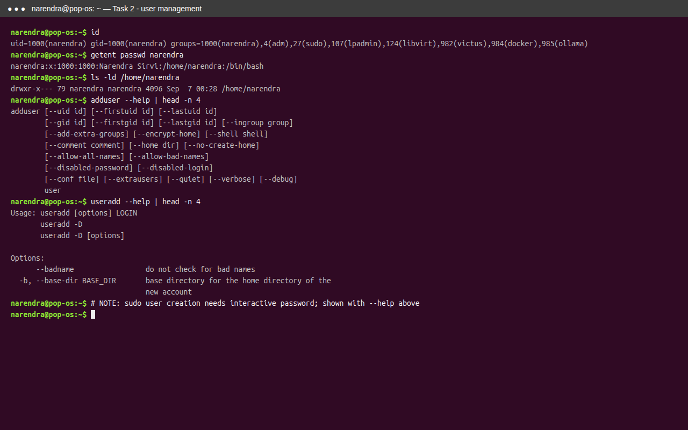
