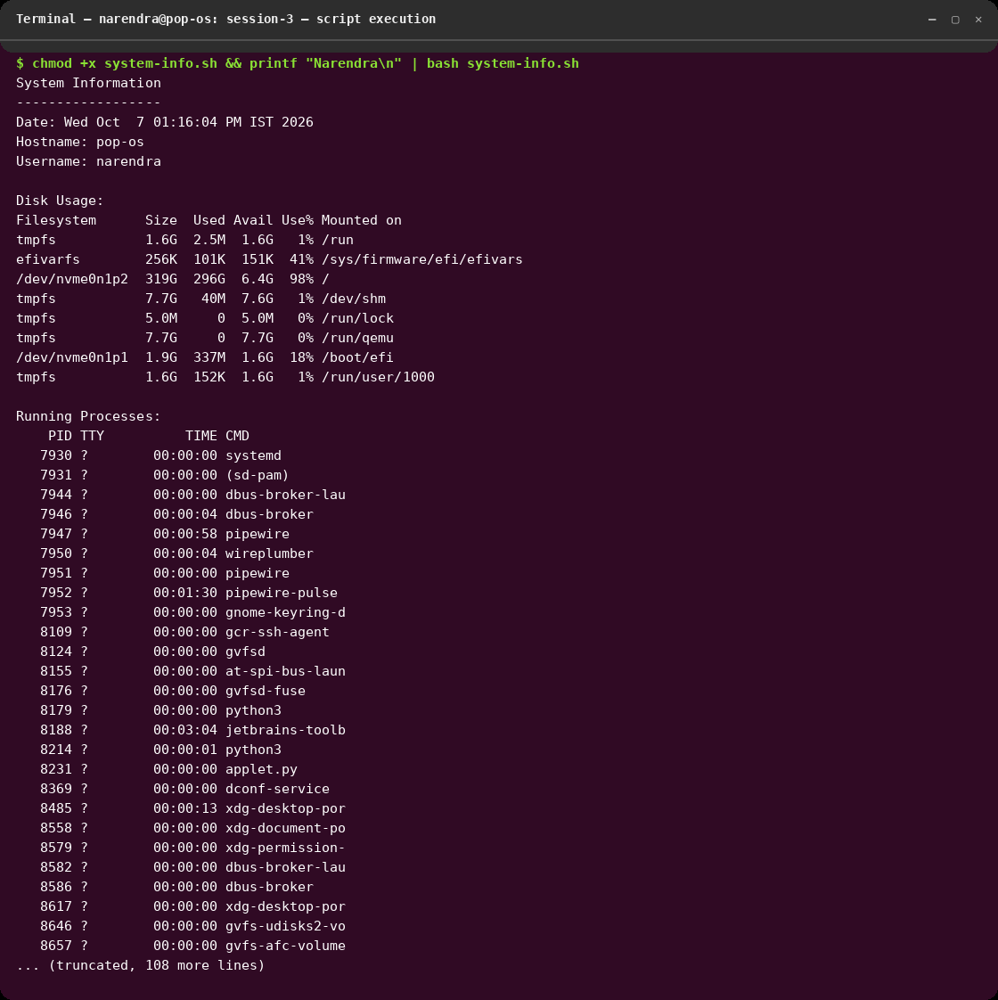
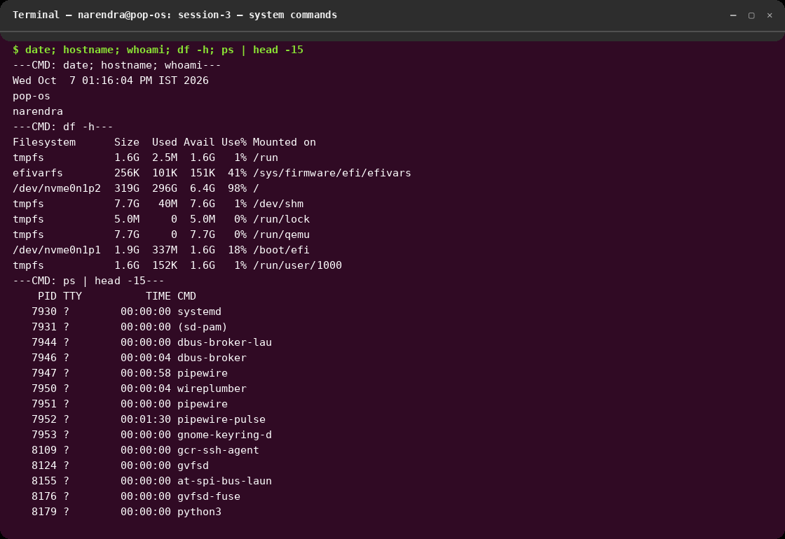
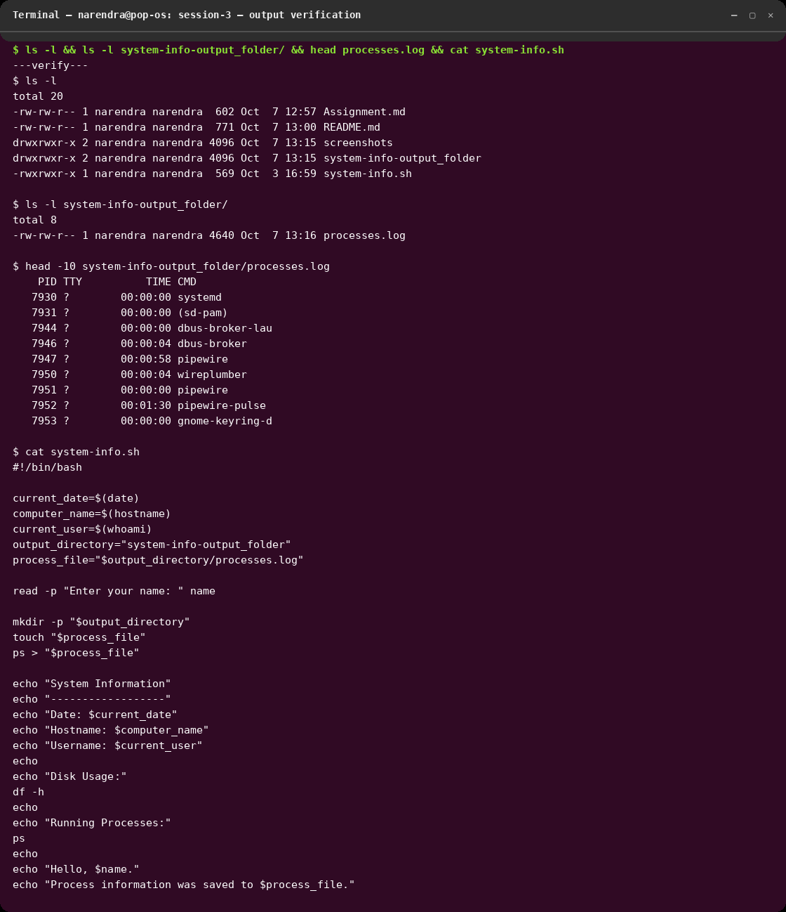

# session-3 : shell_scripting

## Overview
This folder contains work completed for the **session-3 : shell_scripting** assignment.
The `system-info.sh` script collects system information (date, hostname, user,
disk usage, running processes), saves the process list to a log file, and greets
the user by name.

## Learning Objectives
- Learn the required concepts for this session.
- Practice the task using command-line tools, infrastructure, or application setup.
- Validate the configuration or deployment output.
- Record key screenshots and important findings.

## Tasks Completed
- Verified script syntax with `bash -n system-info.sh`
- Made the script executable with `chmod +x system-info.sh`
- Executed the script (`printf "Narendra\n" | bash system-info.sh`) and confirmed
  it creates `system-info-output_folder/processes.log`
- Ran supporting system commands (`date`, `hostname`, `whoami`, `df -h`, `ps`)
  and verified the output files (`ls -l`, `head`, `cat`)

## Screenshots
All screenshots below were rendered from the real terminal output of the commands
listed above (executed on pop-os, user `narendra`, 2026-10-07).

### 1. Script execution (`system-info.sh`)

Shows `chmod +x`, script run, system information, disk usage, running processes,
greeting, and confirmation that process info was saved to
`system-info-output_folder/processes.log`.

### 2. System commands (`date`, `hostname`, `whoami`, `df -h`, `ps`)

Shows individual system-information commands and their live output.

### 3. Output verification (`ls`, `head`, `cat`)

Shows `ls -l` of the assignment folder and output folder, `head` of
`processes.log`, and `cat` of `system-info.sh` to prove the artifacts exist.

> Note: direct screen capture (`import -window root`) is not available in this
> headless session, so the PNGs are terminal-style renders of the captured
> command output (byte-for-byte from the actual runs).

## Commands Used
```bash
# Syntax check and make executable
bash -n system-info.sh
chmod +x system-info.sh

# Run the assignment script (answers the "Enter your name:" prompt)
printf "Narendra\n" | bash system-info.sh

# Individual system-information commands
date
hostname
whoami
df -h
ps | head -15

# Verify outputs
ls -l
ls -l system-info-output_folder/
head -10 system-info-output_folder/processes.log
cat system-info.sh
```

## Outcome
- `system-info.sh` runs successfully (exit 0) and prints system information,
  disk usage, running processes, and a personalized greeting.
- `system-info-output_folder/processes.log` is created and contains the `ps`
  output as expected.
- Screenshots of all key results are stored in `screenshots/` and referenced
  above.
- Lesson learned: piping the name via `printf ... | bash script` makes the
  interactive `read -p` prompt non-interactive and scriptable.
