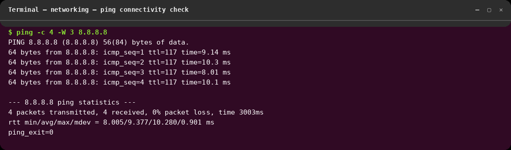
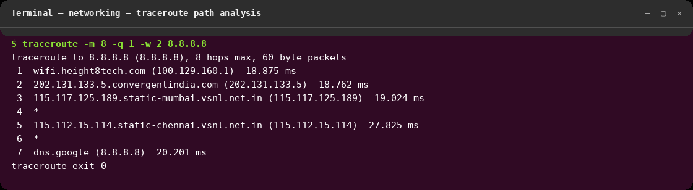
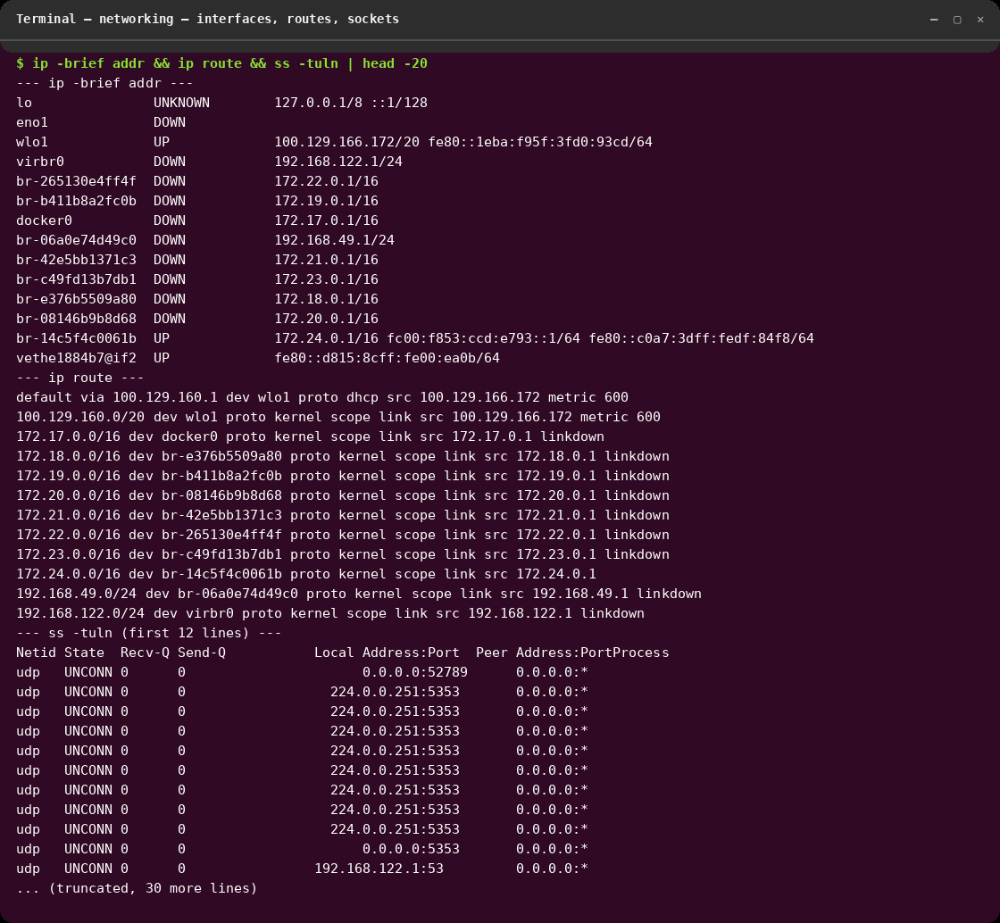
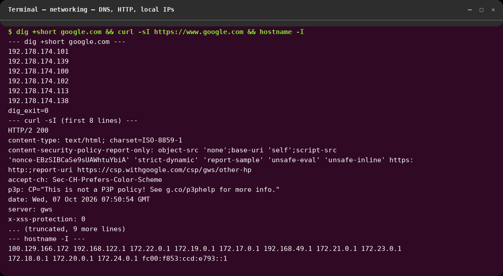

# session-4 : networking

## Overview
This folder contains the networking assignment notes and command outputs.
All commands below were executed live on pop-os (user `narendra`, 2026-10-07,
Wi-Fi interface `wlo1`, gateway `100.129.160.1`) and the screenshots are renders
of the real captured output.

## Objectives
- Test connectivity with ping
- Trace routes with traceroute
- Observe network behavior and diagnose reachability issues

## Commands Used
```bash
# 1. Connectivity check (ICMP echo to Google DNS)
ping -c 4 -W 3 8.8.8.8

# 2. Path analysis (max 8 hops, 1 probe per hop, 2s timeout)
traceroute -m 8 -q 1 -w 2 8.8.8.8

# 3. Interfaces, routing table, listening sockets
ip -brief addr
ip route
ss -tuln

# 4. DNS resolution, HTTP check, local IPs
dig +short google.com
curl -sI -m 10 https://www.google.com
hostname -I
```

## Screenshots

### 1. Ping — connectivity check

4 packets transmitted, 4 received, 0% loss, avg ~9.4 ms to 8.8.8.8.
**What I understood:** `ping` sends ICMP echo requests and measures round-trip
time. 0% packet loss plus low/stable latency means the host has working
internet connectivity; packet loss or high times would point to congestion,
routing, or link problems.

### 2. Traceroute — path analysis

Path goes via the Wi-Fi gateway (100.129.160.1) through the ISP
(convergentindia / vsnl) to `dns.google (8.8.8.8)` in 7 hops (`*` = a hop that
didn't answer that probe, which is normal when routers deprioritize ICMP).
**What I understood:** `traceroute` reveals every router hop to a destination
by manipulating packet TTL. It pinpoints *where* latency or failure starts —
e.g. high time at hop 1 = local Wi-Fi issue, timeouts mid-path = ISP problem.

### 3. Interfaces, routes, sockets

- `ip -brief addr`: active interface is `wlo1` (100.129.166.172/20); docker
  bridges exist but are DOWN; loopback is up.
- `ip route`: default route goes via 100.129.160.1 on `wlo1`.
- `ss -tuln`: shows listening UDP/TCP sockets (mDNS :5353, libvirt DNS :53, …).
**What I understood:** `ip addr` shows interface state and assigned IPs
(UP/DOWN matters — DOWN bridges carry no traffic). `ip route` shows how
packets leave the machine — the `default via …` line is the gateway every
non-local packet uses. `ss -tuln` lists listening ports, which tells you what
services accept connections and is the first check when "port not reachable".

### 4. DNS, HTTP, local IPs

- `dig +short google.com` returned Google IPs (192.178.174.x) — DNS works.
- `curl -sI` returned `HTTP/2 200` from `server: gws` — HTTPS to the internet
  works end-to-end (DNS + TCP + TLS + HTTP).
- `hostname -I` lists all local interface addresses.
**What I understood:** `dig` queries DNS directly, so if `ping 8.8.8.8` works
but `ping google.com` fails, DNS is the culprit. `curl -I` checks the full
application path and the status code tells you whether the remote service is
healthy (2xx) versus redirecting (3xx) or erroring (4xx/5xx).

> Earlier captures (`ping.png`, `traceroute.png`) are kept in this folder from
> a previous run; the numbered screenshots above are from the current verified run.

## Outcome
- Verified internet connectivity (0% loss to 8.8.8.8), traced the ISP path to
  Google DNS, and confirmed DNS + HTTPS both work.
- Mapped local interfaces, the default gateway, and listening sockets.
- Lesson learned: diagnose layer by layer — link (`ip`), gateway/ping,
  path (`traceroute`), DNS (`dig`), service (`curl`, `ss`) — so each test
  narrows down where a network problem lives.
