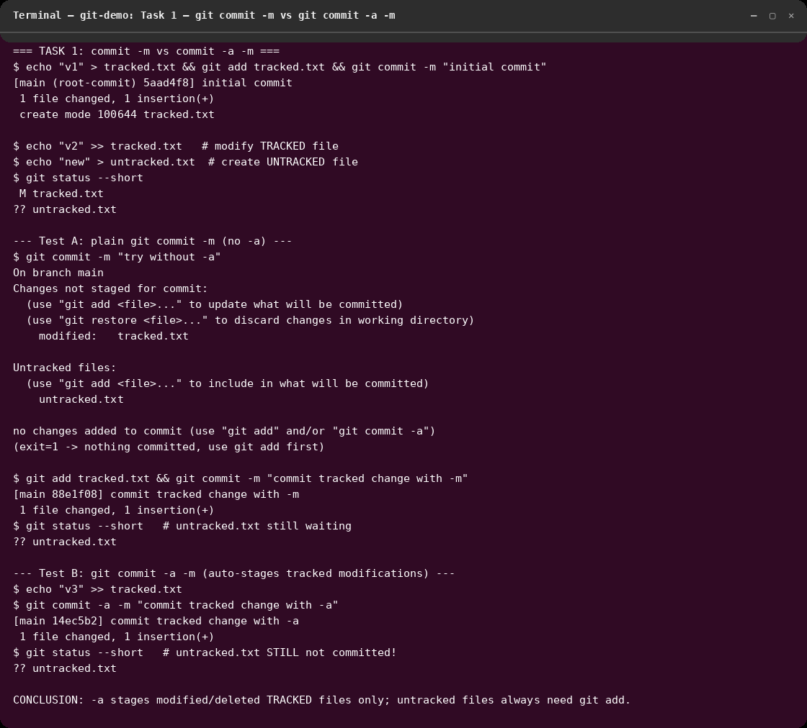
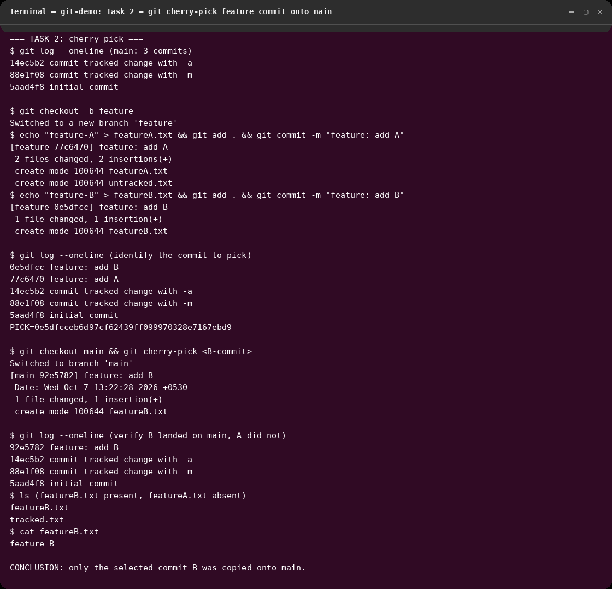

# session-5 : git-github

## Overview
This folder contains work completed for the **session-5 : git-github** assignment:
`git commit -a -m` vs `git commit -m`, and a `git cherry-pick` workflow.

> The demos were run in a scratch repo (`/tmp/git-demo`, test identity only) so
> the real `devops-heros` history stays clean. All outputs below are from real
> command runs on 2026-10-07 (git 2.43.0).

## Learning Objectives
- Learn the difference between `git commit -m` and `git commit -a -m`.
- Practice cherry-picking a specific commit across branches.
- Record commands, outputs, and findings.

## Tasks Completed
- Task 1: tested `git commit -m` vs `git commit -a -m` with a modified tracked
  file plus a new untracked file — observed exactly what `-a` stages.
- Task 2: created 3 commits on `main`, branched `feature` with 2 commits,
  cherry-picked one commit back onto `main`, verified with `git log` and `ls`.
- (Earlier local files `file.txt`, `file1.txt`, `file3.txt`, `git-homeowork/`
  from a previous run are kept untouched.)

## Commands Used
```bash
# ---------- Task 1: commit -m vs commit -a -m ----------
git init -b main
echo "v1" > tracked.txt && git add tracked.txt && git commit -m "initial commit"
echo "v2" >> tracked.txt        # modify TRACKED file
echo "new" > untracked.txt      # create UNTRACKED file
git status --short
git commit -m "try without -a"  # fails: nothing staged (exit 1)
git add tracked.txt && git commit -m "commit tracked change with -m"
echo "v3" >> tracked.txt
git commit -a -m "commit tracked change with -a"  # auto-stages tracked edit
git status --short              # untracked.txt still uncommitted!

# ---------- Task 2: cherry-pick ----------
git log --oneline               # 3 commits on main
git checkout -b feature
echo "feature-A" > featureA.txt && git add . && git commit -m "feature: add A"
echo "feature-B" > featureB.txt && git add . && git commit -m "feature: add B"
git log --oneline               # identify commit B hash
git checkout main
git cherry-pick <B-commit-hash> # copy only commit B onto main
git log --oneline               # verify: B present, A absent
ls && cat featureB.txt          # verify files
```

## Screenshots

### Task 1: `git commit -m` vs `git commit -a -m`

**What I understood:** plain `git commit -m` commits only what is already
staged — with no `git add` it fails with "nothing to commit". `git commit -a -m`
auto-stages *modified/deleted tracked* files, so the `tracked.txt` edit was
committed without `git add`. Crucially, `-a` never touches *untracked* files:
`untracked.txt` stayed uncommitted (`??` in status) after both commands and
still needs an explicit `git add`.

### Task 2: cherry-pick a feature commit onto main

**What I understood:** after 2 commits on `feature`, `git log --oneline` gives
the hash of the wanted commit; `git checkout main && git cherry-pick <hash>`
copies *only that commit's changes* onto main as a new commit (new hash
`92e5782`, same message). Verification (`git log --oneline`, `ls`,
`cat featureB.txt`) proves `featureB.txt` arrived on main while `featureA.txt`
did not — i.e. cherry-pick is surgical, unlike merge which brings everything.

## Outcome
- Demonstrated the `-a` flag boundary (tracked edits yes, new files no) and
  the cherry-pick flow (branch → identify hash → pick → verify) with passing
  real runs.
- Screenshots: `01-commit-a-vs-m.png`, `02-cherry-pick.png`.
- Lesson learned: use `git commit -a -m` for quick iterations on known files,
  but review `git status` first so new files aren't silently left out; use
  cherry-pick to backport single fixes without merging a whole branch.
