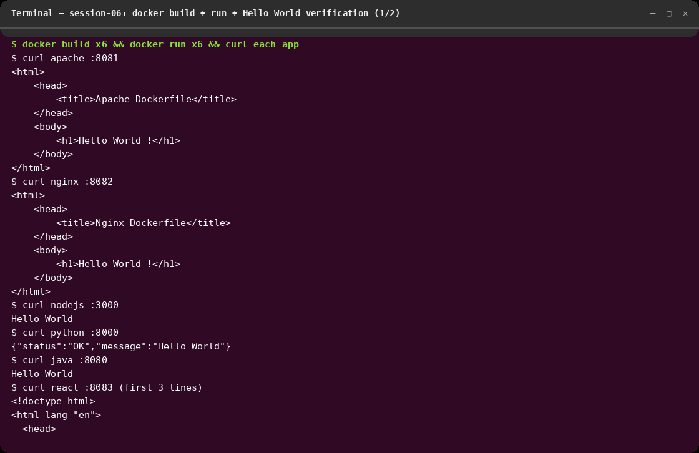
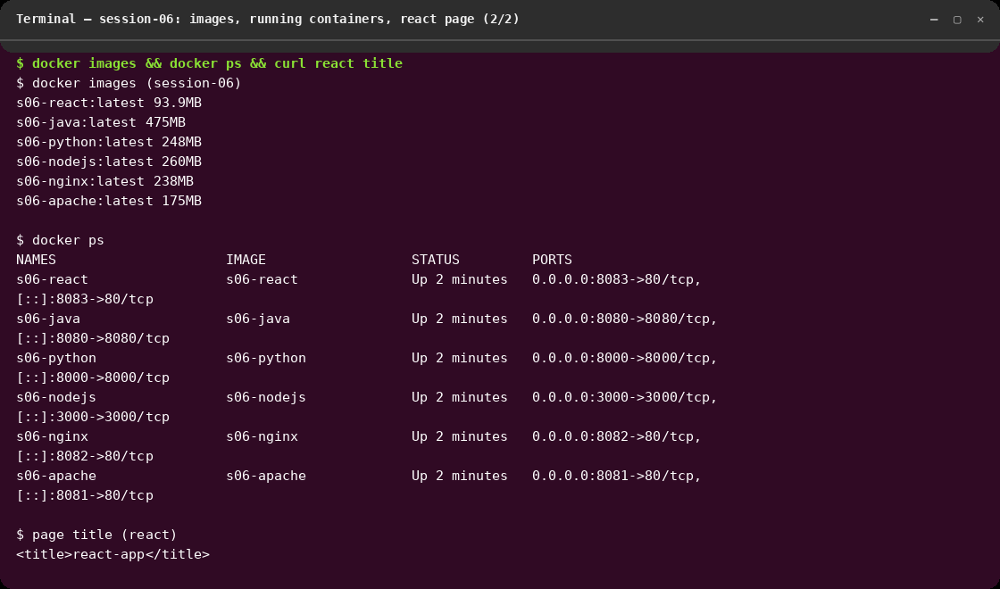
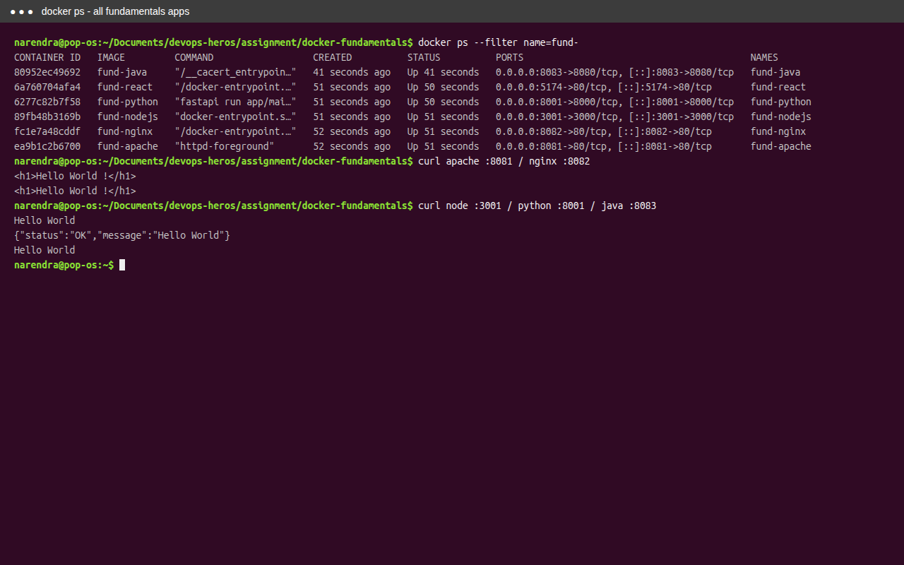
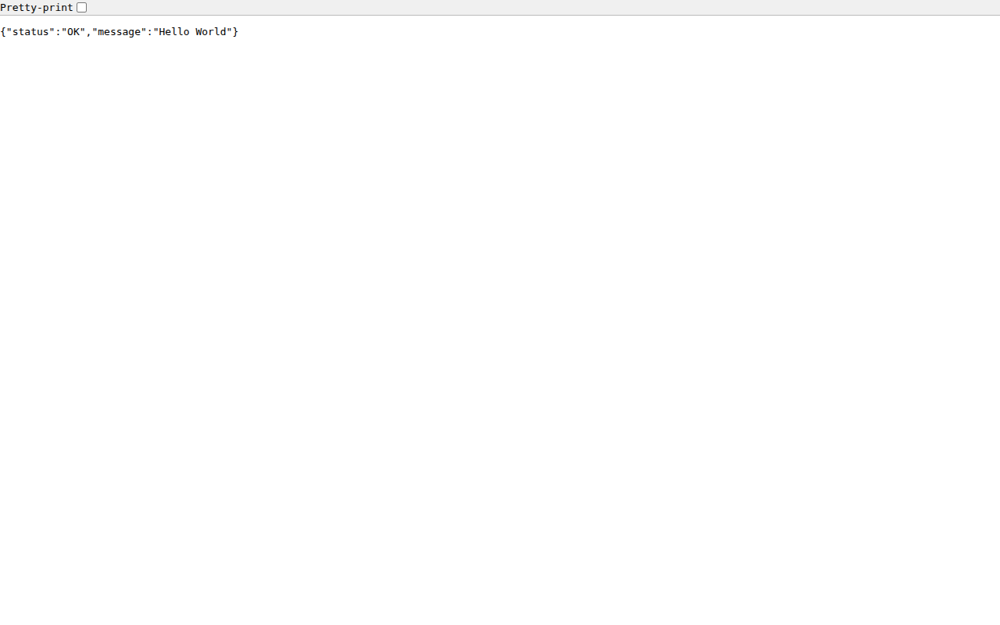
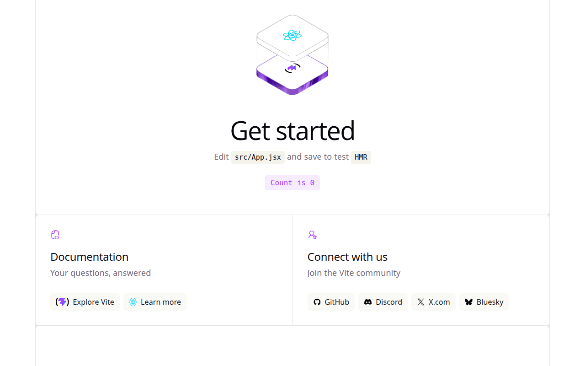

# session-6 : docker-fundamentals

## Overview
This folder covers Docker fundamentals: 6 Hello World apps (Apache, Nginx,
Node.js/Express, Python/FastAPI, Java/Spring Boot, React/Vite) — each with app
code + Dockerfile, built, run, and verified with `curl` on 2026-10-07
(Docker 29.8.2).

## Objectives
- Build and run containerized applications.
- Validate Docker commands and runtime behavior.
- Review application screenshots and logs.

## Folder structure (as required)
```
apache/   → Dockerfile (httpd) + index.html
nginx/    → Dockerfile (nginx) + index.html
nodejs/   → Dockerfile (node:24-alpine) + index.js + package.json
python/   → Dockerfile (multi-stage uv + FastAPI) + app/main.py
java/     → Dockerfile (eclipse-temurin:17-jre) + Spring Boot jar
react/    → React-app/Dockerfile (multi-stage node build → nginx)
```

## Commands Used
```bash
# Build all images
docker build -t s06-apache ./apache
docker build -t s06-nginx  ./nginx
docker build -t s06-nodejs ./nodejs
docker build -t s06-python ./python
docker build -t s06-java   ./java
docker build -t s06-react  ./react/React-app

# Run each on its own host port
docker run -d --name s06-apache -p 8081:80   s06-apache
docker run -d --name s06-nginx  -p 8082:80   s06-nginx
docker run -d --name s06-nodejs -p 3000:3000 s06-nodejs
docker run -d --name s06-python -p 8000:8000 s06-python
docker run -d --name s06-java   -p 8080:8080 s06-java
docker run -d --name s06-react  -p 8083:80   s06-react

# Verify Hello World on each
curl http://localhost:8081/   # apache
curl http://localhost:8082/   # nginx
curl http://localhost:3000/   # nodejs
curl http://localhost:8000/   # python
curl http://localhost:8080/   # java
curl http://localhost:8083/   # react
docker ps
```

## Verification results (all passing)
| App    | Port | Response |
|--------|------|----------|
| Apache | 8081 | `<h1>Hello World !</h1>` |
| Nginx  | 8082 | `<h1>Hello World !</h1>` |
| Node.js/Express | 3000 | `Hello World` |
| Python/FastAPI  | 8000 | `{"status":"OK","message":"Hello World"}` |
| Java/Spring Boot| 8080 | `Hello World` |
| React (Vite build served by nginx) | 8083 | `<title>react-app</title>`, full page served |

Image sizes: react 93.9MB (multi-stage) · apache 175MB · nginx 238MB ·
python 248MB · nodejs 260MB · java 475MB.

## Screenshots

### Fresh verification run (2026-10-07)

`curl` output of all 6 apps — every one returns its Hello World page/payload.


`docker images`, `docker ps` (all 6 `Up`), and the React page title check.

### Earlier captures (kept)







### App Assets


## Outcome
- All 6 images build cleanly (one transient `auth.docker.io` DNS timeout on the
  first Python build attempt; retry succeeded).
- All 6 containers run simultaneously on ports 8081/8082/3000/8000/8080/8083
  and serve their Hello World pages — verified live with `curl`.
- Lesson learned: multi-stage builds pay off (React final image only 93.9MB
  vs 475MB for the Spring Boot JRE image); explicit per-app host ports avoid
  clashes when running everything at once.
