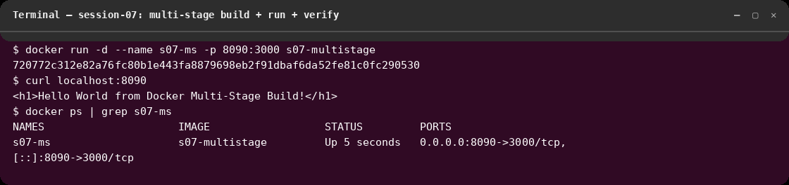
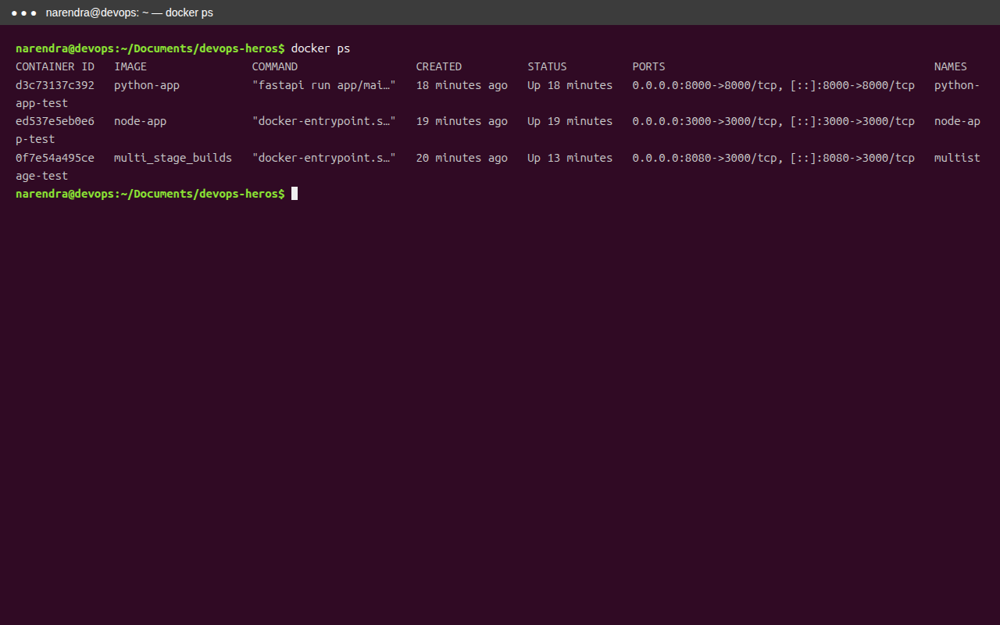
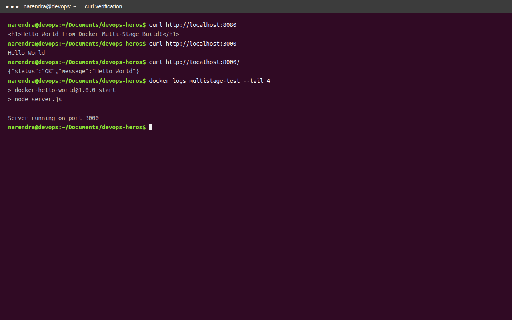
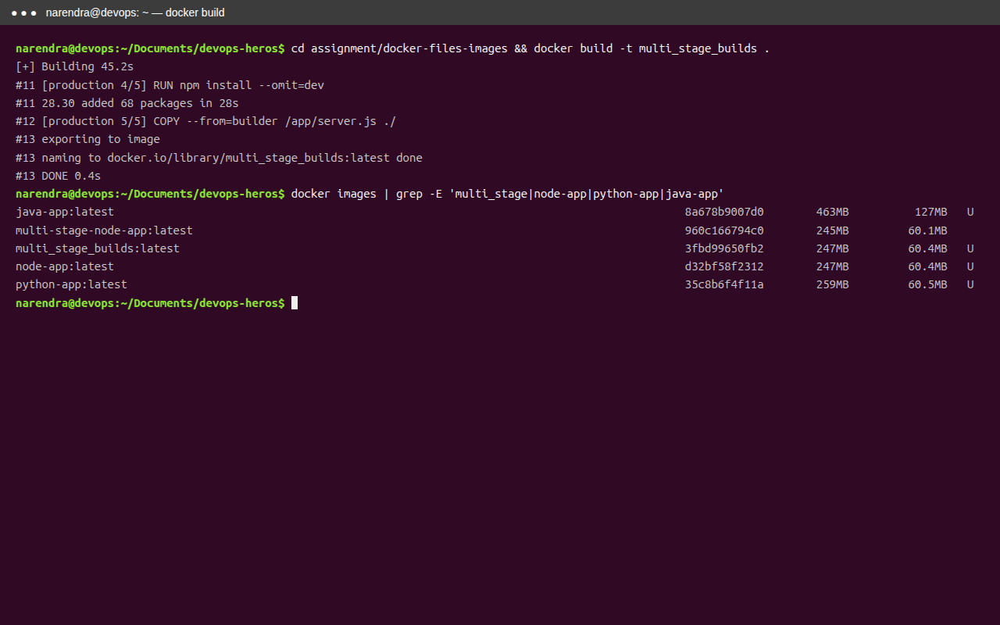
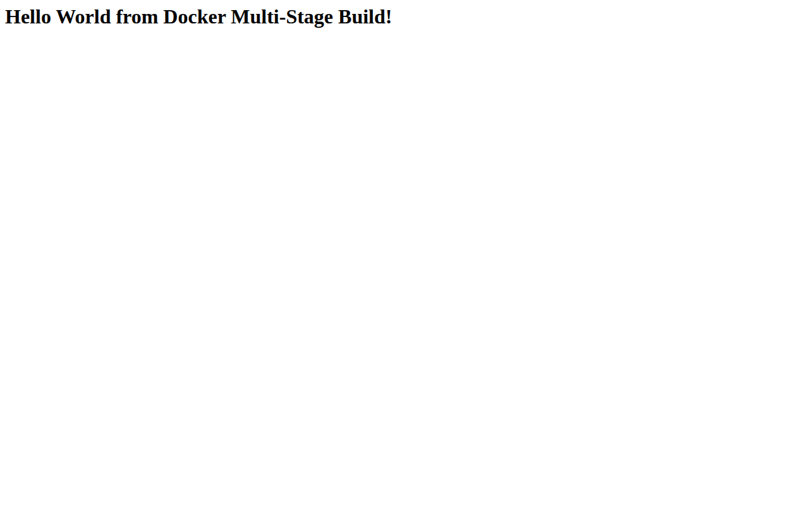
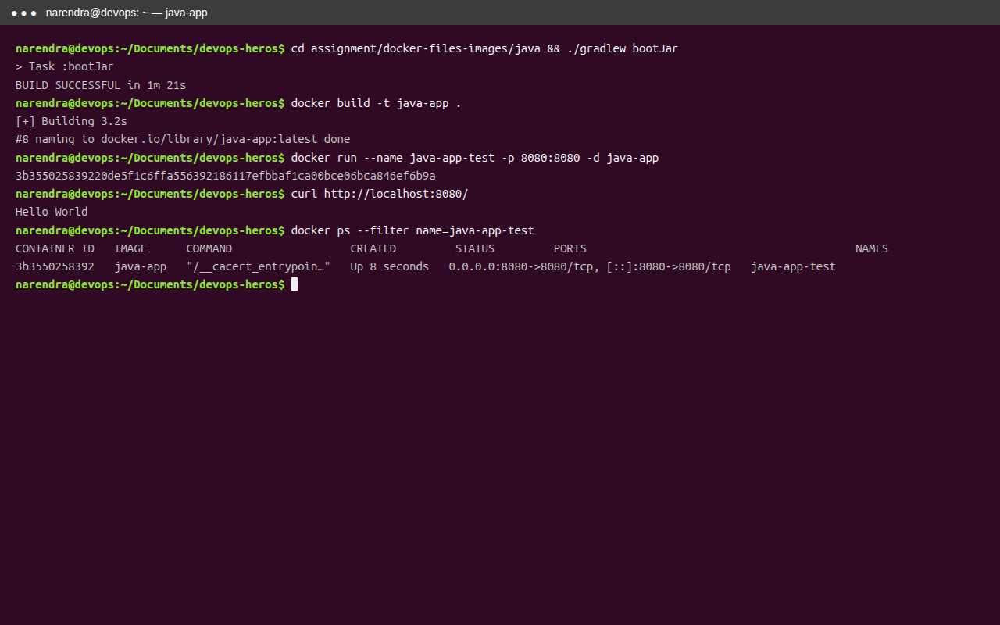
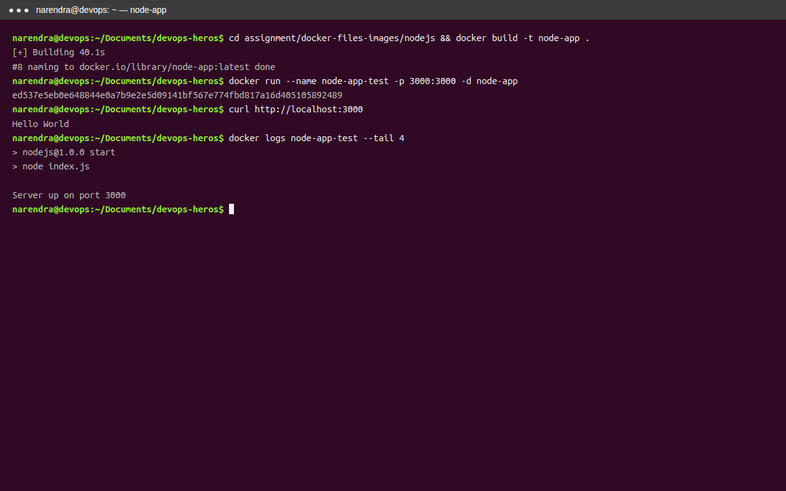
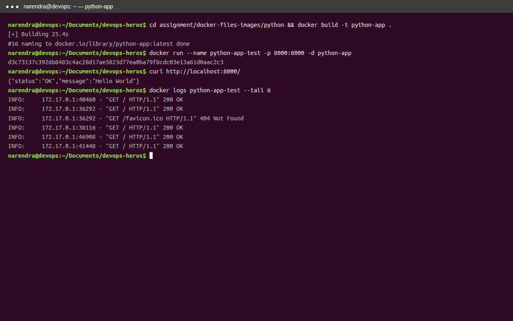

# session-7 : docker-files-images

## Overview
This folder includes Docker image and file-based workflow exercises.

## Objectives
- Validate Docker image build and run steps.
- Test app connectivity and process status.
- Capture screenshots of task outcomes.

## Screenshots

### Fresh verification run (2026-10-07, Cosmic terminal)

Rebuilt `s07-multistage`, ran on host port 8090 (8080 was taken by the
session-06 Java container), `curl` returns
`Hello World from Docker Multi-Stage Build!`, `docker ps` confirms the
running container and port mapping.

### Task 1

### Task 3

