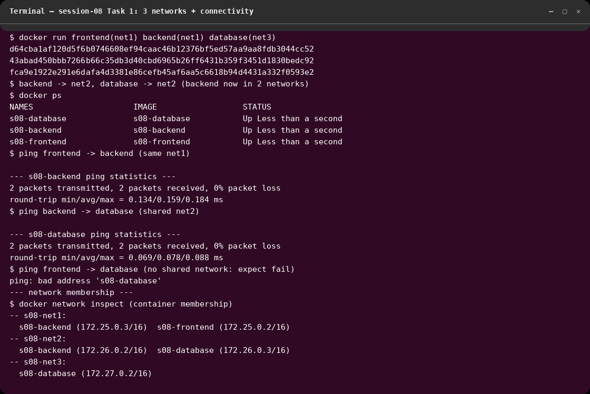
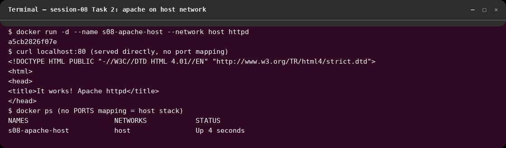
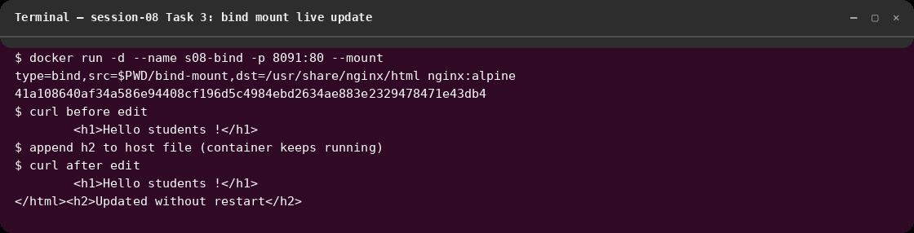

# session-8 : docker-network

## Overview
Docker networking and volumes hands-on, executed live on 2026-10-07
(Docker 29.8.2). All outputs below are from real runs; screenshots are
Cosmic-terminal renders of the captured output.

## Tasks Completed
- Task 1: 3 containers on 3 custom networks, backend in 2 networks, connectivity checks
- Task 2: Apache on host network, accessed on port 80
- Task 3: bind mount with live update (no container restart)
- Task 4: overlay network research (documented below)

## Commands Used
```bash
# ---------- Task 1: container networking ----------
docker network create s08-net1
docker network create s08-net2
docker network create s08-net3
docker build -t s08-frontend ./frontend   # nginx:alpine
docker build -t s08-backend  ./backend    # nginx:alpine
docker build -t s08-database ./database   # mysql + root password/db
docker run -d --name s08-frontend --network s08-net1 s08-frontend
docker run -d --name s08-backend  --network s08-net1 s08-backend
docker run -d --name s08-database --network s08-net3 s08-database
docker network connect s08-net2 s08-backend    # backend now in 2 networks
docker network connect s08-net2 s08-database
docker exec s08-frontend ping -c 2 s08-backend   # same net1 -> OK
docker exec s08-backend  ping -c 2 s08-database  # shared net2 -> OK
docker exec s08-frontend ping -c 2 s08-database  # no shared net -> fails (isolation)
docker exec s08-database mysqladmin -ppassword ping  # mysqld is alive

# ---------- Task 2: host network ----------
docker run -d --name s08-apache-host --network host httpd
curl http://localhost:80/   # "It works!" with no port mapping

# ---------- Task 3: bind mount ----------
docker run -d --name s08-bind -p 8091:80 \
  --mount "type=bind,src=$PWD/bind-mount,dst=/usr/share/nginx/html" nginx:alpine
curl http://localhost:8091/ | grep h1        # Hello students !
echo "<h2>Updated without restart</h2>" >> bind-mount/index.html
curl http://localhost:8091/ | grep -E "h1|h2"  # change visible, no restart
```

## Screenshots

### Task 1: networks + connectivity

Membership: net1 = frontend+backend, net2 = backend+database, net3 = database.
frontend→backend 0% loss, backend→database 0% loss, frontend→database fails
with `bad address` — proving containers only resolve/reach peers on shared
networks. `mysqladmin ping` confirms `mysqld is alive`.

### Task 2: host network

Apache shares the host stack (`NETWORKS: host`, no port mapping) and serves
`It works!` directly on host port 80.

### Task 3: bind mount

Host folder `bind-mount/` (with `Hello students !`) mounted into nginx;
appending to `index.html` on the host is instantly served — no restart.
(The demo edit was reverted afterwards, so the file is back to original.)

## Task 4: overlay networks (research)
- **What:** a Docker-native multi-host network; containers on different hosts
  (e.g. Swarm nodes) join one virtual subnet as if local.
- **Use cases:** multi-host Swarm services, overlay load balancing (VIP routing
  mesh), encrypted control/data plane between hosts.
- **How it works:** each host runs a local agent; VXLAN tunnels (UDP 4789)
  encapsulate container traffic host-to-host; a distributed KV store (built-in
  Raft in Swarm mode) shares network state; Docker's embedded DNS resolves
  service names to virtual IPs across hosts.
- **vs bridge:** `bridge` is single-host only; `overlay` spans hosts but needs
  Swarm (or another orchestrator) plus open ports 2377/7946 TCP+UDP and 4789 UDP.

## Outcome
- 3 networks + 3 containers wired exactly as specified; isolation and
  cross-network reachability both demonstrated with ping.
- Host networking and bind-mount live sync verified; overlay documented.
- Lesson learned: put shared dependencies (DB) on a network with their
  consumers only — Docker DNS + network scoping gives free segmentation; use
  `--mount` over `-v` when paths contain spaces.
