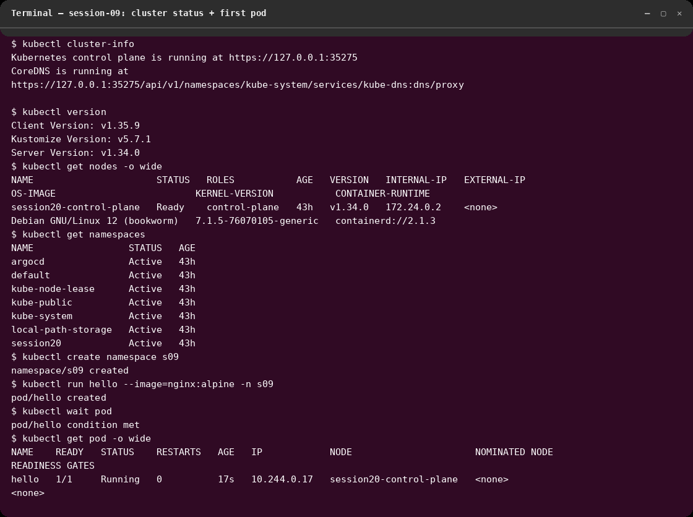
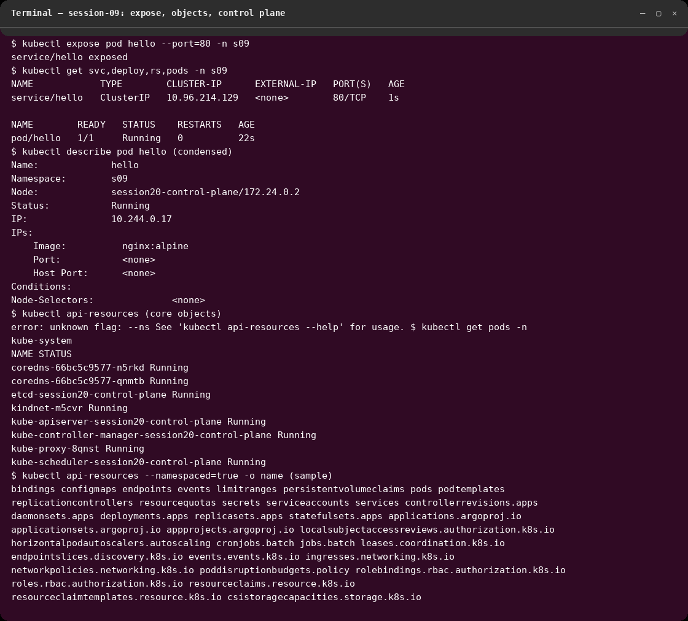

# session-09 : kubernetes-fundamental

## Overview
Kubernetes fundamentals on a live cluster (kind `kind-session20`, server v1.34.0;
minikube is also installed). Work ran in namespace `s09` on 2026-10-07. All
outputs are real; screenshots are Cosmic-terminal renders of captured output.

## Commands Used
```bash
kubectl cluster-info
kubectl version
kubectl get nodes -o wide
kubectl get namespaces
kubectl create namespace s09
kubectl run hello --image=nginx:alpine -n s09
kubectl wait --for=condition=Ready pod/hello -n s09 --timeout=120s
kubectl get pod hello -n s09 -o wide
kubectl expose pod hello --port=80 -n s09
kubectl get svc,deploy,rs,pods -n s09
kubectl describe pod hello -n s09
kubectl api-resources --namespaced=true -o name
kubectl get pods -n kube-system
```

## Screenshots

### Cluster status + first pod

Control plane reachable, single-node Ready (`session20-control-plane`,
containerd 2.1.3), namespace `s09` created, pod `hello` (nginx:alpine) pulled
and Running with cluster IP 10.244.0.17.

### Workload objects + control plane

Pod exposed as ClusterIP service (10.96.214.129:80); `describe` shows image,
node placement and conditions; control-plane pods (apiserver, etcd,
scheduler, controller-manager, CoreDNS ×2, kindnet, kube-proxy) all Running.

## Short notes on Kubernetes architecture
- **Control plane:** kube-apiserver (front door, all clients talk to it),
  etcd (cluster state store), kube-scheduler (assigns pods to nodes),
  kube-controller-manager (reconciliation loops: ReplicaSet, Deployment…),
  CoreDNS (in-cluster DNS for Services).
- **Node components:** kubelet (runs pod containers via CRI/containerd),
  kube-proxy (Service virtual IPs + load balancing), CNI plugin (kindnet here —
  pod networking, IPs like 10.244.0.17).
- **Request flow observed:** `kubectl run` → apiserver → etcd → scheduler binds
  pod to node → kubelet pulls image + starts container → kube-proxy/CoreDNS
  make it reachable via the Service IP.

## Outcome
- Cluster verified healthy; created namespace, ran and exposed first pod.
- Can name every control-plane component and its role from live `get pods`.
- Lesson learned: everything (even `kubectl get`) goes through the API server;
  `describe` and `-o wide` are the fastest way to see scheduling/network facts.
