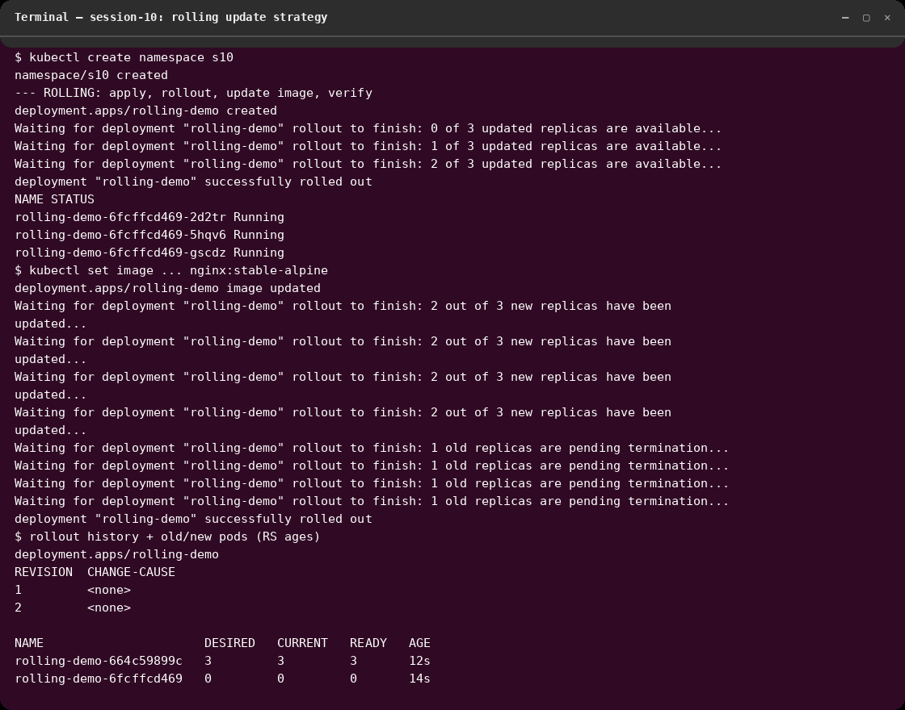
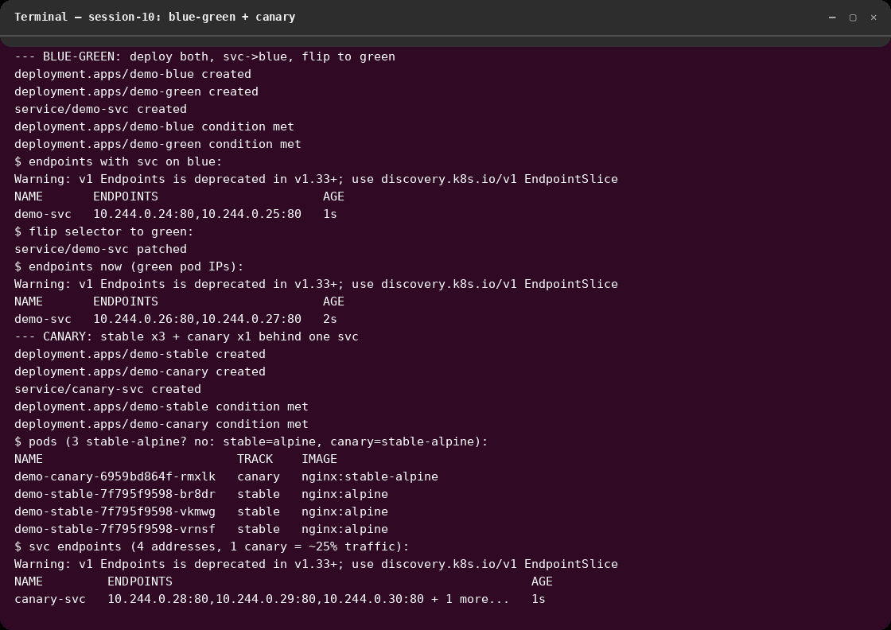
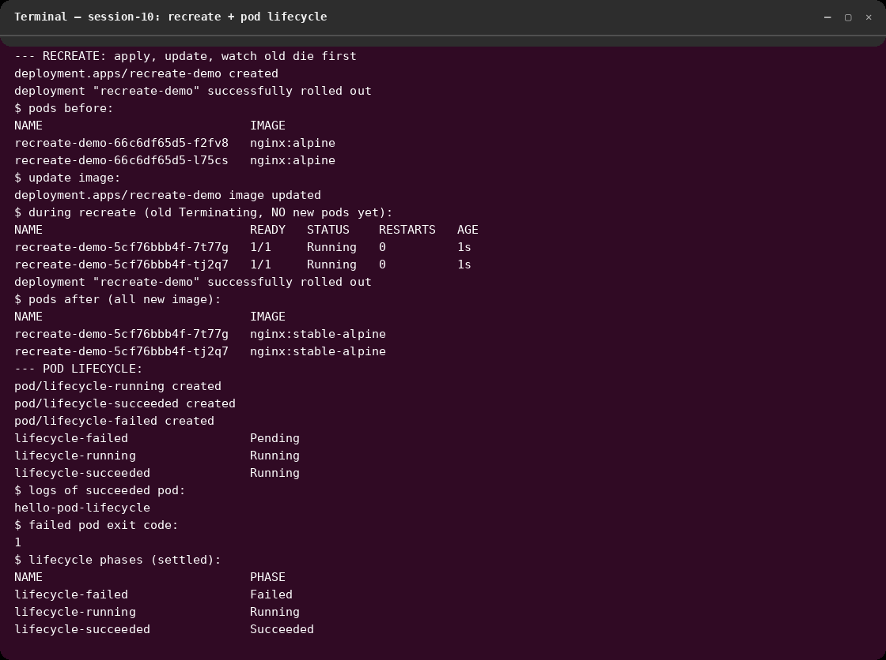

# session-10: Kubernetes Pods, ReplicaSets & Deployments

## Overview
All 4 deployment strategies plus the Pod lifecycle, executed live on kind
(`kind-session20`) in namespace `s10` on 2026-10-07. Manifests live beside this
README; outputs are real; screenshots are Cosmic-terminal renders.

## Manifests
```
01-rolling/deployment.yaml        3 replicas, RollingUpdate (maxUnavailable 1 / maxSurge 1)
02-blue-green/demo.yaml           blue + green Deployments + Service (selector flips)
03-canary/demo.yaml               stable x3 + canary x1 behind one Service (~25% canary)
04-recreate/deployment.yaml       strategy: Recreate (downtime, old die first)
pod-lifecycle/pods.yaml           running / succeeded / failed pods
```

## Commands Used
```bash
kubectl create namespace s10
# Rolling
kubectl apply -f 01-rolling/deployment.yaml
kubectl rollout status deployment/rolling-demo -n s10
kubectl set image deployment/rolling-demo web=nginx:stable-alpine -n s10
kubectl rollout status deployment/rolling-demo -n s10
kubectl rollout history deployment/rolling-demo -n s10
kubectl get rs -n s10
# Blue-green
kubectl apply -f 02-blue-green/demo.yaml
kubectl get endpoints demo-svc -n s10                                   # blue IPs
kubectl patch svc demo-svc -n s10 -p '{"spec":{"selector":{"app":"demo","version":"green"}}}'
kubectl get endpoints demo-svc -n s10                                   # green IPs
# Canary
kubectl apply -f 03-canary/demo.yaml
kubectl get pods -n s10 -l app=canary-demo -o custom-columns=NAME:.metadata.name,TRACK:.metadata.labels.track,IMAGE:.spec.containers[0].image
kubectl get endpoints canary-svc -n s10
# Recreate
kubectl apply -f 04-recreate/deployment.yaml
kubectl set image deployment/recreate-demo web=nginx:stable-alpine -n s10
kubectl get pods -n s10 -l app=recreate-demo
# Lifecycle
kubectl apply -f pod-lifecycle/pods.yaml
kubectl get pods -n s10 -o custom-columns=NAME:.metadata.name,PHASE:.status.phase
kubectl logs lifecycle-succeeded -n s10
kubectl get pod lifecycle-failed -n s10 -o jsonpath='{.status.containerStatuses[0].state.terminated.exitCode}'
```

## Screenshots

### 1. Rolling update

Image `nginx:alpine` → `nginx:stable-alpine` rolled one pod at a time
(`maxUnavailable 1`); history shows revisions 1→2; old ReplicaSet scaled to
0/0 while the new one serves 3/3 — zero downtime.
**Observed:** new ReplicaSet hash appears, old pods terminate only after new
ones are Ready.

### 2. Blue-green + canary

Blue-green: endpoints flipped from blue IPs (.24/.25) to green IPs (.26/.27)
by patching the Service selector — instant cutover, old version kept for
rollback. Canary: 3 stable pods + 1 canary pod behind one Service (4
endpoints), so ~25% of traffic hits the new image.
**Observed:** selector change moves traffic with no redeploy; canary ratio is
purely replica arithmetic.

### 3. Recreate + pod lifecycle

Recreate: after the image update the whole ReplicaSet hash changed at once
(old `66c6df…` → new `5cf76b…`) — all old pods die before new ones start
(downtime by design). Lifecycle: `Running` (nginx), `Succeeded`
(`echo … && sleep 2`, logs show the message), `Failed` (exit code 1).
**Observed:** `restartPolicy: Never` lets one-shot pods reach terminal phases
instead of looping; exit code is inspectable via jsonpath.

## Outcome
- All 4 strategies demonstrated with before/after proof; lifecycle phases
  Running/Succeeded/Failed captured.
- Lesson learned: Rolling = safe default; Recreate = only for singletons that
  can't run twice (DB migrations, volume locks); Blue-green = instant rollback
  at 2× cost; Canary = replica math for risk ramp.
