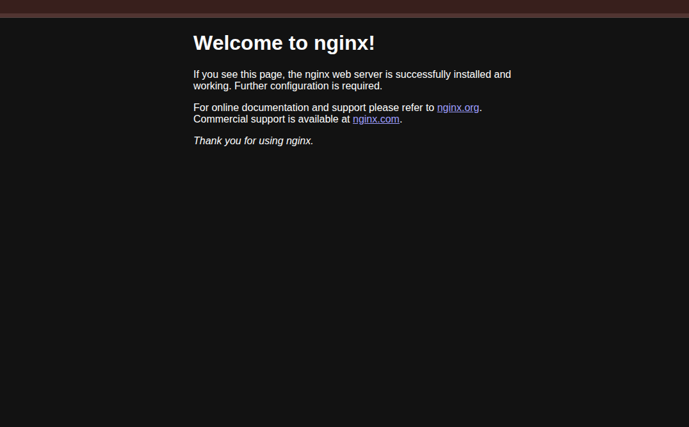
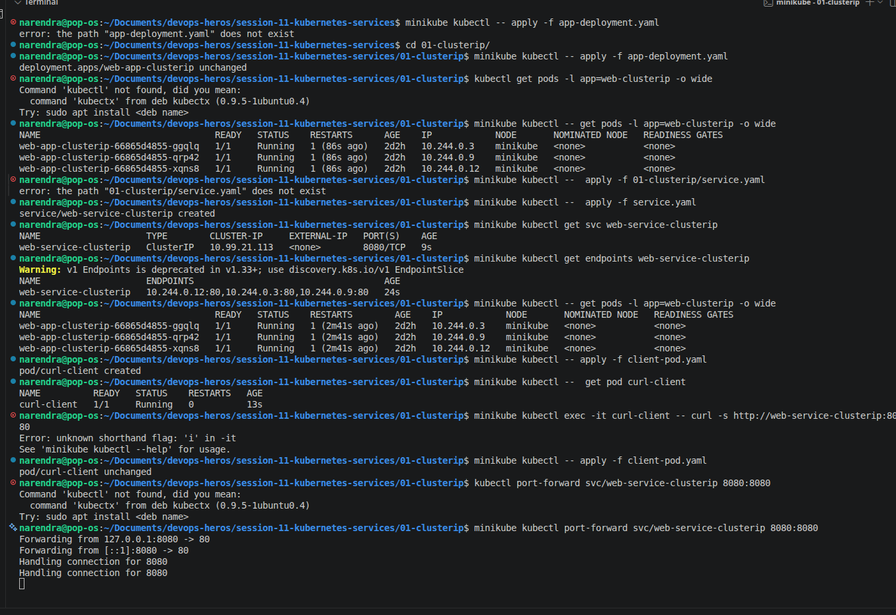
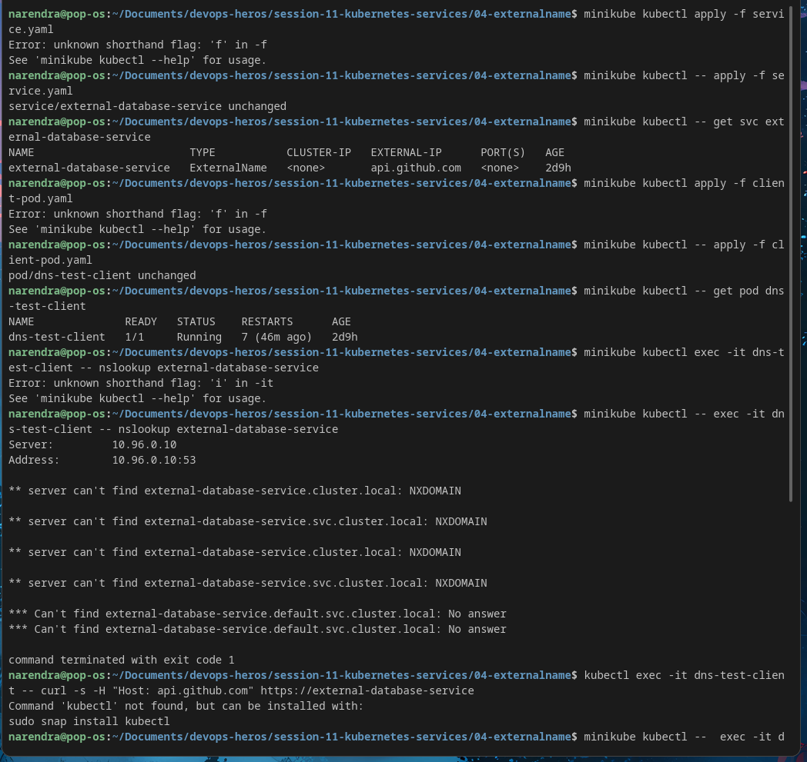
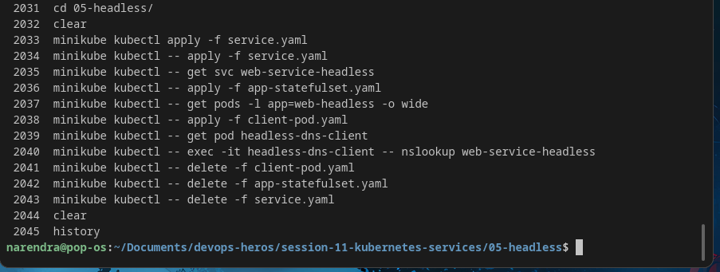
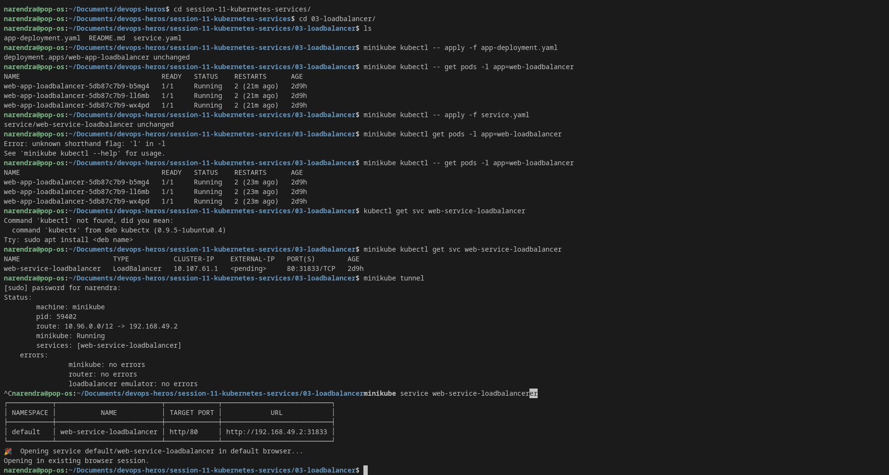
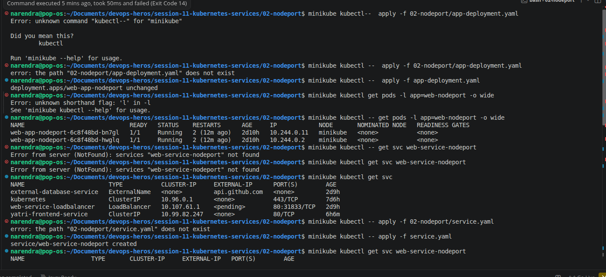
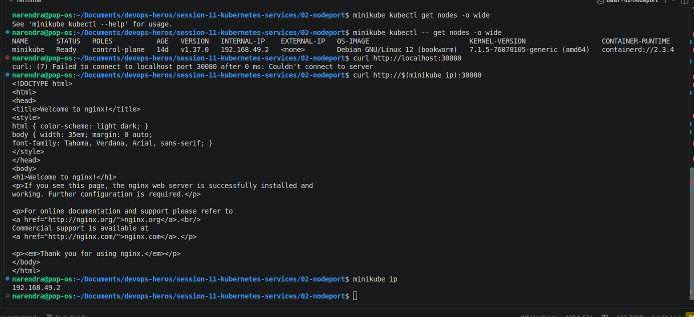

# session-11: Kubernetes Networking & Services

## Overview
This folder contains the Kubernetes networking service examples and screenshots.

## Screenshots

### ClusterIP

### ExternalName

### Headless

### LoadBalancer

### NodePort

