# Session 14 Kubernetes Troubleshooting

## 01 - `kubectl get`

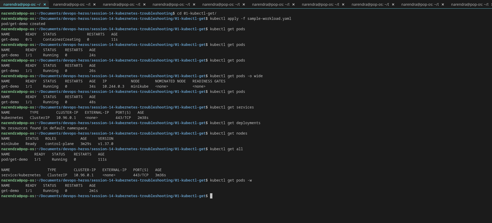

## 02 - `kubectl describe`

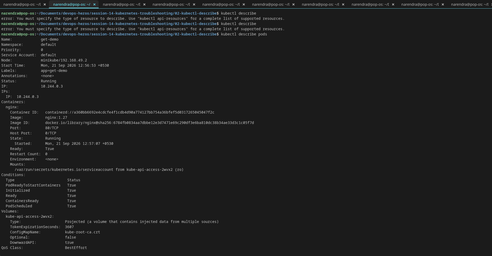

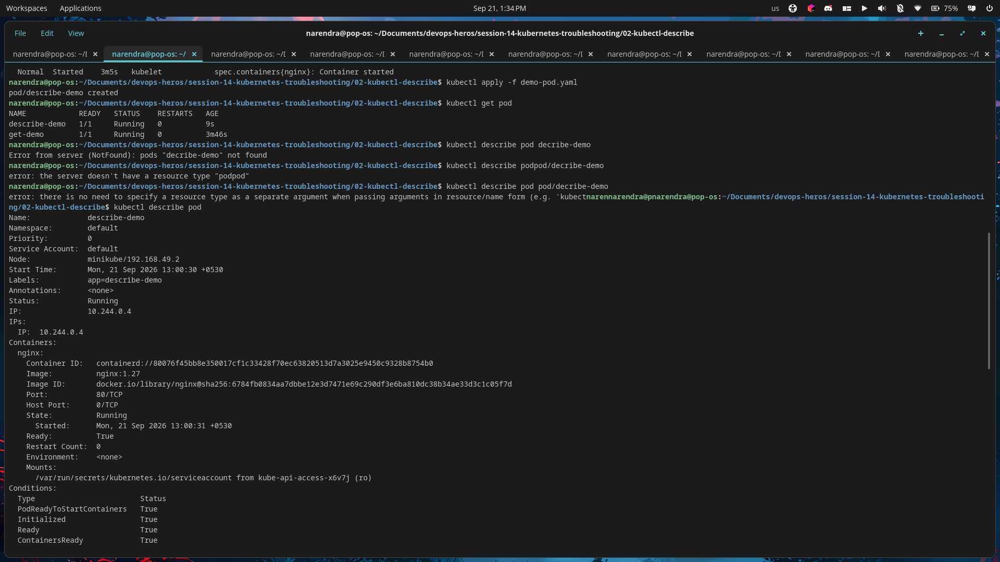

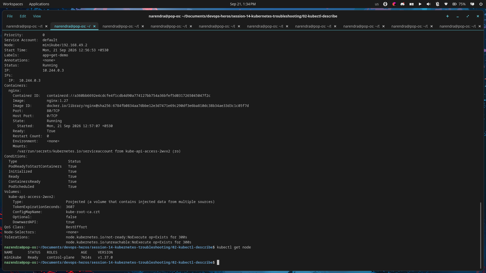

## 03 - `kubectl logs`

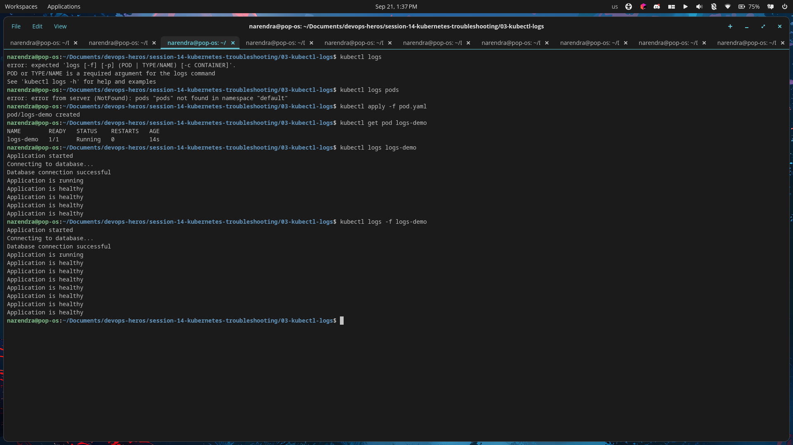

## 04 - `kubectl exec`

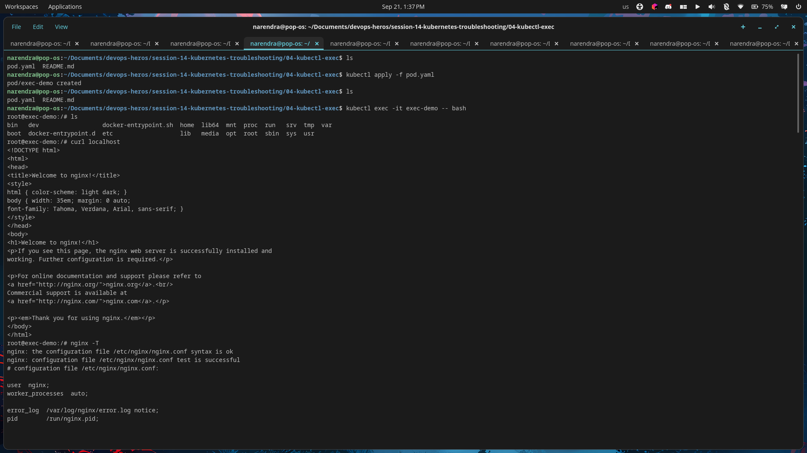

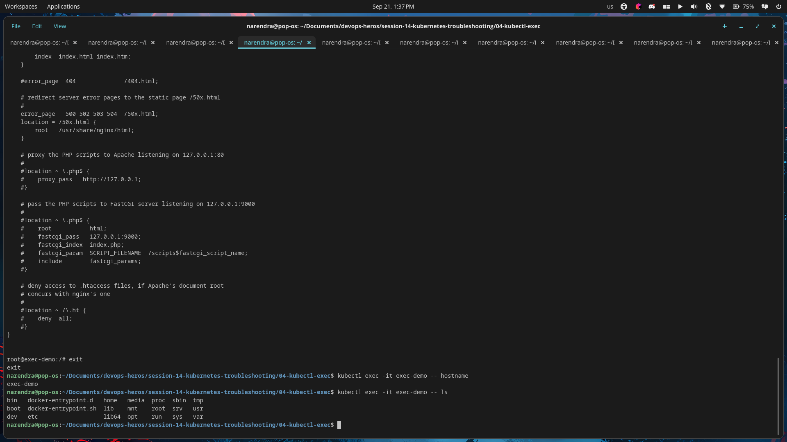

## 05 - Events

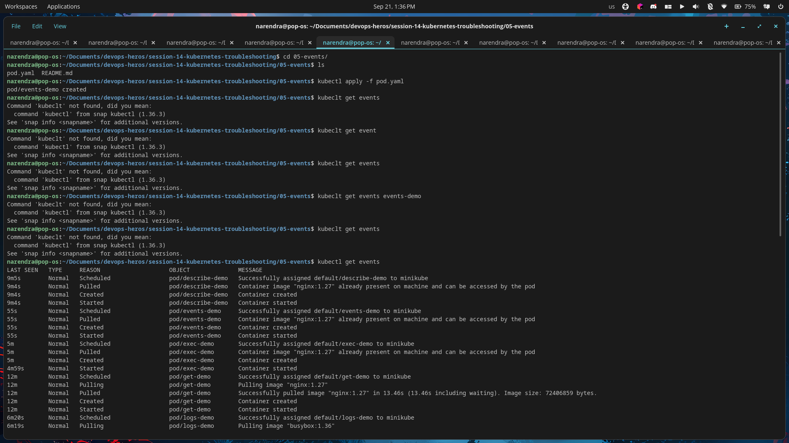

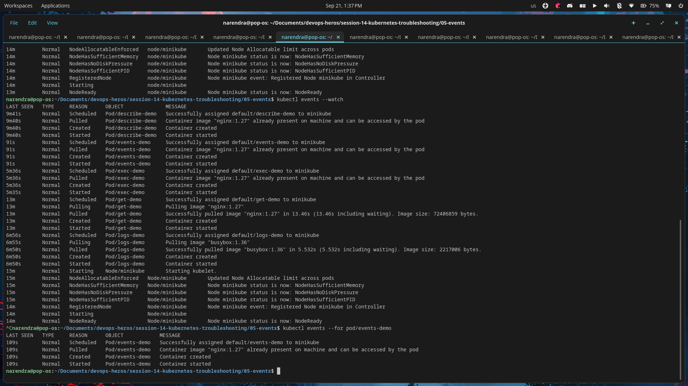

## 06 - `CrashLoopBackOff`

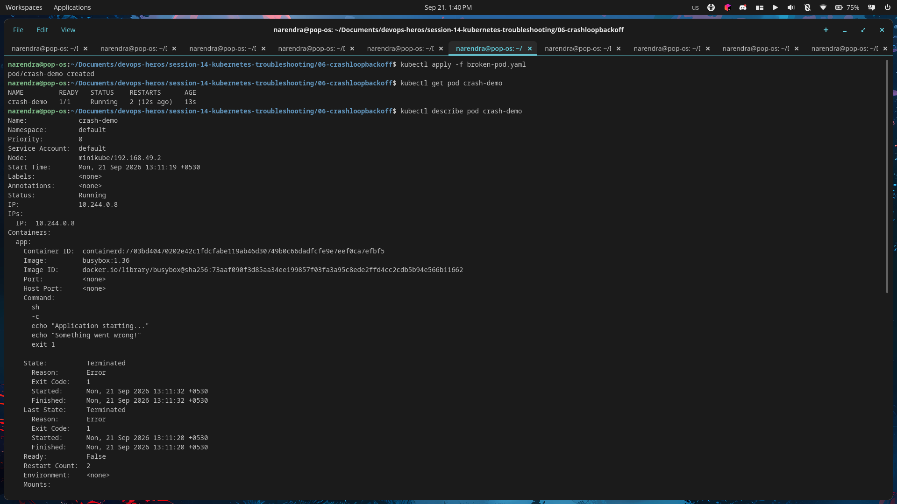

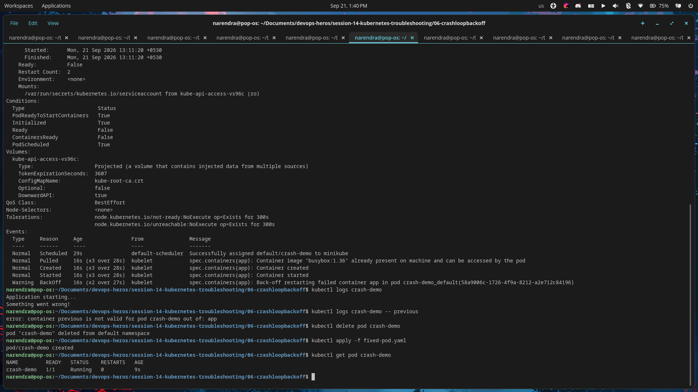

## 07 - `ImagePullBackOff`

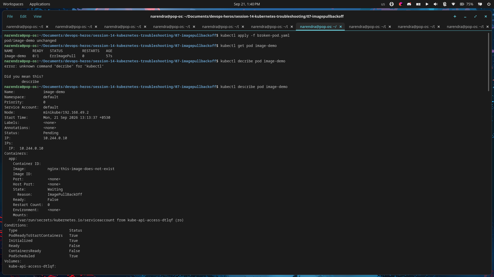

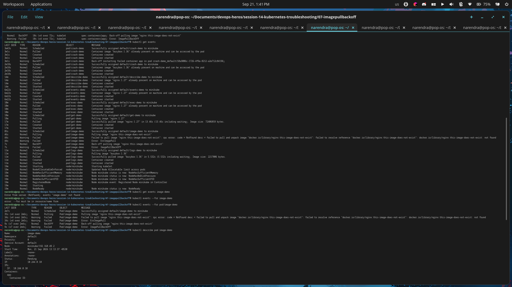

## 08 - Pending Pods

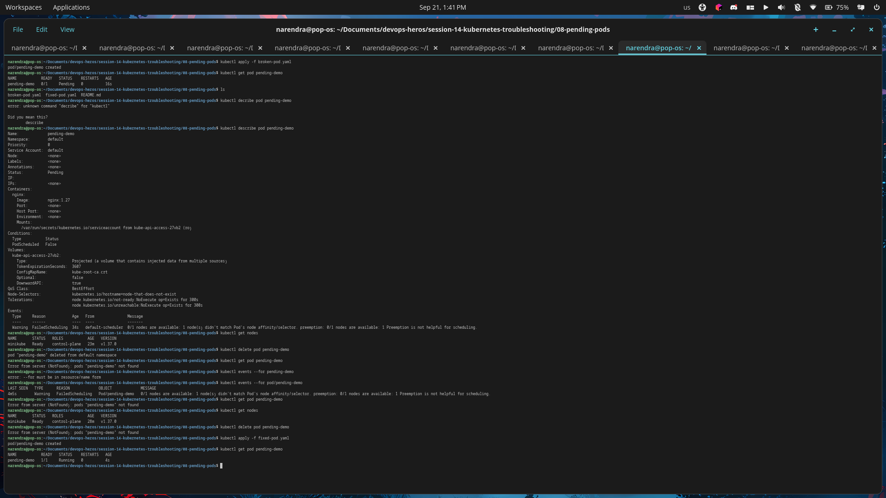

## 09 - Service and DNS Troubleshooting

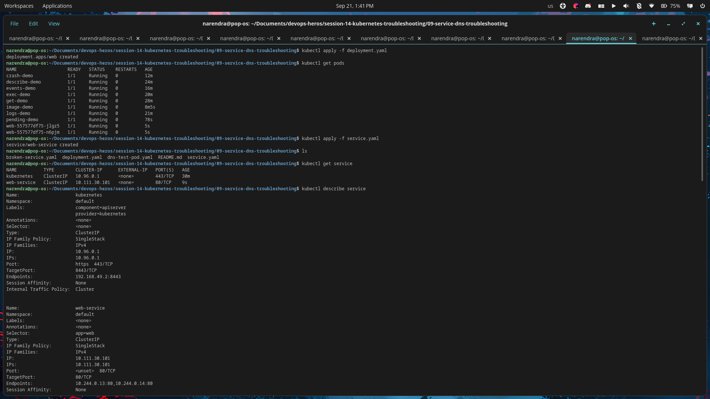

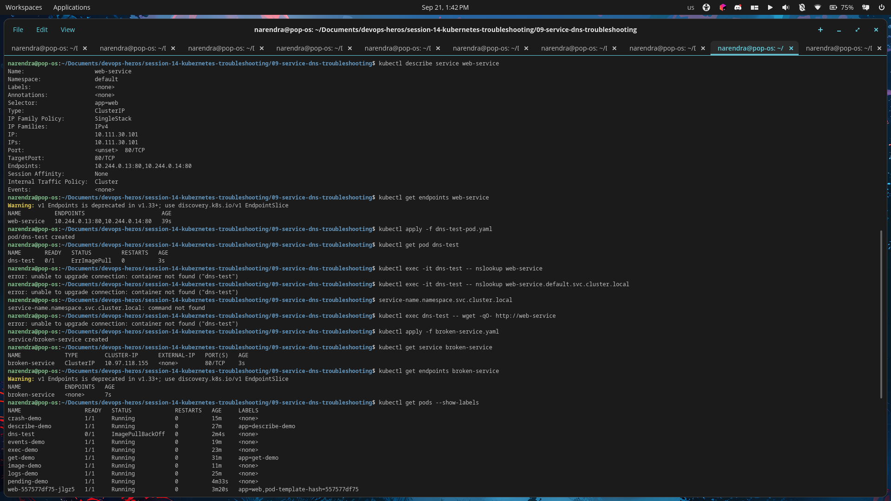

## Mini-project

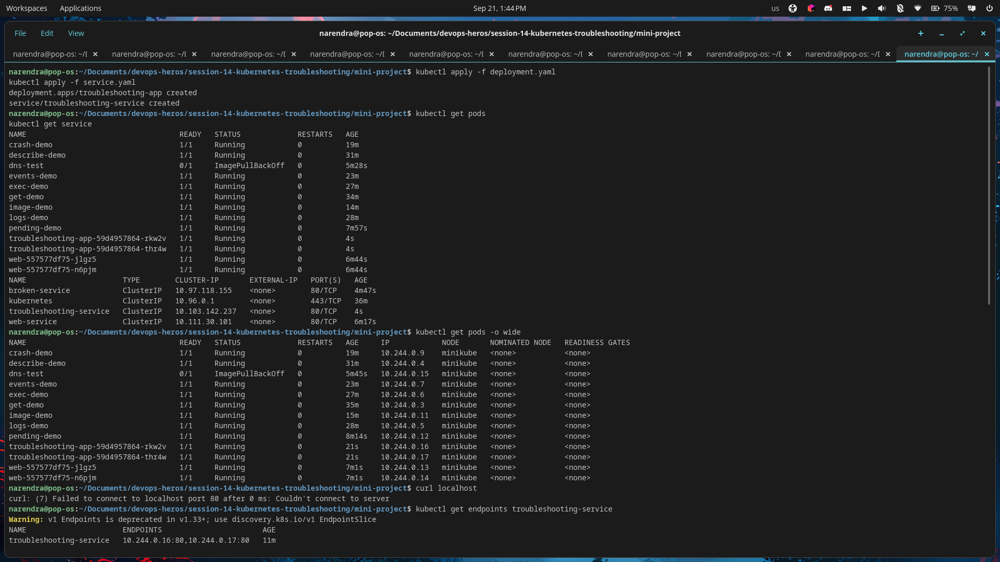

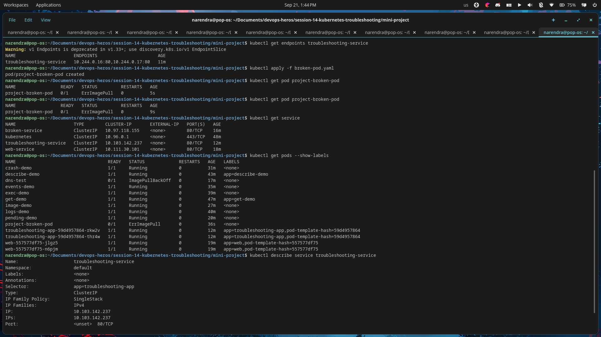
