# session-14: Kubernetes Troubleshooting

## Overview
This folder contains troubleshooting exercises and supporting screenshots.

## Screenshots

### Kubectl Get
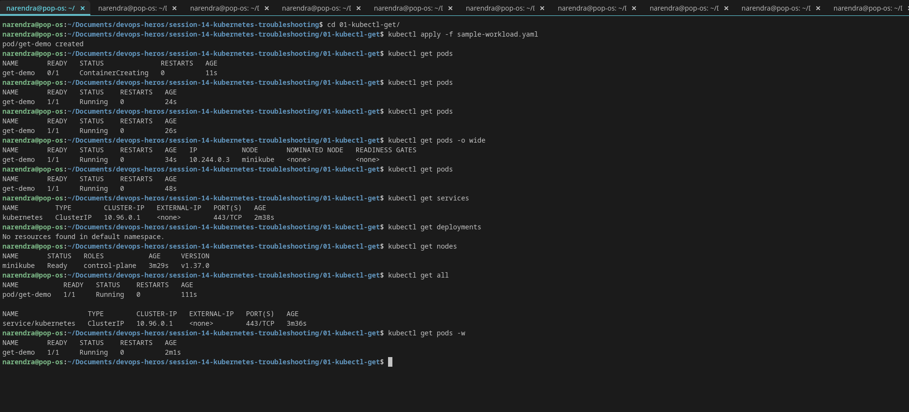

### Kubectl Describe
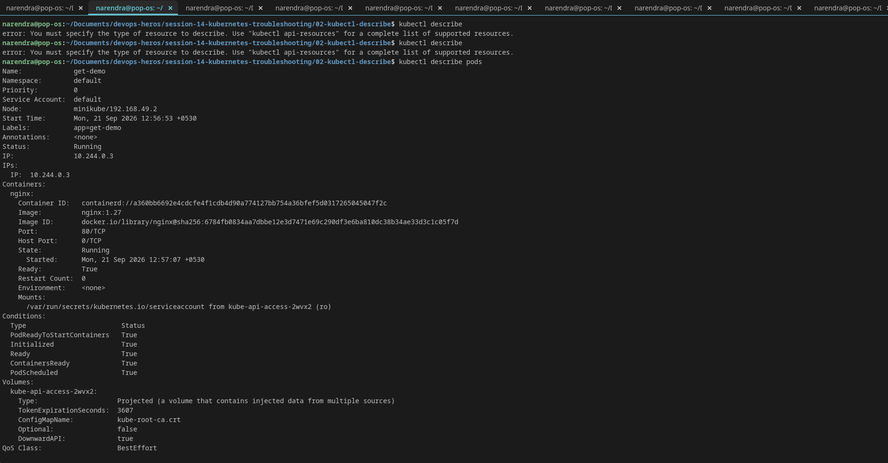
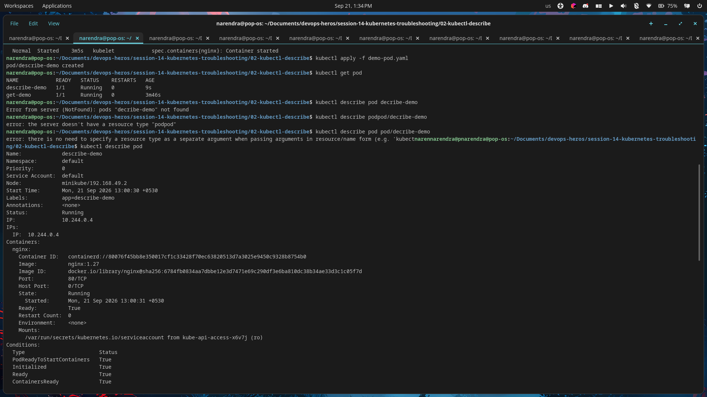
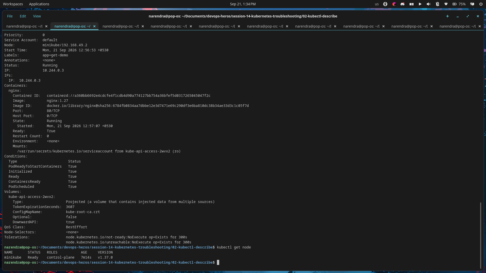

### Kubectl Logs
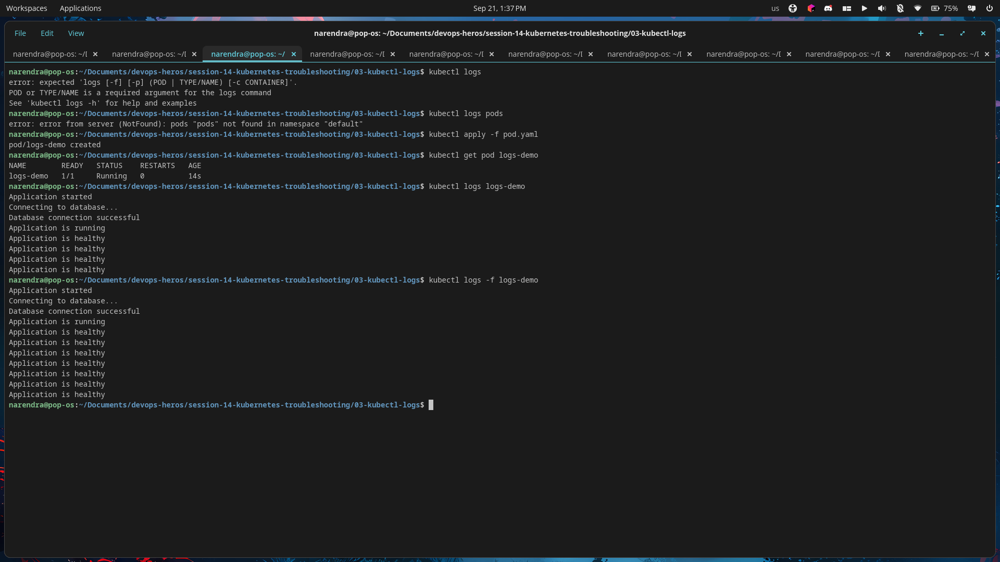

### Kubectl Exec
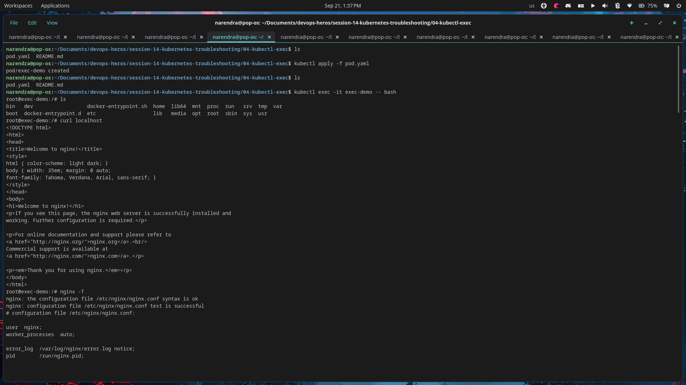
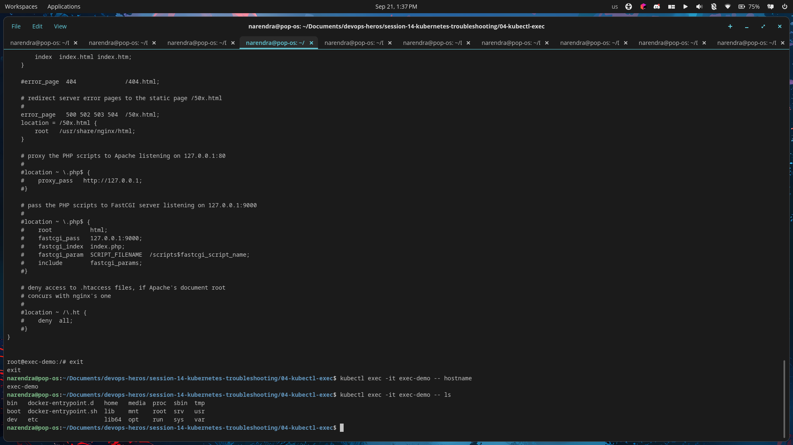

### Events
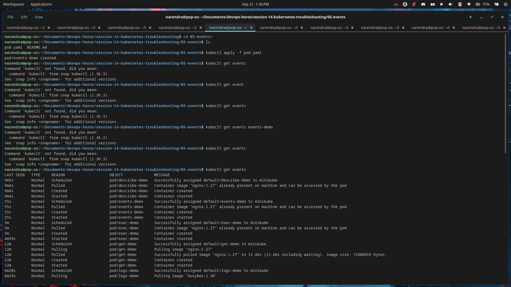
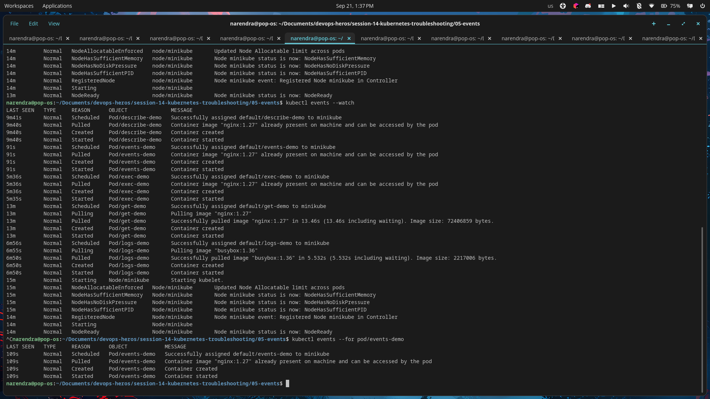

### Crashloopbackoff
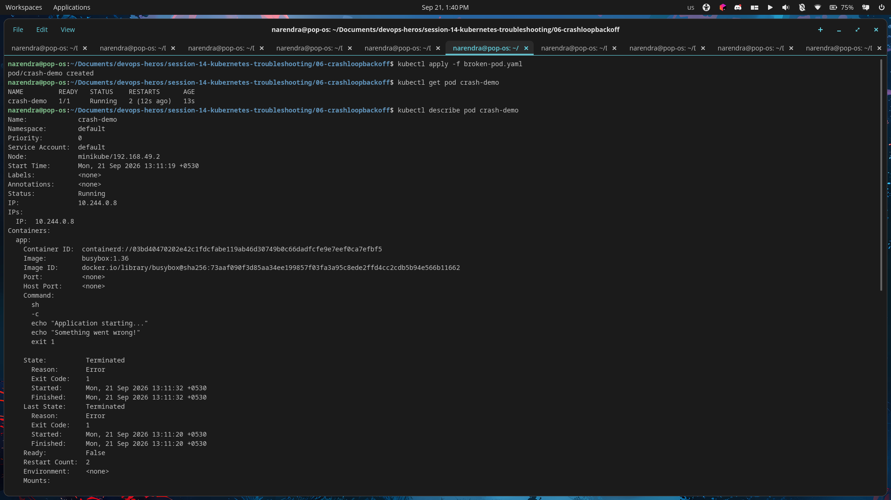
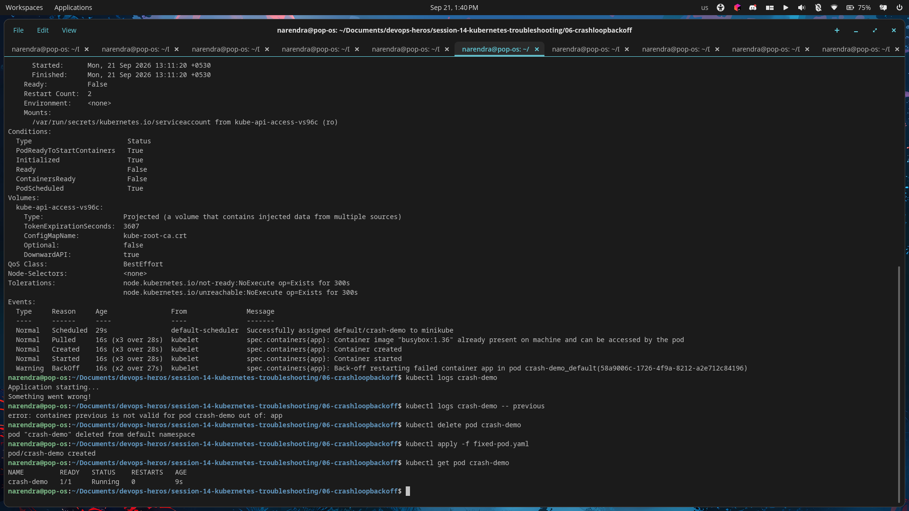

### Imagepullbackoff
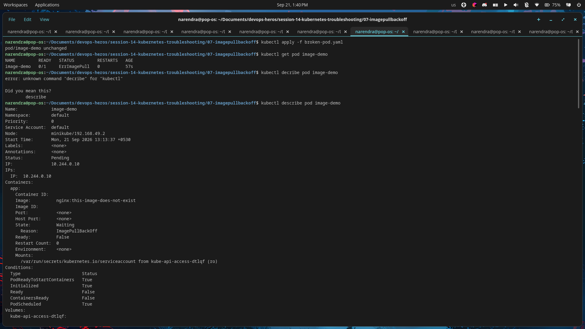
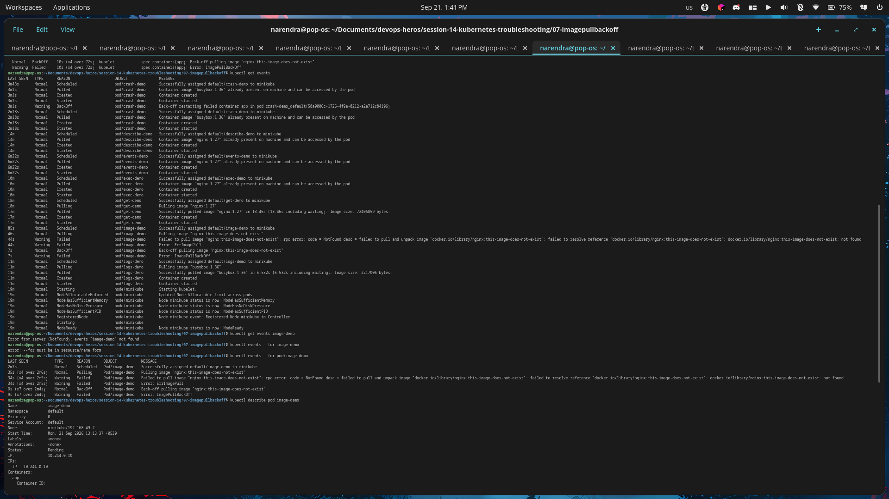

### Pending Pod
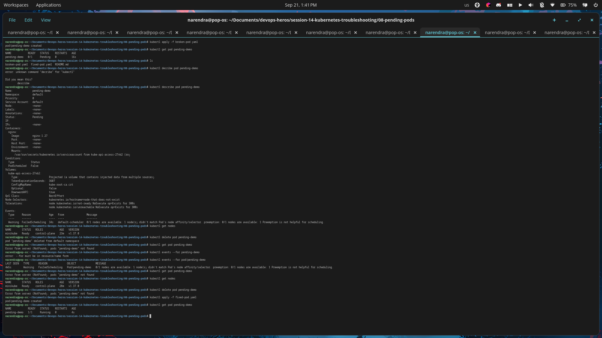

### Service Dns
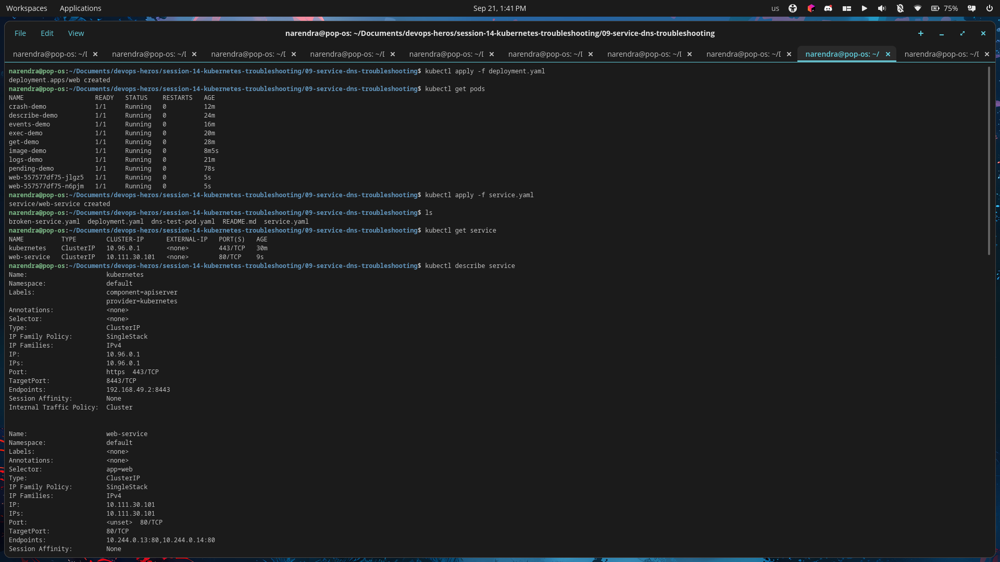
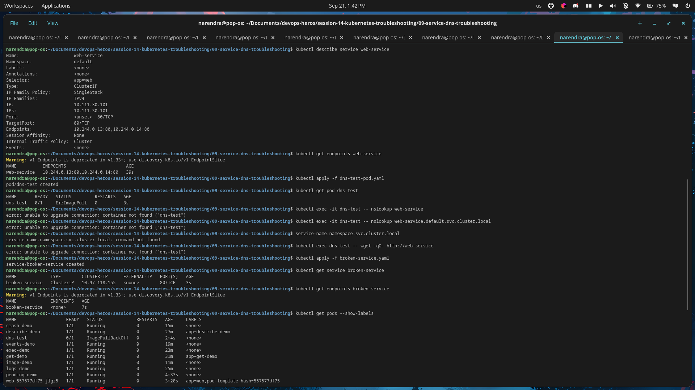

### Mini Project
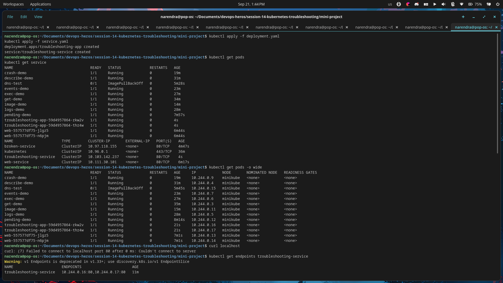
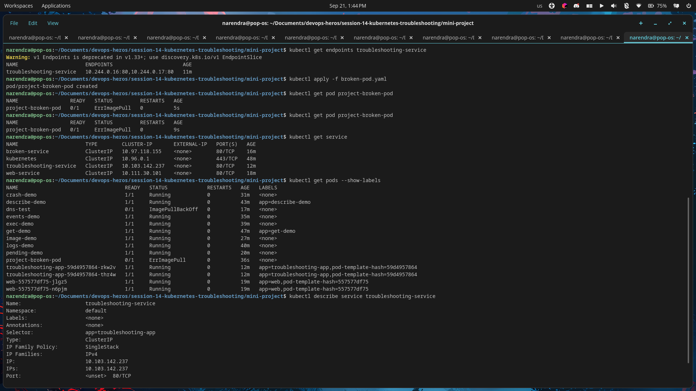

