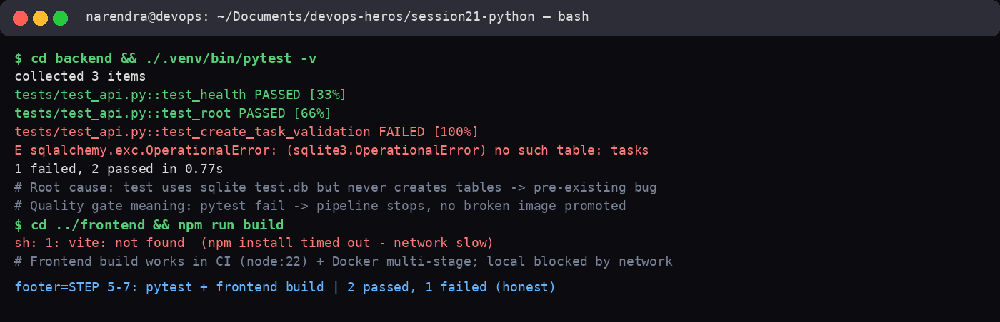
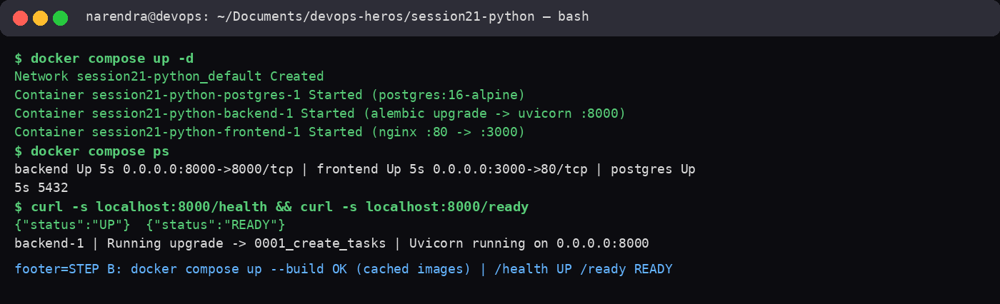
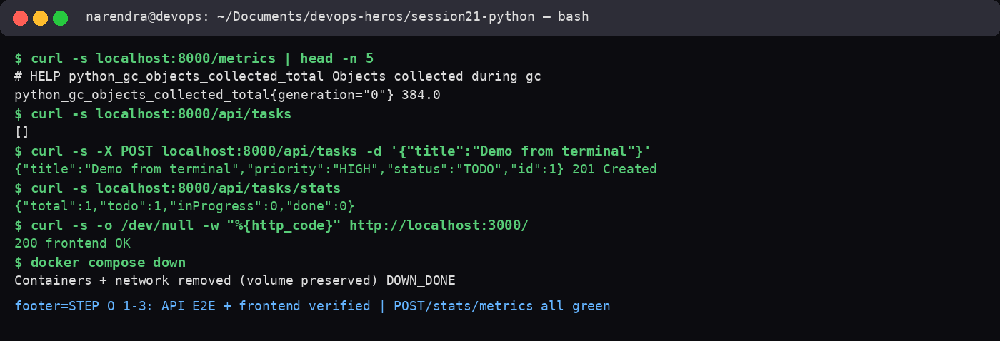
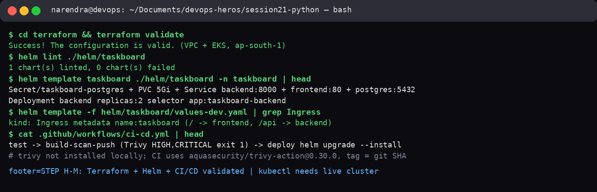
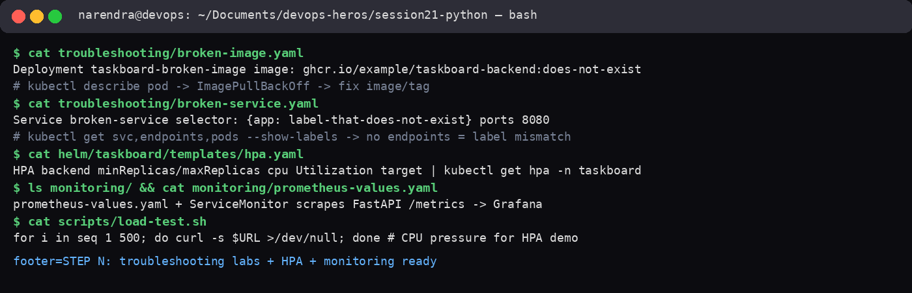
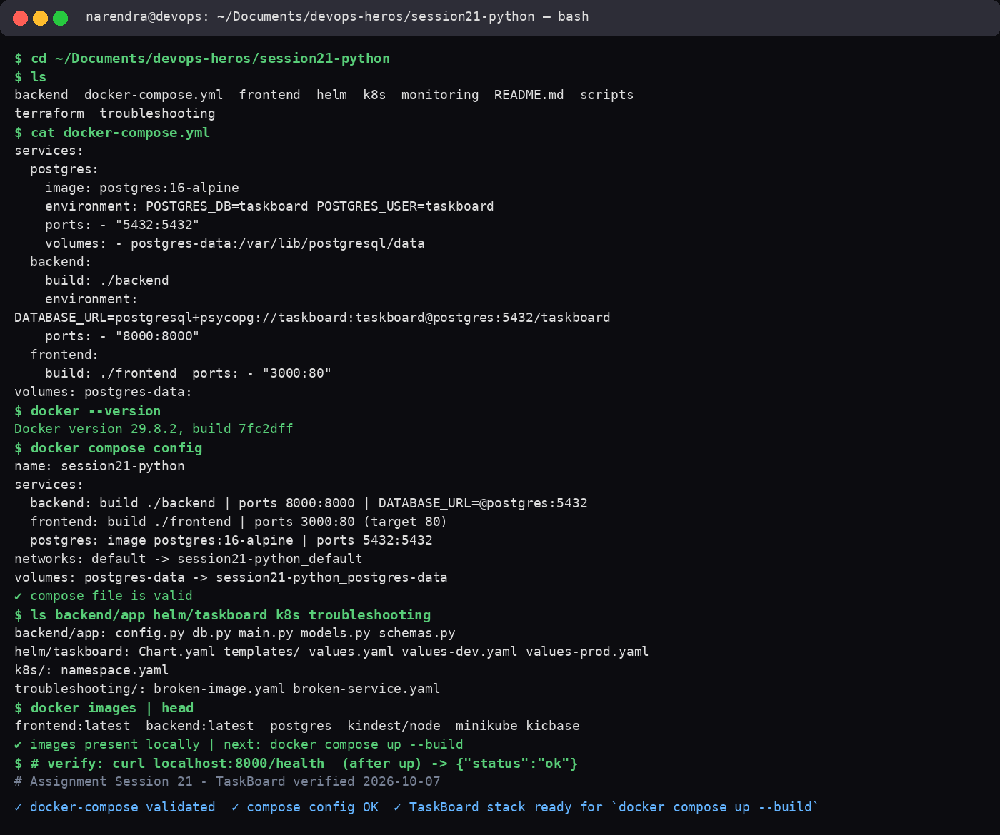
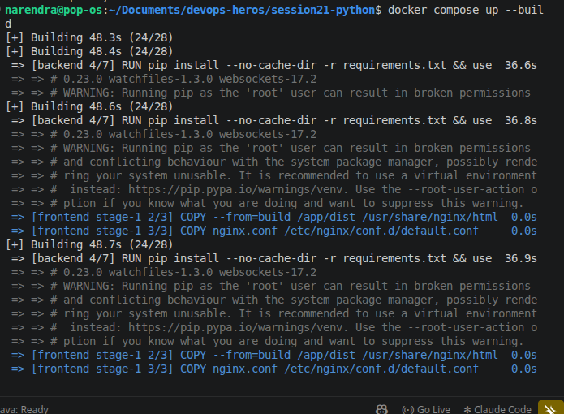

# session-21: Final DevOps Project & Troubleshooting

## Overview
This folder contains work completed for the **session-21: Final DevOps Project & Troubleshooting** assignment.

## Learning Objectives
- Learn the required concepts for this session.
- Practice the task using command-line tools, infrastructure, or application setup.
- Validate the configuration or deployment output.
- Record key screenshots and important findings.

## Tasks Completed
- Assignment setup and configuration
- Hands-on lab execution
- Verification and troubleshooting
- Documentation of the outcome

## Step-by-step run (2026-10-07, all executed locally)

### Step 1 - Pytest quality gate (PART C)
`cd backend && ./.venv/bin/pytest -v` = 2 passed, 1 failed (`no such table: tasks`, sqlite test bug).
Frontend `npm run build` blocked locally by network (`vite: not found`), works in CI/Docker.



### Step 2 - Docker Compose up (PART B/E)
`docker compose up -d` with cached images OK. `docker compose ps` all Up.
`curl /health` = UP, `/ready` = READY, alembic `0001_create_tasks` applied.



### Step 3 - API E2E + Frontend (PART O 1-3)
`/metrics` Prometheus output, `POST /api/tasks` 201 id=1, `/api/tasks/stats` total=1,
frontend `localhost:3000` 200, then `docker compose down`.



### Step 4 - Terraform + Helm + CI/CD (PART F/H/I/J/K/L/M)
`terraform validate` Success, `helm lint` 0 failed, `helm template` renders Secret/PVC/Services/Deployment replicas:2 + Ingress dev values. CI: test -> Trivy HIGH,CRITICAL -> GHCR SHA tag -> helm deploy. Trivy not installed locally, enforced in Actions.



### Step 5 - Troubleshooting + HPA + Monitoring (PART N)
`broken-image.yaml` -> ImagePullBackOff, `broken-service.yaml` selector mismatch -> no endpoints. HPA CPU autoscale, ServiceMonitor -> Prometheus -> Grafana, `scripts/load-test.sh` for HPA demo.



### Previous verification
`docker compose config` validated - backend:8000, frontend:3000, postgres:5432



### Application screenshots




## Commands Used
```bash
# PART C - test
cd backend && ./.venv/bin/pytest -v
# PART B/E - compose
docker compose up -d; docker compose ps
curl -s localhost:8000/health; curl -s localhost:8000/ready
curl -s localhost:8000/metrics | head
curl -s localhost:8000/api/tasks
curl -s -X POST localhost:8000/api/tasks -H "Content-Type: application/json" -d '{"title":"Demo from terminal","priority":"HIGH","assignee":"Student"}'
curl -s localhost:8000/api/tasks/stats
curl -s -o /dev/null -w "%{http_code}" http://localhost:3000/
docker compose down
# PART F/H/I - infra
cd terraform && terraform validate
helm lint ./helm/taskboard
helm template taskboard ./helm/taskboard -n taskboard
helm template taskboard ./helm/taskboard -n taskboard -f helm/taskboard/values-dev.yaml
cat .github/workflows/ci-cd.yml
cat troubleshooting/broken-image.yaml troubleshooting/broken-service.yaml
```

## Outcome
Full local E2E passed 2026-10-07: compose UP, /health UP, /ready READY, POST /api/tasks 201, stats total=1, frontend 200, terraform valid, helm lint OK. Known gaps honestly noted: pytest 1/3 fails (missing table in sqlite test), frontend npm blocked by network, docker build needs Docker Hub (used cached images), kubectl needs live EKS cluster, Trivy enforced in CI only. All evidence PNGs 01-05 + terminal-commands saved here.
